<p align="center">
  
</p>

<div align="center">

# VIREA

### Verifiable Retargeting for Expressive Avatars

**Turn heterogeneous human motion into one auditable VRM/glTF humanoid contract.**

[](#status)
[](doc/engineering-design.zh-CN.md)
[](doc/math-retarget/README.zh-CN.md)
[](#supported-motion-sources)
[](pyproject.toml)
[](doc/annotation-viewer.zh-CN.md)

[Quick Start](#quick-start) · [Results](#retargeting-results) · [Sources](#supported-motion-sources) · [Architecture](#architecture) · [Validation](#validation) · [Docs](doc/README.zh-CN.md)

</div>

<br>

## What VIREA delivers

<table>
  <tr>
    <td width="50%"><strong>One canonical motion format</strong><br>Root translation and rotation, 21 core-bone quaternions, 30 hand-bone quaternions, canonical rest geometry, seconds-based timing, and discontinuity segments — all in a single <code>T × 211</code> tensor.</td>
    <td width="50%"><strong>Mechanism-level retargeting</strong><br>Root, body, ankle, and hand orientation are resolved before playback through a unified constraint solver that covers all 30 VRM hand bones without dataset-specific Viewer repairs.</td>
  </tr>
  <tr>
    <td><strong>Replay-verifiable artifacts</strong><br>Canonical v3 artifacts bind source evidence, pre-solver hands, solver policy, quality metrics, content hashes, and deterministic certificates. Reader replay rejects altered or incomplete artifacts.</td>
    <td><strong>Portable VRM playback</strong><br>The Viewer consumes normalized humanoid motion, validates the payload it receives, and applies no dataset-specific hand, ankle, or rest-pose correction. Zero pose mutation is contractual.</td>
  </tr>
</table>

<br>

## Retargeting results

All animations below show source motion retargeted to **"Unnamed Character 6" by Reira**. Each dataset presents four distinct data entries in full-body overview: source motion was coordinate-normalized, retargeted to the VIREA canonical v3 humanoid contract, transferred to the credited VRM Avatar, and rendered as a whole-body view. Raw datasets and the Avatar model are not included. Licensing conditions are summarized per dataset and detailed in [Third-Party Notices](THIRD_PARTY_NOTICES.md).

<p align="center">
  
</p>

---

### BEAT · conversational gesture

<table>
  <tr>
    <td width="50%" align="center">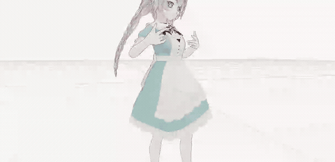<br><sub><strong>Wayne gesture 100</strong></sub></td>
    <td width="50%" align="center">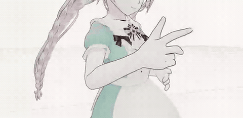<br><sub><strong>Wayne gesture 101</strong></sub></td>
  </tr>
  <tr>
    <td width="50%" align="center">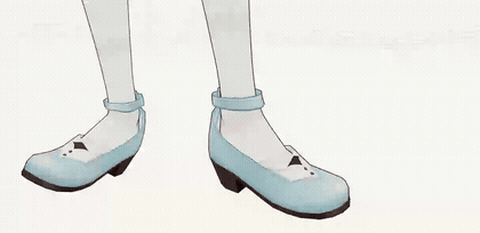<br><sub><strong>Wayne gesture 102</strong></sub></td>
    <td width="50%" align="center">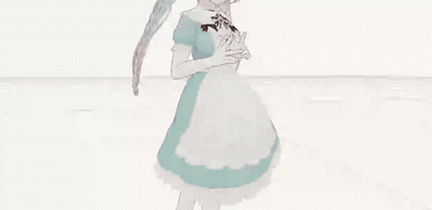<br><sub><strong>Wayne gesture 103</strong></sub></td>
  </tr>
</table>

BEAT motion © its authors and contributors, declared [Apache-2.0](https://www.apache.org/licenses/LICENSE-2.0) at the pinned [official dataset revision](https://huggingface.co/datasets/H-Liu1997/BEAT/tree/604f5eca9d8dc2e1b8c3ed21045f9e24a7b6d3ff). Four distinct clips rendered as modified retargeted GIFs.

---

### Motion-X / AIST++ · dance

<table>
  <tr>
    <td width="50%" align="center">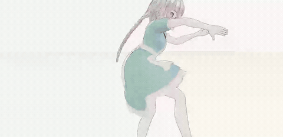<br><sub><strong>Dance Break</strong></sub></td>
    <td width="50%" align="center">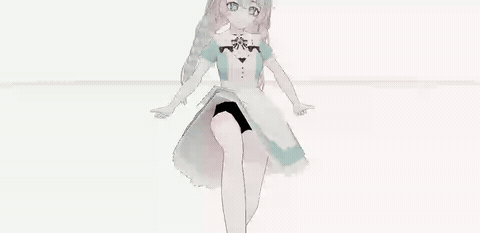<br><sub><strong>3 Step</strong></sub></td>
  </tr>
  <tr>
    <td width="50%" align="center">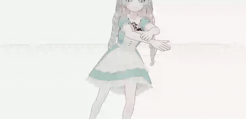<br><sub><strong>6 Step</strong></sub></td>
    <td width="50%" align="center">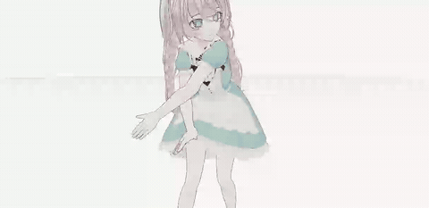<br><sub><strong>Battle Rock</strong></sub></td>
  </tr>
</table>

Motion-X annotations © International Digital Economy Academy, licensed [CC BY-NC-SA 4.0](https://motion-x-dataset.github.io/static/license/Motion-X%20License.pdf); the AIST++ source annotations © Google LLC are [CC BY 4.0](https://google.github.io/aistplusplus_dataset/factsfigures.html). Modified GIFs are offered under CC BY-NC-SA 4.0 for non-commercial use.

---

### SuSuInterActs · expressive interaction

<table>
  <tr>
    <td width="50%" align="center">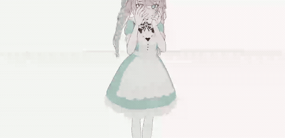<br><sub><strong>Near-face interaction</strong></sub></td>
    <td width="50%" align="center">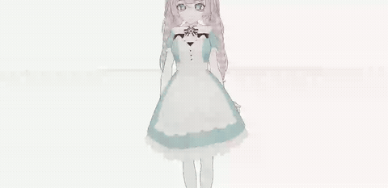<br><sub><strong>Gesture motion</strong></sub></td>
  </tr>
  <tr>
    <td width="50%" align="center">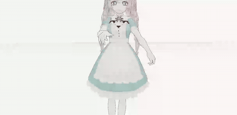<br><sub><strong>Crossed-arm motion</strong></sub></td>
    <td width="50%" align="center">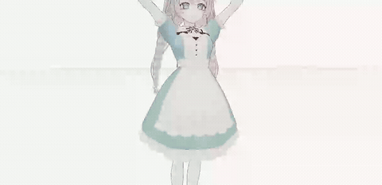<br><sub><strong>Dialogue motion</strong></sub></td>
  </tr>
</table>

SuSuInterActs © 2026 **Shandong SentiPulse Technology Development Co., Ltd.**, licensed under the [SentiPulse Non-Commercial Source License v1.0](https://github.com/SentiAvatar/SentiAvatar/blob/71c61b05a0609a41c17aa146c9f4ee7778ebc649/LICENSE). Modified derivative renderings for non-commercial use; the license is source-available, not open source.

---

### AMASS · large-scale mocap archive

<table>
  <tr>
    <td width="50%" align="center">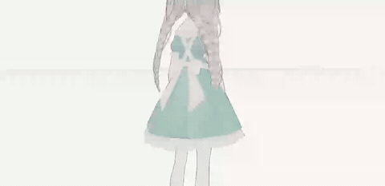<br><sub><strong>Stand to skip</strong></sub></td>
    <td width="50%" align="center">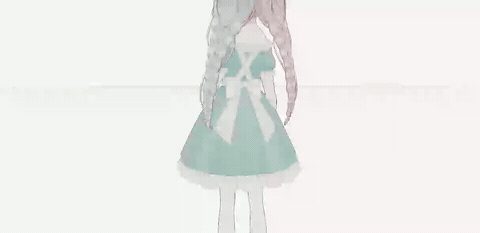<br><sub><strong>Upper-body swing</strong></sub></td>
  </tr>
  <tr>
    <td width="50%" align="center">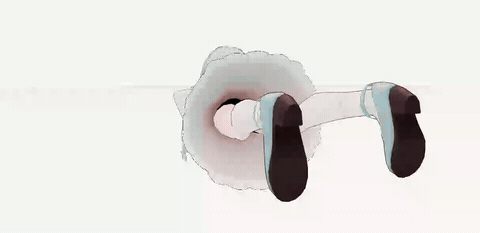<br><sub><strong>Lie to crouch</strong></sub></td>
    <td width="50%" align="center">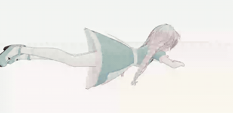<br><sub><strong>Crawl forward</strong></sub></td>
  </tr>
</table>

AMASS © Max Planck Gesellschaft. [License terms](https://amass.is.tue.mpg.de/license.html) apply; four distinct ACCAD Female1 clips rendered as modified retargeted GIFs.

---

### BABEL · annotated motion segments

<table>
  <tr>
    <td width="50%" align="center">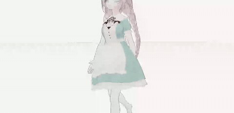<br><sub><strong>Walk cycle</strong></sub></td>
    <td width="50%" align="center">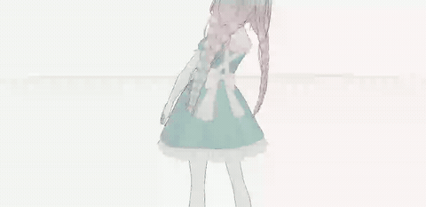<br><sub><strong>Urban gestures</strong></sub></td>
  </tr>
  <tr>
    <td width="50%" align="center">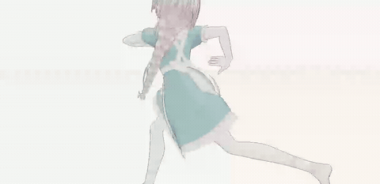<br><sub><strong>Run motion</strong></sub></td>
    <td width="50%" align="center">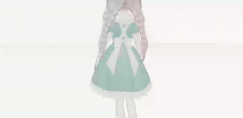<br><sub><strong>Walk to stand</strong></sub></td>
  </tr>
</table>

BABEL © Max Planck Gesellschaft. [License terms](https://babel.is.tue.mpg.de/license.html) apply; BABEL annotation intervals overlay AMASS carriers. Four distinct ACCAD clips rendered as modified retargeted GIFs.

---

### GRAB · object interaction

<table>
  <tr>
    <td width="50%" align="center">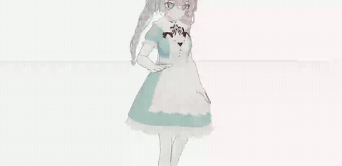<br><sub><strong>Airplane fly</strong></sub></td>
    <td width="50%" align="center">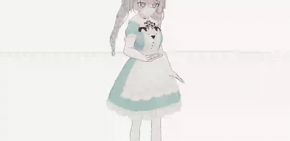<br><sub><strong>Airplane lift</strong></sub></td>
  </tr>
  <tr>
    <td width="50%" align="center">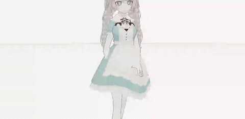<br><sub><strong>Airplane off-hand</strong></sub></td>
    <td width="50%" align="center">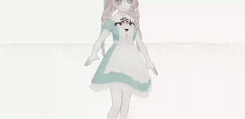<br><sub><strong>Airplane pass</strong></sub></td>
  </tr>
</table>

GRAB © Max Planck Gesellschaft. [License terms](https://grab.is.tue.mpg.de/license.html) apply; four distinct object-interaction clips rendered as modified retargeted GIFs.

---

### HumanML3D · text-motion pairs

<table>
  <tr>
    <td width="50%" align="center">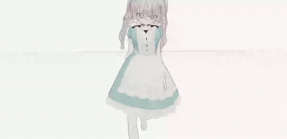<br><sub><strong>Text-motion sample 0</strong></sub></td>
    <td width="50%" align="center">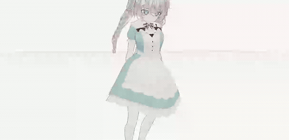<br><sub><strong>Text-motion sample 3</strong></sub></td>
  </tr>
  <tr>
    <td width="50%" align="center">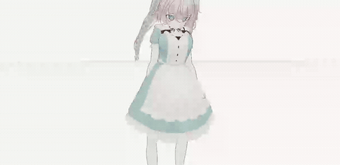<br><sub><strong>Text-motion sample 4</strong></sub></td>
    <td width="50%" align="center">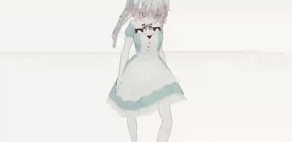<br><sub><strong>Turning sample 7</strong></sub></td>
  </tr>
</table>

HumanML3D uses AMASS-carried motion. [HumanML3D license](https://github.com/EricGuo5513/HumanML3D#how-to-obtain-the-data) applies; four distinct text-motion test samples rendered as modified retargeted GIFs.

---

<sub><strong>Avatar credit:</strong> "Unnamed Character 6" by Reira — non-commercial display allowed; credit required; <code>.vrm</code> redistribution prohibited. See the <a href="https://vroid.pixiv.help/hc/en-us/articles/360013153714--About-the-characters-conditions-of-use">official VRoid usage-condition guide</a>, the <a href="doc/showcase/media/manifest.json">media manifest</a>, and the <a href="doc/showcase/publication-policy.json">publication policy</a>.</sub>

<br>

## Canonical v3 at a glance

| Contract | Specification |
|---|---|
| Motion tensor | `T × 211` float32 |
| Layout | root position `3` + root quaternion `4` + core quaternions `21 × 4` + hand quaternions `30 × 4` |
| Rotation convention | right-handed, `+Y` up, `+Z` forward, `xyzw`, rest-relative normalized local deltas |
| Time | explicit FPS, seconds-based preview duration, half-open continuity segments |
| Hand safety | 30-bone solver policy, evidence coverage, constraint residuals, postconditions, deterministic certificate |
| Target | VRM 0.x / VRM 1 normalized humanoid through `three-vrm` |

## Supported motion sources

VIREA resolves source representation, coordinate basis, units, timing, rotation semantics, and hand evidence per profile.

| Source | Motion carrier | Canonical result | Profile status |
|---|---|---|---|
| **AMASS** | SMPL / SMPL-H / Stage-II SMPL-X | Body rotation retargeting; verified SMPL-H path; uncalibrated hand frames remain neutral | Regression-verified core; Stage-II draft |
| **BABEL** | BABEL annotations over AMASS motion | Annotation intervals aligned with the AMASS carrier; annotations never replace motion arrays | Source-verified SMPL/SMPL-H carriers |
| **BEAT** | Raw 75-joint BVH | Full hierarchy decode, skipped-joint composition, 30-hand mapping, joint-centre evidence | Source-verified |
| **GRAB** | SMPL-X 55-joint full pose | Body motion retained; object/contact context preserved; uncalibrated hand frames remain neutral | Source-verified |
| **HumanML3D** | 263D root + RIC positions | Official RIC geometry drives the body; child-edge 6D is not misread as glTF node-local; hands explicitly neutral | Source-verified |
| **Motion-X** | 322D SMPL-X-derived arrays | Sub-source-specific translation and basis policy; hand evidence neutral until frame calibration | Draft |
| **SuSuInterActs** | Body/hand 6D with optional 63-joint positions | MTA63 joint-centre evidence drives the canonical hand solver; official columns/local profile verified | Official verified; local variants draft |

See [Dataset Audit](doc/dataset-audit.zh-CN.md) for exact slices, frame rates, units, basis transforms, authority links, and unresolved profile-level claims.

## Quick start

Requirements: Python 3.10+, Node.js 20+, and `uv`.

```bash
git clone git@github.com:Moonweave-AI/virea.git
cd virea
uv sync --extra dev
npm ci
uv run python -m virea serve --data-source demo
```

Open `http://127.0.0.1:8000/`. Motion datasets are not bundled; connect data that you are licensed to use. See [Getting Started](doc/getting-started.zh-CN.md).

## Architecture

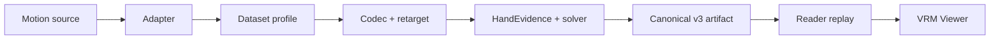

The boundary is deliberate:

- **Adapters** preserve source facts and provenance.
- **Profiles** define basis, units, timing, rotation semantics, and evidence policy.
- **Codecs and retargeting** produce pre-solver canonical motion.
- **The hand solver** produces the only final canonical hand track.
- **Artifacts and Reader replay** make the result independently checkable.
- **The Viewer** verifies and renders; it does not repair poses.

## Validation

VIREA uses separate gates so that one passing layer cannot hide a failure in another.

| Gate | What is checked |
|---|---|
| Source fidelity | Official layouts, joint order, basis, units, hierarchy collapse, and source FK or position evidence |
| Retarget quality | Root/core invariants plus complete observable hand-edge coverage; missing or degenerate edges fail closed |
| Hand constraints | Convergence, observation coverage, anatomical residuals, continuity segmentation, and solver certificate |
| Artifact integrity | Array hashes, schema, canonical FK, quality replay, solver replay, and tamper rejection |
| Viewer contract | Exact v3 mapping/rest contract, payload hand hash, normalized humanoid transfer, and zero pose mutation |
| Real-data QA | Representative samples from all seven source families, long sequences, discontinuities, hand articulation, ankle alignment, and global facing |

Run the local contract suite:

```bash
uv run python -m pytest -q
npm run check
npm run test:viewer
uv run python scripts/check_docs.py
```

Current dated evidence, thresholds, skips, and known limitations are listed in [Validation](doc/validation.zh-CN.md).

## Status

**Research preview.** Processing v0.4 and canonical v3 are implemented; profiles marked `draft` remain experimental and are identified in the source matrix above.

The public gallery contains twenty-eight dataset-derived GIFs — four per dataset across all seven sources — listed in the hash-bound [media manifest](doc/showcase/media/manifest.json). The repository does not yet include a code license; public visibility does not grant permission to copy, modify, or redistribute VIREA code. See [Showcase](doc/showcase/README.md) and [Third-Party Notices](THIRD_PARTY_NOTICES.md).

## Documentation

| Goal | Start here |
|---|---|
| Install and open the Viewer | [Getting Started](doc/getting-started.zh-CN.md) |
| Integrate or process a dataset | [Pipeline Guide](doc/pipeline.zh-CN.md) |
| Understand coordinates, FK, 211D, and hand constraints | [Retarget Mathematics](doc/math-retarget/README.zh-CN.md) |
| Implement or inspect v3 artifacts | [Engineering Design](doc/engineering-design.zh-CN.md) · [Schemas](schemas) |
| Review dataset-specific evidence | [Dataset Audit](doc/dataset-audit.zh-CN.md) |
| Review quality claims and open risks | [Validation](doc/validation.zh-CN.md) |
| Inspect decisions and proposed contracts | [RFC-0002](doc/rfcs/0002-constraint-aware-hand-retarget-v1.zh-CN.md) · [ADR-0002](doc/adrs/0002-canonical-v3-constrained-hand-retarget.zh-CN.md) |

The complete documentation map — tutorials, how-tos, references, explanations, decision records, and evidence — is in the [Documentation Hub](doc/README.zh-CN.md).

## Contributing and security

- Contributions must update code, contracts, tests, and evidence together. See [CONTRIBUTING.md](CONTRIBUTING.md).
- Treat raw datasets, object containers, annotations, audio, face channels, VRM files, and external URLs as untrusted or restricted assets. See [SECURITY.md](SECURITY.md).
- Embedded third-party material and non-commercial constraints are recorded in [THIRD_PARTY_NOTICES.md](THIRD_PARTY_NOTICES.md).

Owner: `@Joker-of-Gotham`

<!--
type: readme
status: Active
owner: "@Joker-of-Gotham"
created: 2026-08-08
updated: 2026-08-10
last_reviewed: 2026-08-10
review_cycle_days: 30
title: VIREA — Verifiable Retargeting for Expressive Avatars
audience: Researchers, motion engineers, dataset integrators, and reviewers
visibility: Public
summary: VIREA 的能力、结果、数据源、架构、使用方式与验证边界。
canonical: README.md
related:
  - doc/README.zh-CN.md
  - doc/getting-started.zh-CN.md
  - doc/engineering-design.zh-CN.md
  - doc/validation.zh-CN.md
  - doc/showcase/README.md
supersedes: []
superseded_by: []
-->
