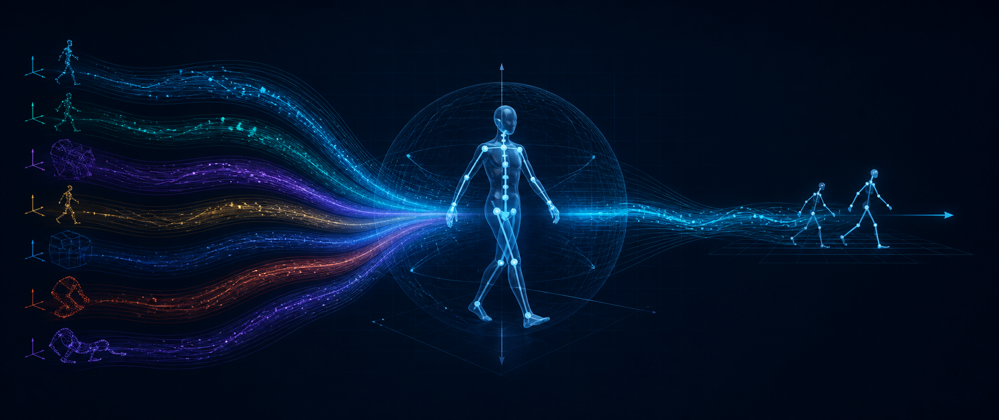
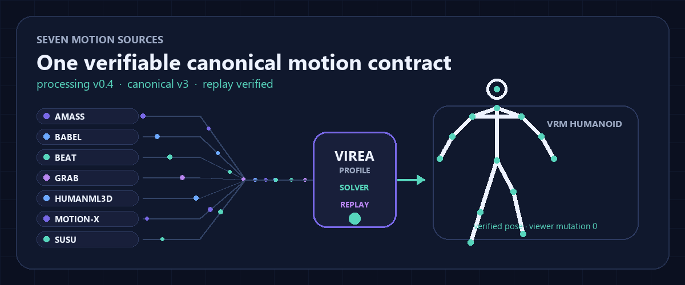
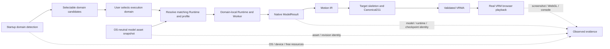

<p align="center">
  
</p>

<div align="center">

# VIREA

### Cross-platform motion generation, one auditable motion contract, real VRM playback

VIREA detects the machine, installs each model into an isolated Runtime, preserves its native skeleton and representation,
converts the result through Motion IR, and exports validated VRMA for browser playback.

[](CHANGELOG.md)
[](doc/math-retarget/README.zh-CN.md)
[](packages/contracts/schemas/v2/motion_ir.schema.json)
[](doc/platforms/README.en.md)
[](doc/README.en.md)

[English](README.md) · [简体中文](README.zh-CN.md) ·
[Get started](doc/getting-started.en.md) ·
[CLI reference](doc/reference/cli.en.md) ·
[Models](doc/models/README.en.md) ·
[Platforms](doc/platforms/README.en.md) ·
[Architecture](#architecture) ·
[Evidence](doc/quality/production-e2e.en.md) ·
[Documentation](doc/README.en.md)

</div>

## What VIREA is

Motion generation projects usually ship incompatible Python stacks, output tensors, skeletons and coordinate conventions.
VIREA treats every model as an isolated, versioned capability and makes the conversion path explicit:

- **Model** — tasks, official artifacts, native skeleton/representation, license and exact acceptance request;
- **Execution Domain** — where detector, builder and Worker actually run: Windows, Linux, WSL2 or macOS;
- **Result** — immutable model/runtime/checkpoint identity plus native → target skeleton and representation;
- **Playback** — validated Motion IR/Canonical211/VRMA loaded with a real VRM in the browser.

The checkout contains source, lightweight registries, locks, tests and documentation. Environments, checkpoints, caches,
logs, jobs, results and QA workspaces live under an external `VIREA_HOME`.

<p align="center">
  
</p>

## Choose your path

| I want to… | Start here |
|---|---|
| Generate motion with an integrated model | [Clone-to-result tutorial](doc/getting-started.en.md) → [CLI reference](doc/reference/cli.en.md) |
| Pick the correct model and skeleton | [Model directory](doc/models/README.en.md) → [generated support matrix](doc/models/support-matrix.generated.md) |
| Deploy on Windows, Linux, WSL2 or macOS | [Platform and execution-domain guide](doc/platforms/README.en.md) |
| Update an already-deployed device without redownloading models | [Persistent-root update procedure](doc/getting-started/persistent-data-root.en.md#update-another-device-that-is-already-deployed) |
| Load a result in a real Avatar | [Browser playback](doc/getting-started.en.md#7-advanced-play-a-result-in-the-browser) |
| Integrate another model | [Model adapter guide](doc/development/model-adapter.zh-CN.md) |
| Audit claims or release evidence | [Production E2E contract](doc/quality/production-e2e.en.md) |
| Explore datasets and retargeting | [Dataset pipeline](doc/pipeline.zh-CN.md) and [showcase](doc/showcase/README.md) |

## Architecture



The control plane never imports model frameworks. Each Worker owns its locked environment, validates official artifacts
offline, emits a versioned `ModelResult`, and can be cancelled or recovered as an isolated process tree. A model and its
checkpoint do not belong to an operating system: the selected execution domain determines the Runtime, path view and
accelerator backend. Observed evidence reports where one exact configuration ran; it never chooses or hides domains.

## Model support

The table is generated from `plugins/models/*/manifest.yaml`; status, native skeleton and native representation are not
hand-written README claims. Full task, license and upstream details are in the
[model matrix](doc/models/support-matrix.generated.md).

<!-- BEGIN GENERATED: MODEL_SUPPORT -->
| Model | Status | Native motion identity | Declared Runtime capability | Known deployment blockers | Observed evidence coverage |
|---|---|---|---|---|---|
| **ACMDM-S-PS22 HumanML3D Absolute XYZ**<br><code>acmdm-humanml3d</code> | Integrated · experimental | <code>humanml3d.body22.v1</code><br><code>humanml3d.body22.positions.v1</code> · 20.0 FPS | <code>acmdm-humanml3d-cu128</code> · Windows x86_64, Linux x86_64 · cuda_full (VRAM 6 GiB, RAM 8 GiB)<br><code>acmdm-humanml3d-cpu</code> · Windows x86_64, Linux x86_64, macOS arm64, macOS x86_64 · cpu (RAM 12 GiB) | No structured blocker recorded | No model-scoped observation recorded |
| **CMDM HumanML3D**<br><code>cmdm-humanml3d</code> | Integrated · experimental | <code>humanml3d.body22.v1</code><br><code>humanml3d.vector263.v1</code> · 20.0 FPS | <code>cmdm-humanml3d-cu128</code> · Windows x86_64, Linux x86_64 · cuda_full (VRAM 6 GiB, RAM 8 GiB)<br><code>cmdm-humanml3d-cpu</code> · Windows x86_64, Linux x86_64, macOS arm64, macOS x86_64 · cpu (RAM 12 GiB) | No structured blocker recorded | No model-scoped observation recorded |
| **FloodDiffusion Tiny**<br><code>flood-diffusion-tiny</code> | Integrated · experimental | <code>humanml3d.body22.v1</code><br><code>humanml3d.vector263.v1</code> · 20.0 FPS | <code>flood-diffusion-tiny-cu128</code> · Windows x86_64, Linux x86_64 · cuda_full (VRAM 16 GiB, RAM 16 GiB)<br><code>flood-diffusion-tiny-cpu</code> · Windows x86_64, Linux x86_64, macOS arm64, macOS x86_64 · cpu (RAM 16 GiB) | No structured blocker recorded | No model-scoped observation recorded |
| **MARDM SiT-XL HumanML3D**<br><code>mardm-humanml3d</code> | Integrated · experimental | <code>humanml3d.body22.v1</code><br><code>mardm.humanml3d.ric67.v1</code> · 20.0 FPS | <code>mardm-humanml3d-cu128</code> · Windows x86_64, Linux x86_64 · cuda_full (VRAM 12 GiB, RAM 16 GiB)<br><code>mardm-humanml3d-cpu</code> · Windows x86_64, Linux x86_64, macOS arm64, macOS x86_64 · cpu (RAM 24 GiB) | No structured blocker recorded | No model-scoped observation recorded |
| **MoMADiff HumanML3D**<br><code>momadiff-humanml3d</code> | Integrated · experimental | <code>humanml3d.body22.v1</code><br><code>humanml3d.vector263.v1</code> · 20.0 FPS | <code>momadiff-humanml3d-cu128</code> · Windows x86_64, Linux x86_64 · cuda_full (VRAM 6 GiB, RAM 8 GiB)<br><code>momadiff-humanml3d-cpu</code> · Windows x86_64, Linux x86_64, macOS arm64, macOS x86_64 · cpu (RAM 12 GiB) | No structured blocker recorded | No model-scoped observation recorded |
| **PRISM TP2M 1.4B**<br><code>prism-tp2m-1-4b</code> | Integrated · experimental | <code>smplh.body22.v1</code><br><code>prism.smplh_body22.axis_angle69.v1</code> · 30.0 FPS | <code>prism-tp2m-1-4b-cu128-component-split</code> · Windows x86_64, Linux x86_64 · cuda_component_split (VRAM 12 GiB, RAM 28 GiB)<br><code>prism-tp2m-1-4b-cpu</code> · Windows x86_64, Linux x86_64, macOS arm64, macOS x86_64 · cpu (RAM 96 GiB) | No structured blocker recorded | No model-scoped observation recorded |
<!-- END GENERATED: MODEL_SUPPORT -->

Status dimensions are deliberately separate:

- `integrated_experimental` means a real VIREA Worker and bounded production-acceptance path exist;
- `supported` requires broader platform/configuration evidence and an explicit distribution decision;
- `external_assets_only` or `license_review_required` limits acquisition/redistribution, not technical deployability;
- a Runtime platform declaration is not the same as a completed real-device E2E.

Model status can preserve a previous bounded acceptance, while the current release still requires a fresh browser/backend
record for the latest manifest and Runtime selection. Read the versioned production evidence registry through the
[E2E documentation](doc/quality/production-e2e.en.md); never infer current evidence from this table alone.

The current validated-evidence and validator policy is `v1.1.0`. The six legacy `v1.0.0` records are invalid for current
promotion because they do not bind both acceptance and generation to the installed Runtime core epoch; until new records
are actually written, the current-policy `passed` count is zero. Raw browser observation remains a separate `v1.0.0`
telemetry contract and is never promotion evidence by itself.

See [status semantics](doc/reference/status-semantics.zh-CN.md) for the complete contract.

## Execution-domain selection and evidence

VIREA treats Windows, Linux, WSL2 and macOS as first-class execution domains. The common flow is: detect available domains
at startup → let the user select one → reuse the same OS-neutral model assets → resolve and lazily build or reuse the
matching isolated Runtime → re-check resources in that domain before Worker launch. Selecting a new domain does not
reinstall or redownload the model asset snapshot. An explicit selection must fail with a model-level
reason when no compatible Runtime exists; it must not silently switch operating system, accelerator or resource profile.
Runtime choices that are not implemented for the selected domain are diagnostic facts, not selectable menu items. For
example, PRISM CUDA now declares both native Windows and Linux/WSL after its CUDA 12.8 lock and shared loader were audited
for Windows. Its 28 GiB RAM / 12 GiB VRAM component-split profile is the correct path for a 64 GiB + 16 GiB Windows
machine; the conservative 96 GiB CPU Runtime remains a fallback rather than a reason to reject that CUDA-capable host.

<!-- BEGIN GENERATED: PLATFORM_SUPPORT -->
| Selectable execution domain | Declared Runtime capability | Known deployment blockers | Observed evidence coverage |
|---|---|---|---|
| Windows native | detector=implemented, resolver=implemented, builder=implemented, worker=implemented<br>matching models: `acmdm-humanml3d`, `cmdm-humanml3d`, `flood-diffusion-tiny`, `mardm-humanml3d`, `momadiff-humanml3d`, `prism-tp2m-1-4b`<br>cpu (RAM 12 GiB); cpu (RAM 16 GiB); cpu (RAM 24 GiB); cpu (RAM 96 GiB); cuda_component_split (VRAM 12 GiB, RAM 28 GiB); cuda_full (VRAM 12 GiB, RAM 16 GiB); cuda_full (VRAM 16 GiB, RAM 16 GiB); cuda_full (VRAM 6 GiB, RAM 8 GiB) | No structured blocker recorded | No model-scoped observation recorded |
| WSL2 (Linux runtime) | detector=implemented, resolver=implemented, builder=implemented, worker=implemented<br>matching models: `acmdm-humanml3d`, `cmdm-humanml3d`, `flood-diffusion-tiny`, `mardm-humanml3d`, `momadiff-humanml3d`, `prism-tp2m-1-4b`<br>cpu (RAM 12 GiB); cpu (RAM 16 GiB); cpu (RAM 24 GiB); cpu (RAM 96 GiB); cuda_component_split (VRAM 12 GiB, RAM 28 GiB); cuda_full (VRAM 12 GiB, RAM 16 GiB); cuda_full (VRAM 16 GiB, RAM 16 GiB); cuda_full (VRAM 6 GiB, RAM 8 GiB) | No structured blocker recorded | No model-scoped observation recorded |
| Linux native | detector=implemented, resolver=implemented, builder=implemented, worker=implemented<br>matching models: `acmdm-humanml3d`, `cmdm-humanml3d`, `flood-diffusion-tiny`, `mardm-humanml3d`, `momadiff-humanml3d`, `prism-tp2m-1-4b`<br>cpu (RAM 12 GiB); cpu (RAM 16 GiB); cpu (RAM 24 GiB); cpu (RAM 96 GiB); cuda_component_split (VRAM 12 GiB, RAM 28 GiB); cuda_full (VRAM 12 GiB, RAM 16 GiB); cuda_full (VRAM 16 GiB, RAM 16 GiB); cuda_full (VRAM 6 GiB, RAM 8 GiB) | No structured blocker recorded | No model-scoped observation recorded |
| macOS native | detector=implemented, resolver=implemented, builder=implemented, worker=implemented<br>matching models: `acmdm-humanml3d`, `cmdm-humanml3d`, `flood-diffusion-tiny`, `mardm-humanml3d`, `momadiff-humanml3d`, `prism-tp2m-1-4b`<br>cpu (RAM 12 GiB); cpu (RAM 16 GiB); cpu (RAM 24 GiB); cpu (RAM 96 GiB) | No structured blocker recorded | No model-scoped observation recorded |
<!-- END GENERATED: PLATFORM_SUPPORT -->

Four statements must never be conflated:

1. **Selectable execution domain** — a detected, user-chosen command/filesystem/resource boundary.
2. **Declared Runtime capability** — a particular lock/Worker implements a platform ABI and memory strategy.
3. **Known deployment blocker** — a structured model/domain/stage reason prevents a declared option from becoming ready.
4. **Observed evidence coverage** — an identified model/configuration ran a named scope on one domain; current promotion
   still comes only from the production evidence registry.

All six integrated models now declare whole-model CPU Runtime variants across `win-64`, `linux-64`, `osx-arm64` and
`osx-64`. For ACMDM, MARDM, FloodDiffusionTiny and PRISM, this is a locked contract/import baseline only: real CPU
model load/inference and native Linux/macOS observations have not run. PRISM uses a conservative fail-closed 96 GiB RAM
floor. The current structured portability blocker lists are empty, but an empty blocker list is not validation. Therefore
VIREA still cannot claim that every model has completed operation on every target system.

## Quick start

### 1. Keep the checkout clean

Start from a clean clone, then choose a data volume with enough free space *before* syncing or installing a model.
`VIREA_HOME` owns model assets, isolated Runtimes, downloads, results and logs; it is not a small configuration
directory. Persistent commands require `--virea-home PATH` or `VIREA_HOME`, so they never silently download models to
`LOCALAPPDATA`, `$HOME`, or the clone. The full bilingual walkthrough and parameter tables are in the [English tutorial](doc/getting-started.en.md),
[中文教程](doc/getting-started.zh-CN.md), and [CLI reference](doc/reference/cli.en.md).
See [data-root paths and quotation marks](doc/getting-started/persistent-data-root.en.md) before entering a copied Windows path.

<details>
<summary><strong>Windows PowerShell</strong></summary>

```powershell
# List local file-system volumes and their free space before choosing a data volume.
Get-PSDrive -PSProvider FileSystem
# Read the selected data-volume root once; clone and all local dependency trees will live below it.
# At the prompt paste only the directory, for example X:\VIREA-DATA; outer ' or " quotation marks are not part of the path.
$vireaDataVolume = Read-Host "Enter the selected data-volume root"
# Create the root if needed, clone the source there, then make the clone the current directory.
New-Item -ItemType Directory -Force -Path $vireaDataVolume | Out-Null
Set-Location $vireaDataVolume
git clone https://github.com/Moonweave-AI/virea.git
Set-Location virea
# Persist VIREA_HOME, UV_PROJECT_ENVIRONMENT, UV_CACHE_DIR, HF_HOME and Node caches for this user and future terminals.
& .\scripts\configure-virea.ps1 -DataRoot $vireaDataVolume
# Install all locked Python workspace packages and the development dependencies.
uv sync --locked --all-packages --extra dev
# Install the Web workspace from its locked pnpm dependency graph.
pnpm install --frozen-lockfile
# Build the local browser UI without starting a server or downloading models.
pnpm --filter @virea/web build
# Start the guided workflow: it initializes state, detects domains, lets you choose a model/Runtime/profile, confirms installation, then offers generation and browser playback.
uv run virea
```

</details>

<details>
<summary><strong>Linux / WSL2</strong></summary>

```bash
# Read a mounted data-volume root once; clone and all local dependency trees will live below it.
# At the prompt paste only the directory, for example /mnt/virea-data; outer ' or " quotation marks are not part of the path.
printf '%s' "Enter the selected data-volume root: "
read -r virea_data_root
# Create the root if needed, clone the source there, then enter the clone.
mkdir -p "$virea_data_root"
cd "$virea_data_root"
git clone https://github.com/Moonweave-AI/virea.git
cd virea
# Create the VIREA layout and install a shell hook so future terminals inherit all persistent directory settings.
./scripts/configure-virea.sh --data-root "$virea_data_root"
# Load the generated settings in this shell immediately; future shells load them through the installed hook.
. "${XDG_CONFIG_HOME:-$HOME/.config}/virea/environment.sh"
# Install all locked Python workspace packages and the development dependencies.
uv sync --locked --all-packages --extra dev
# Install the Web workspace from its locked pnpm dependency graph.
pnpm install --frozen-lockfile
# Build the local browser UI without starting a server or downloading models.
pnpm --filter @virea/web build
# Start the guided workflow: it initializes state, detects domains, lets you choose a model/Runtime/profile, confirms installation, then offers generation and browser playback.
uv run virea
```

</details>

<details>
<summary><strong>macOS</strong></summary>

```bash
# Read a mounted data-volume root once; clone and all local dependency trees will live below it.
# At the prompt paste only the directory, for example /Volumes/VIREA-DATA; outer ' or " quotation marks are not part of the path.
printf '%s' "Enter the selected data-volume root: "
read -r virea_data_root
# Create the root if needed, clone the source there, then enter the clone.
mkdir -p "$virea_data_root"
cd "$virea_data_root"
git clone https://github.com/Moonweave-AI/virea.git
cd virea
# Create the VIREA layout and install a shell hook so future terminals inherit all persistent directory settings.
./scripts/configure-virea.sh --data-root "$virea_data_root"
# Load the generated settings in this shell immediately; future shells load them through the installed hook.
. "${XDG_CONFIG_HOME:-$HOME/.config}/virea/environment.sh"
# Install all locked Python workspace packages and the development dependencies.
uv sync --locked --all-packages --extra dev
# Install the Web workspace from its locked pnpm dependency graph.
pnpm install --frozen-lockfile
# Build the local browser UI without starting a server or downloading models.
pnpm --filter @virea/web build
# Start the guided workflow: it initializes state, detects domains, lets you choose a model/Runtime/profile, confirms installation, then offers generation and browser playback.
uv run virea
```

</details>

The wizard restores the last model/target, labels every model `not installed`, `needs attention`, or re-verified
`READY`, and reuses a matching deployment without another download. Installation and generation show honest stage
progress plus compact results instead of raw JSON; full evidence remains in the data root. Dependency download,
reconstruction, and file-count bars are routed into one VIREA live line instead of scrolling the terminal. Acceptance
failures show their error and failed stages before successful download notes. Press Enter to reuse a saved choice. `NO_COLOR=1` or
redirected output uses bounded plain-text snapshots (first, at most one per 15 seconds, and final).

### 2. Advanced: install one real model non-interactively

Inspect the model first; installation performs resource admission before downloading artifacts.

```bash
# Inspect declared Runtimes and resource profiles before selecting/installing a model.
uv run virea model info flood-diffusion-tiny
# Apply a reviewed installation in one explicit domain; replace <external-home> with your VIREA_HOME.
uv run virea model install flood-diffusion-tiny --execution-domain windows-native --runtime flood-diffusion-tiny-cu128 --resource-profile cuda-full --apply --virea-home <external-home>
# Verify that the latest installation is still READY and accessible.
uv run virea model verify flood-diffusion-tiny --virea-home <external-home>
```

Use a domain ID returned by `doctor --json`: `windows-native`, `linux-native`, `macos-native`, or a concrete
`wsl:<distribution>`. `--runtime` and `--resource-profile` are optional advanced overrides, but when present they require
`--execution-domain`. The same flags are available on `model repair` and `generate`; VIREA never silently changes a
selection that fails.

The hardware-capability decision checks **total VRAM** and **total physical RAM**. Current available RAM/VRAM are recorded
as changing observations and may be used to prefer one of several capable GPUs, but another application using memory does
not make the hardware itself undeployable. Free swap/pagefile and storage remain consumable-resource checks. RAM is used
only when the selected Worker genuinely implements CPU or offload placement; the resolver never adds RAM and VRAM
together to make an impossible configuration appear sufficient.

### 3. Advanced: generate and validate non-interactively

```bash
# Submit a bounded text-to-motion job; --timeout is an end-to-end limit in seconds.
uv run virea generate --model flood-diffusion-tiny --execution-domain windows-native --runtime flood-diffusion-tiny-cu128 --resource-profile cuda-full --task text_to_motion --prompt "A person walks forward, turns left, and waves with the right hand." --seconds 4 --fps 20 --seed 42 --timeout 1800 --virea-home <external-home>
# Read-only validation of the persisted generation chain; replace <job-id> with the returned value.
uv run virea validate-real-e2e --virea-home <external-home> --job-id <job-id>
```

The persisted result identifies the model/version/runtime/checkpoint, native skeleton/representation, target
skeleton/representation, execution domain, resource profile and device.

### 4. Advanced: play the result manually

```bash
# Start the local API and browser UI on loopback; --port chooses the browser URL port.
uv run virea serve --host 127.0.0.1 --port 8000 --virea-home <external-home>
```

Open `http://127.0.0.1:8000/`; it redirects to the only current Motion Studio. Generation and diagnostics share one
workbench: the model-space skeleton before retargeting and the final VRM/VRMA play side by side from the same immutable
result. CLI deployments/results are synchronized automatically from the persistent state. Load a local `.vrm`.
Production browser evidence must
show a visible full Avatar, advancing animation time, validated duration, finite tracks and zero console errors. A client
cannot promote itself by reporting `playing=true`; see the [E2E contract](doc/quality/production-e2e.en.md).

## Resource admission and fallback

```text
RuntimeSpec resource profiles (ordered)
  ├─ accelerator and ABI
  ├─ minimum total VRAM capacity
  ├─ minimum total physical RAM capacity
  ├─ minimum free swap/pagefile
  └─ minimum free storage
```

Examples include full CUDA placement, whole-model CPU, component-split CPU/CUDA, and model-specific offload. A strategy is
advertised only after the Worker implements it; insufficient resources stop installation before a transaction or download
is created. Before spawning a Worker, the authoritative ControlPlane for one shared `VIREA_HOME` acquires a durable
resource lease and re-detects the domain while holding that lease. This closes the install-to-inference race among
VIREA processes that share that home; separate `VIREA_HOME` values and unrelated external processes do not interlock, and
resources can still change after observation, so this is not a machine-global guarantee against OOM.

## Motion and result contracts

VIREA does not erase model-native information in order to make every model look identical.

- `ModelResult` stores native arrays and provenance with the correct source skeleton and representation.
- `Motion IR v2` provides typed actor tracks, time, space and artifact references.
- `Canonical211 v3` is the current VRM humanoid compatibility carrier: root translation/rotation, body rotations and hand rotations.
- `VrmMotionResult` binds canonical tracks, native artifacts and per-actor VRMA exports.
- VRMA export includes canonical rest translations and absolute hips translation so three-vrm-animation can play finite tracks.

The resulting filename carries a readable source → target identity while the result ULID remains the database key.

## Repository structure

| Path | Responsibility |
|---|---|
| `apps/api` | FastAPI control plane and versioned result/artifact API |
| `apps/cli` | setup, doctor, model lifecycle, generation, validation and support commands |
| `apps/web` | model catalog, generation UI and real VRM/VRMA Viewer |
| `packages/contracts` | Python and JSON contracts |
| `packages/bootstrap` | machine detection and execution-domain/resource resolution |
| `packages/model_pool` | artifact staging, installation transactions and READY verification |
| `packages/runtime` | isolated runtime build, Worker supervision, cancellation and recovery |
| `packages/compatibility` | model-native adapters into Motion IR |
| `packages/retarget`, `packages/vrm` | target retargeting and validated VRMA export |
| `plugins/models` | one manifest and optional isolated Runtime per model |
| `registries` | model, runtime, skeleton, representation, bundle and evidence facts |
| `doc` | tutorials, how-to guides, reference, explanation, decisions and evidence |

## Validation

No generated fixture or protocol-only check counts as real-model production evidence. A complete model record links one
doctor report, installation, exact real-checkpoint job/result, native artifacts, Motion IR, Canonical211, VRMA validation
and browser run. The browser run stores Playwright JSON, screenshots, WebGL information and console output outside the
checkout.

```text
python scripts/generate_docs.py --check
python scripts/check_docs.py
python -m pytest tests/refactor tests/characterization -q
pnpm --filter @virea/web test
pnpm --filter @virea/web exec tsc --noEmit
pnpm --filter @virea/web build
```

Exact current release evidence and any unvalidated platforms are recorded in the
[quality documentation](doc/quality/production-e2e.en.md), not copied into multiple README paragraphs.

## Documentation

The [Documentation Hub](doc/README.zh-CN.md) is organized by task:

- [Getting started](doc/getting-started/installation.zh-CN.md)
- [Models and skeleton identities](doc/models/README.en.md)
- [Platforms and execution domains](doc/platforms/README.en.md)
- [Runtime data and retention](doc/operations/runtime-data-and-retention.en.md)
- [Troubleshooting](doc/operations/troubleshooting.en.md)
- [Motion/retarget mathematics](doc/math-retarget/README.zh-CN.md)
- [Documentation design](doc/development/documentation.zh-CN.md)
- [Research registry](doc/model-catalog/motion-generation-registry-2026-08-20.zh-CN.md)
- [Dataset showcase](doc/showcase/README.md)

## Contributing, security and distribution

Contributions must update contracts, implementation, tests and evidence together. See
[CONTRIBUTING.md](CONTRIBUTING.md) and [SECURITY.md](SECURITY.md). Third-party model, dataset and Avatar terms are listed
in [THIRD_PARTY_NOTICES.md](THIRD_PARTY_NOTICES.md) and per-model notices.

The repository does not currently declare a project-code license. Public redistribution and open-source GA remain pending
an explicit maintainer license decision; third-party licenses cannot be used to infer one for VIREA itself.

<!--
type: readme
status: Active
owner: VIREA maintainers
created: 2026-08-08
updated: 2026-08-21
last_reviewed: 2026-08-21
review_cycle_days: 14
title: VIREA — cross-platform multi-model motion generation
audience: Users, model integrators, motion engineers, researchers, reviewers
visibility: Public
summary: VIREA 的价值、模型/平台事实、真实生成流程、架构和文档入口。
canonical: README.md
related:
  - doc/README.zh-CN.md
  - doc/models/README.zh-CN.md
  - doc/platforms/README.zh-CN.md
  - doc/quality/production-e2e.zh-CN.md
supersedes: []
superseded_by: []
-->
