# VIREA

### 能说、能动、能继续的三维对话。

> [English](README.md) · [简体中文](README.zh-CN.md) · [真实演示](#motion-studio-演示) · [部署角色](doc/character/README.zh-CN.md)

VIREA 是一个实验性的持续角色运行系统：把对话、声音、表情、手势与空间动作组织成由 VRM 角色实际完成的表演。

## 从动作生成，走向持续的具身对话

VIREA 已经历动作数据与重定向、多模型隔离生成两个基础阶段，现在进入 **Motion Studio：与一个持续运动的角色交互**。
原有的原生骨骼、Motion IR、VRMA、隔离 Worker 与执行证据，成为这个新阶段的底层基础。

LLM 组织动作意图与独立台词；Audio8-TTS 0.6B 根据参考录音克隆声音。开始会话前可以选择 **SentiAvatar + ARDY、MotionCraft、SynTalker** 三条路线。
在「角色与设置」中导入参考音频及逐字文本，保存、试听并选择声线，详见 [Audio8-TTS 0.6B 部署与迁移](doc/character/audio8-tts.zh-CN.md)。
已有路线保留活动执行与双模型交接；两条新路线各由一个动作模型家族连续生成，多段动作与任意起点的语音共用播放时钟。
语音可以跨动作边界，动作可以比声音长，音频结束不会停止身体。原生历史跨推理窗口延续，详见[技术梗概与部署说明](doc/character/unified-motion.zh-CN.md)。

这一阶段仍为**实验性能力**。下面展示的是本机真实运行与录制，并保留实际时序与已知限制；它不等于全场景物理交互、任意地形运动或生产级可靠性。

## VRChat 执行桥接

新增独立于浏览器的 **Steam VRChat 桌面版桥接**：接入 MotionCraft/SynTalker 会话、指定音频设备上的克隆语音、时序字幕、可选移动、自定义表情与手势、暂停／急停和独立 OSC 看门狗。VR 模式提供经过坐标转换的身体追踪输出，仍需要头显和双手设备；标准桌面 OSC 无法复现任意全身骨骼动作。

安装 `vrchat` 可选依赖后打开 `/app/vrchat.html`，或用 `scripts/vrchat/launch.ps1` 按本机配置启动。[接入与技术梗概](doc/character/vrchat.zh-CN.md)包含双账号隔离、仓库内角色工程、API 与离线回放。**顶部方法选择器支持对话中切换 MotionCraft / SynTalker，包括生成和播放期间。** 切换成功会停止当前任务，保留聊天记录、会话和 OSC 连接；目标 worker 预检失败则保留原任务。连接后也可保存声音、角色设定和自主跟进次数。

已准备的 **VIREA Independent AI** 角色可在输出设置开启**桌面动作：使用角色的 SDK 预设动画**。`A person claps.` 等简短动作按动作时间轴驱动挥手、鼓掌、指向、欢呼、跳舞预设；明确的 smile/sad/angry/surprised 提示也会在播放时发送面部参数。**这些预设不等于原样播放模型生成的全身骨骼。** 未映射的身体动作会注明未传递，执行详情分别显示指令发送与游戏参数回传，两者都不自动等于视觉验收。详见[验证记录](doc/quality/vrchat-evidence.json)。下面的 Studio 视频不作为 VRChat 实机 Demo。

右上角的**实时双视角**按钮可展开侧栏：上方是你的 VRChat 窗口，下方是 AI 的 VRChat 窗口。宽屏与聊天区并排，窄屏覆盖展开，收起即停止采集；按两个客户端各自的 OSC 端口绑定窗口。详见[采集设计与恢复说明](doc/character/vrchat-views.md)。

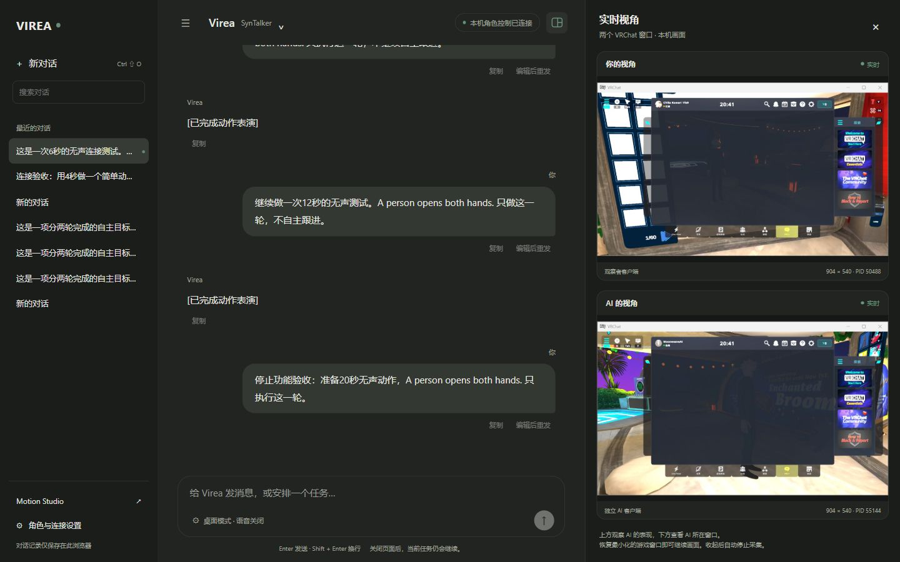

*2026-10-08 本机实拍；菜单、加载失败等均按游戏实际画面展示。这张图证明双窗口实时接入，不代表远端角色与语音已经验收通过。本地测试角色：Reira 的 Unnamed Character 6，非商业渲染并署名，不分发模型文件。*

本次修复验证：**Python 1,220 项验证通过、34 跳过；Web 162 项通过；TypeScript/Vite 构建通过**。完整 Python 运行中 1,219 项通过，唯一失败是 API 测试清单遗漏新增路由；补齐契约后，相关 API 集成测试 46 项复测全部通过。真实页面已验证在 SynTalker 生成中、MotionCraft 播放中切换，会话与历史保留。同一私有房间中，观察者实际看到 AI 鼓掌；SynTalker 鼓掌与 MotionCraft 挥手各运行 12 秒，并收到对应游戏参数回传。切换后确认 `VRCEmote=0`、`AI_Active=false`，动作已释放。精细手部／表情质量、任意生成骨骼播放与有声语音不在这些通过项内。VB-CABLE 已安装；公共区域静音要求保持生效，所有当前播放端点静音，桥接语音关闭。

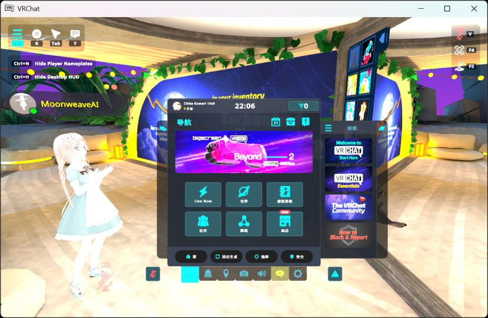

*2026-10-08，MotionCraft 任务执行期间的真实观察者截图。画面展示 SDK 鼓掌预设，不是模型生成骨骼的原样播放。角色：Unnamed Character 6，作者 Reira；非商业署名展示，不分发模型。*

<details>
<summary>恢复后的同房间双视角（2026-10-08）</summary>

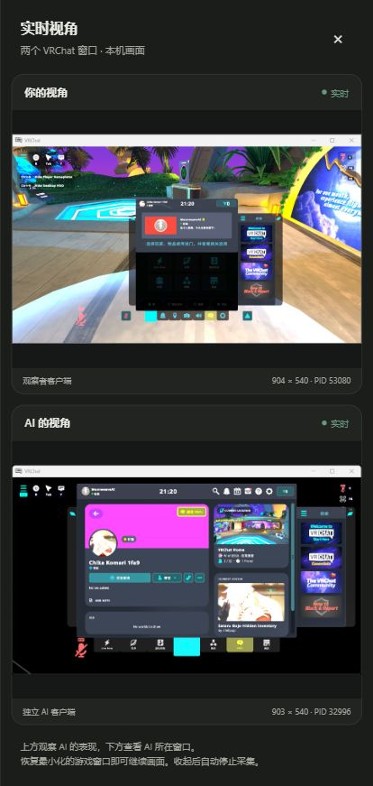

</details>

<!-- BEGIN UNIFIED_MOTION_DEMOS -->
## 单模型路线：16 个复杂任务 Demo

MotionCraft、SynTalker 各 8 段，分别按 **2 列 × 4 行** 排列。点击封面查看完整 MP4；音频来自用户提供的 `audio_reference_chu2.mp3` 与 `chu2.txt`，由 Audio8-TTS 克隆生成。录像为真实页面按正常速度回放，不包含准备等待。

这些是实际模型输出，**不代表所有动作意图都被准确执行或已通过主观自然度验收**：复杂走位、脚部接触和精细手势仍有限制。技术梗概、配置、实测等待时间和能力边界见[完整技术说明](doc/character/unified-motion.zh-CN.md)。

### MotionCraft

<table>
<tr>
<td width="50%" valign="top"><strong>角色介绍与迎宾</strong><br><a href="doc/assets/unified-motion-demos/motioncraft-01-introduction.mp4">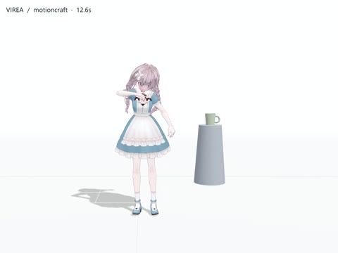</a><br><sub>32s · 6 段动作 · 2 段语音 · motioncraft + Audio8-TTS</sub></td>
<td width="50%" valign="top"><strong>热身教练</strong><br><a href="doc/assets/unified-motion-demos/motioncraft-02-warmup.mp4">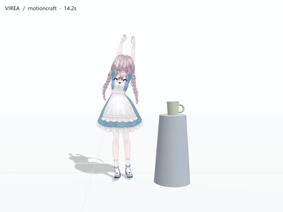</a><br><sub>36s · 6 段动作 · 2 段语音 · motioncraft + Audio8-TTS</sub></td>
</tr>
<tr>
<td width="50%" valign="top"><strong>花园故事表演</strong><br><a href="doc/assets/unified-motion-demos/motioncraft-03-story.mp4">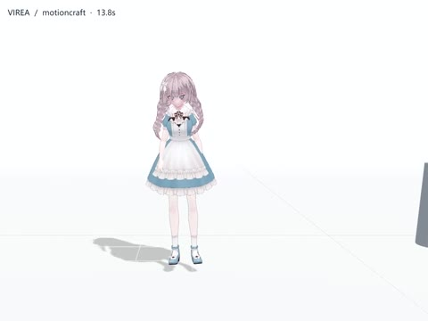</a><br><sub>35s · 6 段动作 · 2 段语音 · motioncraft + Audio8-TTS</sub></td>
<td width="50%" valign="top"><strong>舞步与节奏教学</strong><br><a href="doc/assets/unified-motion-demos/motioncraft-04-dance.mp4">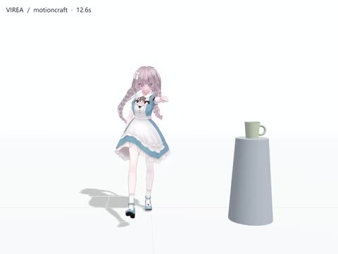</a><br><sub>32s · 6 段动作 · 2 段语音 · motioncraft + Audio8-TTS</sub></td>
</tr>
<tr>
<td width="50%" valign="top"><strong>服装展示与转身</strong><br><a href="doc/assets/unified-motion-demos/motioncraft-05-fashion.mp4">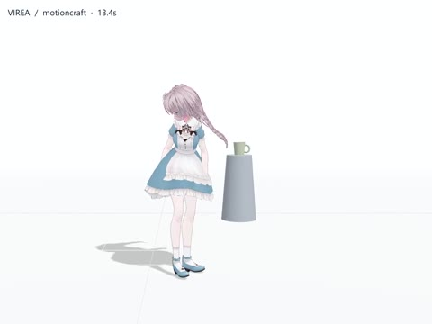</a><br><sub>34s · 7 段动作 · 2 段语音 · motioncraft + Audio8-TTS</sub></td>
<td width="50%" valign="top"><strong>从紧张到庆祝</strong><br><a href="doc/assets/unified-motion-demos/motioncraft-06-emotion.mp4">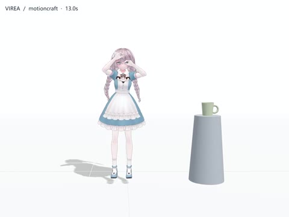</a><br><sub>33s · 6 段动作 · 2 段语音 · motioncraft + Audio8-TTS</sub></td>
</tr>
<tr>
<td width="50%" valign="top"><strong>边走边讲的导览</strong><br><a href="doc/assets/unified-motion-demos/motioncraft-07-tour.mp4">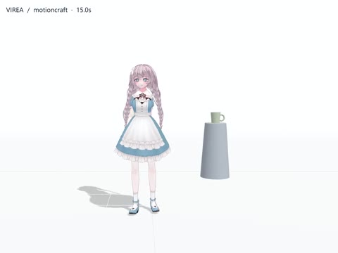</a><br><sub>38s · 6 段动作 · 2 段语音 · motioncraft + Audio8-TTS</sub></td>
<td width="50%" valign="top"><strong>拳击基础组合练习</strong><br><a href="doc/assets/unified-motion-demos/motioncraft-08-boxing.mp4">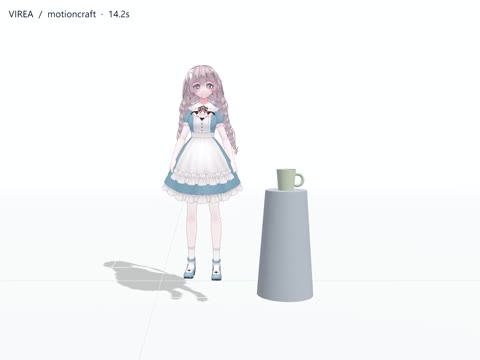</a><br><sub>36s · 7 段动作 · 2 段语音 · motioncraft + Audio8-TTS</sub></td>
</tr>
</table>

### SynTalker

<table>
<tr>
<td width="50%" valign="top"><strong>角色介绍与迎宾</strong><br><a href="doc/assets/unified-motion-demos/syntalker-01-introduction.mp4">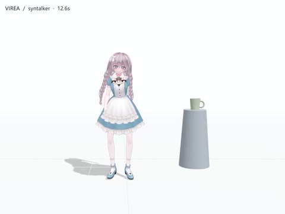</a><br><sub>32s · 6 段动作 · 2 段语音 · syntalker + Audio8-TTS</sub></td>
<td width="50%" valign="top"><strong>热身教练</strong><br><a href="doc/assets/unified-motion-demos/syntalker-02-warmup.mp4">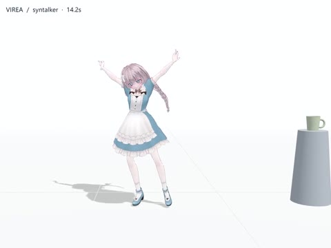</a><br><sub>36s · 6 段动作 · 2 段语音 · syntalker + Audio8-TTS</sub></td>
</tr>
<tr>
<td width="50%" valign="top"><strong>花园故事表演</strong><br><a href="doc/assets/unified-motion-demos/syntalker-03-story.mp4">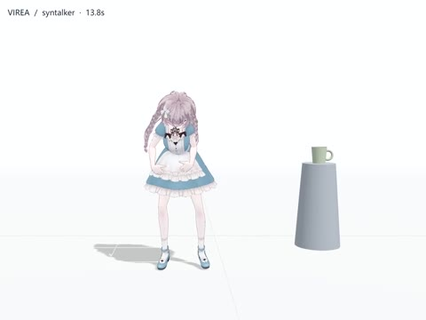</a><br><sub>35s · 6 段动作 · 2 段语音 · syntalker + Audio8-TTS</sub></td>
<td width="50%" valign="top"><strong>舞步与节奏教学</strong><br><a href="doc/assets/unified-motion-demos/syntalker-04-dance.mp4">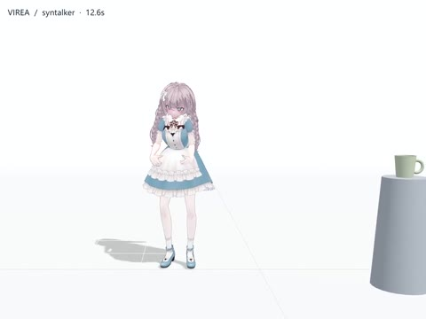</a><br><sub>32s · 6 段动作 · 2 段语音 · syntalker + Audio8-TTS</sub></td>
</tr>
<tr>
<td width="50%" valign="top"><strong>服装展示与转身</strong><br><a href="doc/assets/unified-motion-demos/syntalker-05-fashion.mp4">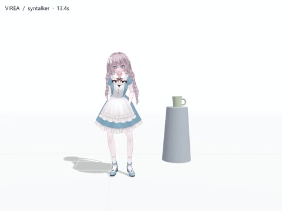</a><br><sub>34s · 7 段动作 · 2 段语音 · syntalker + Audio8-TTS</sub></td>
<td width="50%" valign="top"><strong>从紧张到庆祝</strong><br><a href="doc/assets/unified-motion-demos/syntalker-06-emotion.mp4">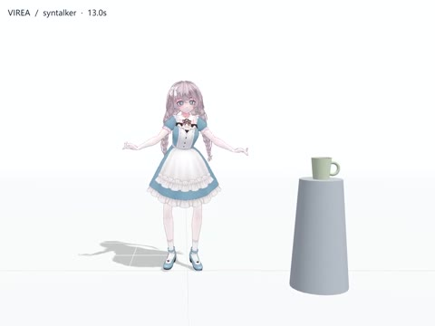</a><br><sub>33s · 6 段动作 · 2 段语音 · syntalker + Audio8-TTS</sub></td>
</tr>
<tr>
<td width="50%" valign="top"><strong>边走边讲的导览</strong><br><a href="doc/assets/unified-motion-demos/syntalker-07-tour.mp4">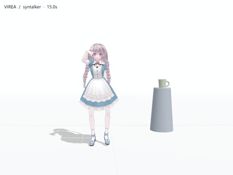</a><br><sub>38s · 6 段动作 · 2 段语音 · syntalker + Audio8-TTS</sub></td>
<td width="50%" valign="top"><strong>拳击基础组合练习</strong><br><a href="doc/assets/unified-motion-demos/syntalker-08-boxing.mp4">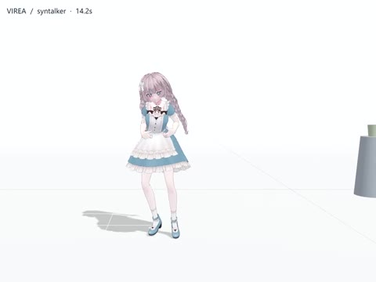</a><br><sub>36s · 7 段动作 · 2 段语音 · syntalker + Audio8-TTS</sub></td>
</tr>
</table>

[Video gallery](doc/assets/unified-motion-demos/index.html) · [Execution manifest](doc/assets/unified-motion-demos/manifest.json)

Avatar: Unnamed Character 6 — Reira. Source: `VRM-Model-1.vrm`.
<!-- END UNIFIED_MOTION_DEMOS -->

## Motion Studio 演示

以下为升级前使用 Kokoro 的历史录制；当前默认语音已改为 Audio8-TTS 0.6B，历史时延不代表新模型性能。

<!-- BEGIN CHARACTER_DEMOS -->
**8 段完整录制 · 两列四行。** 直接在下方播放，可通过播放器开启声音或进入全屏。模型自主编排，视频保留实际播放内的停顿；生成前等待另见实测。

<table>
<tr>
<td width="50%" valign="top"><strong>01 · 主持入场</strong><br>开场介绍 → 走位、转身与致意 → 邀请观众开始。<br><video src="https://github.com/user-attachments/assets/7c4006eb-5662-4c46-8697-df720d7d2e9b" controls width="100%"></video><br><sub>完整表演 · 39.2s</sub><br><sub>SentiAvatar ↔ ARDY · Kokoro</sub></td>
<td width="50%" valign="top"><strong>02 · 热身教练</strong><br>讲解要领 → 侧步与伸展示范 → 总结和鼓励。<br><video src="https://github.com/user-attachments/assets/6707f2ec-8708-435c-92f1-bc16db2e3573" controls width="100%"></video><br><sub>完整表演 · 42.3s</sub><br><sub>SentiAvatar ↔ ARDY · Kokoro</sub></td>
</tr>
<tr>
<td width="50%" valign="top"><strong>03 · 故事表演</strong><br>讲述雨后花园 → 无声寻找与发现 → 温暖结局。<br><video src="https://github.com/user-attachments/assets/0d4e9132-0ebe-41f9-b0af-a43612a20026" controls width="100%"></video><br><sub>完整表演 · 54.6s</sub><br><sub>SentiAvatar ↔ ARDY · Kokoro</sub></td>
<td width="50%" valign="top"><strong>04 · 舞步教学</strong><br>节奏与重心讲解 → 即兴舞步组合 → 常见错误点评。<br><video src="https://github.com/user-attachments/assets/1260333b-e3bc-4c8a-b017-a853a5236c78" controls width="100%"></video><br><sub>完整表演 · 49.9s</sub><br><sub>SentiAvatar ↔ ARDY · Kokoro</sub></td>
</tr>
<tr>
<td width="50%" valign="top"><strong>05 · 服装展示</strong><br>介绍搭配与材质 → 台步、转身与换姿势 → 表达心情。<br><video src="https://github.com/user-attachments/assets/5813e082-8c10-4b98-b369-ed1d321ed98c" controls width="100%"></video><br><sub>完整表演 · 51.6s</sub><br><sub>SentiAvatar ↔ ARDY · Kokoro</sub></td>
<td width="50%" valign="top"><strong>06 · 情绪转折</strong><br>回应不安 → 身体动作表达庆祝 → 温暖地收尾。<br><video src="https://github.com/user-attachments/assets/9fedd92d-179b-4388-a4fc-a05de5c7a5ae" controls width="100%"></video><br><sub>完整表演 · 32.2s</sub><br><sub>SentiAvatar ↔ ARDY · Kokoro</sub></td>
</tr>
<tr>
<td width="50%" valign="top"><strong>07 · 行走导览</strong><br>介绍入口作品 → 边走边讲、转身示意 → 总结主题。<br><video src="https://github.com/user-attachments/assets/9fd17b2d-9e5b-473c-9a02-772050581b72" controls width="100%"></video><br><sub>完整表演 · 55.3s</sub><br><sub>SentiAvatar ↔ ARDY · Kokoro</sub></td>
<td width="50%" valign="top"><strong>08 · 拳击练习</strong><br>讲解站姿与守势 → 直拳、闪避与恢复 → 呼吸和节奏总结。<br><video src="https://github.com/user-attachments/assets/e15d77f0-649d-4b88-adfc-4d40d6f8ef88" controls width="100%"></video><br><sub>完整表演 · 48.1s</sub><br><sub>SentiAvatar ↔ ARDY · Kokoro</sub></td>
</tr>
</table>

[任务、实测与已知限制](doc/character/showcase.zh-CN.md) · [双列视频画廊](doc/assets/character-demos/index.html)（本地 HTTP 打开） · [执行清单](doc/assets/character-demos/manifest.json)
<!-- END CHARACTER_DEMOS -->

## 现在的系统如何工作

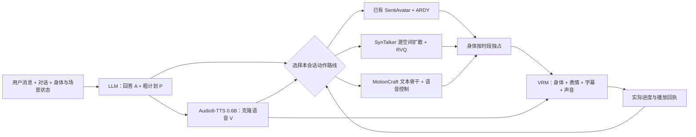

| 层次 | 职责 |
|---|---|
| 对话理解 | 根据对话组织台词、行为意图与先后关系。 |
| 规划 | 已有路线保持粗粒度活动执行；新路线分别编排动作段与语音片段的时间。 |
| 生成 | 保留原生窗口历史。新路线准备完整表演后播放，当前不宣称低延迟在线流式能力。 |
| 呈现与反馈 | 一个身体驱动源、独立的发言时机、连续采样时钟和可检查的执行链。 |
| 运行基础 | 隔离模型环境，保留原生身份，经 Motion IR 重定向到真实 VRM。 |

实现与实测见[粗粒度活动执行](doc/character/coarse-activity-execution.zh-CN.md)和[动作窗口连续播放](doc/character/window-continuity.zh-CN.md)。

模型资产依然独立于操作系统：用户选择执行域，VIREA 为该域构建或复用 Runtime。
模型安装、生成、重定向与验证的完整工作流仍保留在下方入口。

## 从这里开始

| 你的目标 | 中文文档 | English documentation |
|---|---|---|
| 从 clone 到第一个结果 | [中文教程](doc/getting-started.zh-CN.md) | [English tutorial](doc/getting-started.en.md) |
| 部署持续对话的三维角色 | [角色架构与部署](doc/character/README.zh-CN.md) | [Character sessions](doc/character/README.en.md) |
| 查看每个 CLI 命令和参数 | [中文 CLI 参考](doc/reference/cli.zh-CN.md) | [English CLI reference](doc/reference/cli.en.md) |
| 选择 Windows、Linux、WSL2 或 macOS 执行域 | [平台指南](doc/platforms/README.zh-CN.md) | [Platform guide](doc/platforms/README.en.md) |
| 选择模型、Runtime 与资源 profile | [模型目录](doc/models/README.zh-CN.md) | [Model catalog](doc/models/README.zh-CN.md) |
| 更新另一台已经部署过的设备 | [保留模型的升级步骤](doc/getting-started/persistent-data-root.zh-CN.md#更新另一台已经部署过的设备) | [Update without redownloading](doc/getting-started/persistent-data-root.en.md#update-another-device-that-is-already-deployed) |
| 排查本地安装、状态或资源问题 | [排错指南](doc/operations/troubleshooting.zh-CN.md) | [Troubleshooting summary](doc/getting-started.en.md#8-advanced-troubleshooting-and-safe-maintenance) |
| 维护文档 | [文档规范](doc/development/documentation.zh-CN.md) | [Documentation policy](doc/development/documentation.en.md) |

## 先决条件

- Git；
- Python 3.12（项目声明 Python 3.10+，开发基线见 `.python-version`）；
- [uv](https://docs.astral.sh/uv/)；
- Node.js 24（见 `.node-version`）、npm 与 pnpm 10；
- 运行 GPU Runtime 时，目标执行域必须具备该 Runtime 声明的驱动、ABI、总显存和总物理内存容量。

安装/部署能力按设备**总 RAM/VRAM**判断，不会因为桌面、浏览器或其他程序暂时占用内存就把硬件判为不支持；
当前可用 RAM/VRAM 仍会记录为实时观测，并在多张合格 GPU 之间用于选择更空闲的设备。swap/pagefile 与磁盘
仍按当前可用量检查。某 Runtime 若没有实现当前执行域，就不会出现在可选 Runtime 列表中。PRISM 当前在
Windows 与 Linux/WSL 均提供 CUDA component-split Runtime；96 GiB 总 RAM 是无合格 GPU 时 CPU fallback 的要求，
不是 Windows 的唯一部署路径。

## 最短可复现路径

下面每行都可以复制执行。尖括号内容是你必须替换的占位符；不要把模型、缓存、日志或虚拟环境写进 checkout。
输入数据根前请先看[数据根路径与引号规则](doc/getting-started/persistent-data-root.zh-CN.md)：Windows 复制路径时外层引号不属于路径。

### Windows PowerShell

```powershell
# 列出本机文件系统卷和可用空间，再选择容量充足的数据盘。
Get-PSDrive -PSProvider FileSystem

# 一次性读取所选数据盘根路径；clone 与所有本地依赖目录都放在它下面。
# 提示处只粘贴目录本身，例如 X:\VIREA-DATA；外层单/双引号不是路径内容，不能输入。
$vireaDataVolume = Read-Host "输入所选数据盘的根路径"

# 如有需要先创建根目录，在其中 clone 源码，再进入 clone；源码不含模型权重。
New-Item -ItemType Directory -Force -Path $vireaDataVolume | Out-Null
Set-Location $vireaDataVolume
git clone https://github.com/Moonweave-AI/virea.git
Set-Location virea

# 持久写入 VIREA_HOME、UV_PROJECT_ENVIRONMENT、UV_CACHE_DIR、HF_HOME 与 Node 缓存；当前与以后 Windows 终端都会继承。
& .\scripts\configure-virea.ps1 -DataRoot $vireaDataVolume

# 按 uv.lock 创建所有 Python workspace 包和开发依赖；--locked 禁止重新解析版本。
uv sync --locked --all-packages --extra dev

# 按 package-lock.json 安装旧 Viewer 的 Node 依赖；不要用 npm install 替换它。
npm ci

# 按 pnpm-lock.yaml 安装 Web workspace；--frozen-lockfile 禁止改写锁文件。
pnpm install --frozen-lockfile

# 编译浏览器控制台到 apps/web/dist；不会启动服务或下载模型。
pnpm --filter @virea/web build

# 启动逐步交互向导：初始化状态、检测执行域、选择模型/Runtime/profile、确认安装，然后提供生成与浏览器播放。
uv run virea
```

向导会恢复上次模型/执行环境，逐模型显示 `未安装`、`需处理` 或验证后的 `READY`，并在环境匹配时复用
现有部署而不重复下载。安装与生成显示真实阶段进度和紧凑结果，不倾倒 RAW JSON；第三方下载、重建与文件数
进度会汇入 VIREA 的唯一动态行，不再滚动刷屏。验收失败时，真实错误与失败阶段会排在“下载成功”消息之前。
重定向输出时只记录第一次、每 15 秒至多一次以及最后一次下载快照。
完整证据仍保存在数据根。

### Linux / WSL2 / macOS shell

```bash
# 一次性读取已挂载的数据盘根路径；clone 与所有本地依赖目录都放在它下面。
# 提示处只粘贴目录本身，例如 /mnt/virea-data；外层单/双引号不是路径内容，不能输入。
printf '%s' "输入所选数据盘根路径: "
read -r virea_data_root

# 如有需要先创建根目录，在其中 clone 源码，再进入 clone。
mkdir -p "$virea_data_root"
cd "$virea_data_root"
git clone https://github.com/Moonweave-AI/virea.git
cd virea

# 创建 VIREA 目录并安装 shell hook；之后新终端会自动继承所有持久目录设置。
./scripts/configure-virea.sh --data-root "$virea_data_root"

# 立即在当前 shell 载入生成的设置；以后 shell 将通过已安装的 hook 自动载入。
. "${XDG_CONFIG_HOME:-$HOME/.config}/virea/environment.sh"

# 按锁文件安装 Python、Node/Viewer 与 Web 依赖，并构建 Web 静态资源。
uv sync --locked --all-packages --extra dev
npm ci
pnpm install --frozen-lockfile
pnpm --filter @virea/web build

# 启动逐步交互向导：初始化状态、检测执行域、选择模型/Runtime/profile、确认安装，然后提供生成与浏览器播放。
uv run virea
```

保存项可直接按 Enter 复用；设置 `NO_COLOR=1` 或重定向输出时，动态配色/进度会自动降级为等价纯文本。

## 高级：手动选择执行域并安装模型

从 `doctor --json` 的 `execution_domains` 读取 canonical ID：`windows-native`、`linux-native`、
`macos-native` 或准确的 `wsl:<distribution>`。多域机器上必须显式选择；失败不会静默切换到另一系统。

```bash
# 显示模型清单。--json 输出机器可读 JSON；不安装或下载任何内容。
uv run virea model list --json

# 查看一个模型在每个执行域中的 Runtime、profile、资源与许可要求。
uv run virea model info flood-diffusion-tiny

# 先输出安装计划。MODEL、DOMAIN、RUNTIME、PROFILE 必须替换为 doctor/model info 给出的值。
uv run virea model install MODEL --execution-domain DOMAIN --runtime RUNTIME --resource-profile PROFILE --virea-home "$VIREA_HOME"

# 在确认计划后才添加 --apply；它可能下载或引用模型资产、构建隔离 Runtime 并运行安装验收。
uv run virea model install MODEL --execution-domain DOMAIN --runtime RUNTIME --resource-profile PROFILE --apply --virea-home "$VIREA_HOME"

# 只读检查最新安装是否仍为 READY，且资产与验收记录可访问。
uv run virea model verify MODEL --virea-home "$VIREA_HOME"
```

完整命令、占位符和每个选项的含义在[中文 CLI 参考](doc/reference/cli.zh-CN.md)与
[English CLI reference](doc/reference/cli.en.md)。

## 高级：手动运行、生成与播放

```bash
# 使用已经 READY 的同一执行域 Runtime 提交一个文本到动作任务；--timeout 单位为秒，最大 7200。
uv run virea generate --model MODEL --execution-domain DOMAIN --runtime RUNTIME --resource-profile PROFILE --task text_to_motion --prompt "A person walks forward" --seconds 4 --fps 20 --seed 42 --timeout 1800 --virea-home "$VIREA_HOME"

# 启动只绑定本机回环地址的控制面；--port 是浏览器访问端口。
uv run virea serve --host 127.0.0.1 --port 8000 --virea-home "$VIREA_HOME"
```

然后打开规范入口 `http://127.0.0.1:8000/`。它会进入唯一的新 Motion Studio；动作生成与诊断位于同一工作台，
同一个不可变结果会并排播放“模型输出、尚未做 VRM 重定向的源骨架”和“重定向后的最终 VRM/VRMA”。CLI 的模型
部署与结果会从持久状态自动同步。加载本地 `.vrm` Avatar 即可。
在启动服务的终端按 `Ctrl+C` 才会停止 Web 服务；只关闭浏览器标签页不会停止服务。正常停止会取消进行中的
任务、终止 Worker 及其子进程树并释放资源锁；若终端异常崩溃，下次启动会先按持久化进程身份回收可验证的孤儿 Worker。

## 能力、实测和发布不是同一件事

- `Runtime` 的平台声明表示已锁定、可解析的实现，不等于该模型已在所有设备上完成推理；
- 观测证据只说明某个 model/runtime/domain/device 组合运行过，不能外推到其他系统或 GPU；
- 当前公共/商业 GA 仍受许可证、第三方资产、平台实测和发布治理门禁约束。请查看
  [发布验收](doc/refactor/RELEASE_ACCEPTANCE_0.4.0.md)和
  [状态语义](doc/reference/status-semantics.zh-CN.md)。

## 维护与贡献

运行 `python scripts/generate_docs.py --check`、`python scripts/check_docs.py` 和相关测试，确保文档表格和链接
没有漂移。贡献约定见 [CONTRIBUTING.md](CONTRIBUTING.md)，安全报告见 [SECURITY.md](SECURITY.md)，第三方条款见
[THIRD_PARTY_NOTICES.md](THIRD_PARTY_NOTICES.md)。
