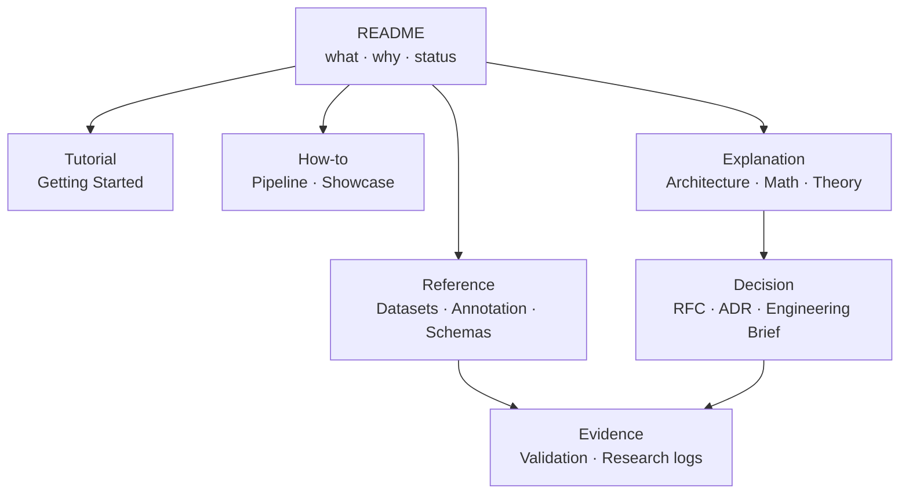

# VIREA Documentation

### 从第一次启动到可重放的 canonical v3 证据

[Getting Started](getting-started.zh-CN.md) · [Pipeline](pipeline.zh-CN.md) · [Retarget Math](math-retarget/README.zh-CN.md) · [Validation](validation.zh-CN.md) · [Showcase](showcase/README.md)

> [!IMPORTANT]
> 本文档体系严格区分四类信息：**已批准的契约**、**当前工作树实现**、**带日期的验证证据**和**仍待研究的假设**。RFC / ADR 处于 `Proposed` 状态时，即使代码已经实现，也不会自动视为 `Accepted`；旧截图和旧测试数字也不自动构成当前证据。

## 选择你的路径

<table>
  <tr>
    <td width="33%"><strong>第一次使用</strong> <a href="getting-started.zh-CN.md">Getting Started</a> 安装、空壳 Viewer、local-only demo、full raw current-v3。</td>
    <td width="33%"><strong>运行与处理</strong> <a href="pipeline.zh-CN.md">Pipeline 使用指南</a> 数据路径、批处理、Viewer 启动、版本化重建与排错。</td>
    <td width="33%"><strong>查看结果</strong> <a href="showcase/README.md">Showcase</a> 七数据集画廊、证据范围与公开许可边界。</td>
  </tr>
  <tr>
    <td><strong>理解数学</strong> <a href="math-retarget/README.zh-CN.md">Retarget 共同层</a> 坐标、时间、quaternion、FK、211D 张量与手部 solver。</td>
    <td><strong>接入数据</strong> <a href="dataset-audit.zh-CN.md">七数据集审计</a> 来源定义、数组 shape、FPS、单位、basis 与 profile 边界。</td>
    <td><strong>审查交付</strong> <a href="validation.zh-CN.md">分层验收清单</a> source、solver、artifact、Reader、VRM、性能与媒体许可。</td>
  </tr>
</table>

## 文档地图

**推荐阅读顺序：** 先通过 Tutorial 完成一次本地运行；需要执行任务时查 How-to；需要准确字段定义时查 Reference；理解设计理由时读 Explanation；争议与长期契约查 Decision；任何"已验证"的声明回到 Evidence 核实。

## Tutorial

| 文档 | 适合谁 | 完成后得到什么 |
|---|---|---|
| [Getting Started](getting-started.zh-CN.md) | 第一次 clone 的用户 | 能区分 UI 安装成功、legacy demo 与 current v3 三种状态 |

## How-to

| 文档 | 任务 |
|---|---|
| [Pipeline 使用指南](pipeline.zh-CN.md) | 安装、数据路径配置、批处理、Viewer 启动、版本化重建与排错 |
| [Showcase](showcase/README.md) | 七数据集画廊、证据范围与媒体发布条件 |
| [SuSu 专项审计](susu-pipeline-audit.zh-CN.md) | 区分 official columns/local 与本地变体，执行 fail-closed 校准 |

## Reference

| 文档 | 权威范围 |
|---|---|
| [Annotation 与 Viewer 契约](annotation-viewer.zh-CN.md) | annotation 结构、时间区间、channel、body anchor 与 Viewer 行为 |
| [七数据集审计](dataset-audit.zh-CN.md) | 原生定义、实际数组、上游转换、当前 profile 与缺口 |
| [`schemas/`](../schemas) | JSON Schema 的公共字段与版本；机器可验证的事实源 |
| [参考资料](references.zh-CN.md) | 一手论文、官方规范、官方仓库与固定工程依据 |
| [公式审查清单](math-retarget/review-checklist.zh-CN.md) | Markdown 公式、数组和代码的对码规则 |

## Explanation

| 文档 | 解释的问题 |
|---|---|
| [工程设计](engineering-design.zh-CN.md) | Adapter、Profile、Codec、Retarget、Solver、Artifact、Reader、Viewer 的分层理由 |
| [Retarget 数学共同层](math-retarget/README.zh-CN.md) | 统一坐标系、rotation 约定、FK、211D 张量、可观测性与 canonical v3 |
| [理论与目标](theory.zh-CN.md) | VRM-native 目标、非目标与长期边界 |

### 五类 source retarget 路径

| Source family | 数据集 | 文档 | 进入 canonical 的路径 |
|---|---|---|---|
| SMPL / SMPL-H | AMASS、BABEL | [SMPL-H → VRM](math-retarget/smplh-to-vrm.zh-CN.md) | body direct rotation；未标定 hands 走显式 neutral policy |
| SMPL-X family | GRAB、Motion-X | [SMPL-X → VRM](math-retarget/smplx-to-vrm.zh-CN.md) | fullpose decode；未标定 hands 不直写 target |
| 75-joint BVH | BEAT | [BVH / BEAT → VRM](math-retarget/bvh-to-vrm.zh-CN.md) | hierarchy FK → body22 + hands30 joint-centre evidence |
| HumanML3D 263D | HumanML3D | [263D → VRM](math-retarget/humanml3d-263d-to-vrm.zh-CN.md) | official RIC positions → position fitting |
| Body/hand 6D | SuSuInterActs | [SuSu → VRM](math-retarget/susu-to-vrm.zh-CN.md) | 原生 63 centres 或 MTA63 FK → joint-centre evidence |

目标 Avatar 的 normalized pose、VRM0/VRM1 alignment 与 three-vrm 契约见 [VRM/glTF 目标层](math-retarget/vrm-gltf-target.zh-CN.md)。

## Decision records

| 状态 | 文档 | 决定范围 |
|---|---|---|
| Accepted | [RFC-0001](rfcs/0001-annotation-time-retarget-v1.zh-CN.md) | Annotation、时间、迁移和 retarget v1 基线 |
| Accepted | [ADR-0001](adrs/0001-versioned-motion-semantics-and-artifacts.zh-CN.md) | 版本化语义与自包含 artifact |
| Proposed | [RFC-0002](rfcs/0002-constraint-aware-hand-retarget-v1.zh-CN.md) | 七库统一 HandEvidence 与约束求解 |
| Proposed | [ADR-0002](adrs/0002-canonical-v3-constrained-hand-retarget.zh-CN.md) | canonical v3 单轨输出、证书与 Viewer 零修正 |
| In review | [Engineering Brief](engineering-briefs/constraint-aware-hand-retarget-v1.zh-CN.md) | 机制、风险、不变量、测试和 rollout 方案 |

## Evidence 与研究

| 文档 | 状态 | 用途 |
|---|---|---|
| [分层验收清单与当前证据](validation.zh-CN.md) | Current | 当前回归数字、Stop-Ship 与 Release No-Go 的唯一摘要入口 |
| [手指重定向根因研究](research/finger-retarget-root-cause-2026-08-09.zh-CN.md) | Current research | target-runtime、source geometry、solver 与不可观测性的真实反例 |
| [姿态重定向真实核验 2026-08-08](research/pose-retarget-validation-2026-08-08.zh-CN.md) | Historical | canonical v3 之前的分层轴向/FK 证据；不可作为当前完成声明 |
| [Source Authority Review](research/source-authority-review.zh-CN.md) | Superseded | 前期一手来源审计，由后续真实验证继承 |

## 维护规则

| 事实类型 | 权威来源 |
|---|---|
| 字段定义 | JSON Schema |
| 当前代码行为 | 当前分支实现与可失败测试 |
| 数学事实 | [Retarget 数学共同层](math-retarget/README.zh-CN.md) |
| 架构事实 | [工程设计](engineering-design.zh-CN.md) |
| 治理状态 | RFC / ADR 的显式状态标签 |
| 当前证据 | [验收清单](validation.zh-CN.md) 中的带日期记录 |
| 历史记录 | 旧报告保留不覆盖，标记 Historical / Superseded 并指向继任文档 |
| 发布状态 | IP decision 与 release review；文件存在、测试通过或公开可见都不等于获得许可 |

贡献规则见 [CONTRIBUTING.md](../CONTRIBUTING.md)，漏洞与敏感数据报告见 [SECURITY.md](../SECURITY.md)，第三方材料见 [THIRD_PARTY_NOTICES.md](../THIRD_PARTY_NOTICES.md)。

<!--
---
type: index
status: Active
owner: "@Joker-of-Gotham"
created: 2026-08-08
updated: 2026-08-10
last_reviewed: 2026-08-10
review_cycle_days: 30
title: VIREA Documentation
audience: Users, implementers, reviewers, and researchers
visibility: Public
summary: 按 Tutorial、How-to、Reference、Explanation、Decision 与 Evidence 组织的 VIREA 唯一文档入口。
canonical: doc/README.zh-CN.md
related:
  - ../README.md
  - getting-started.zh-CN.md
  - engineering-design.zh-CN.md
  - validation.zh-CN.md
  - showcase/README.md
supersedes: []
superseded_by: []
---
-->
