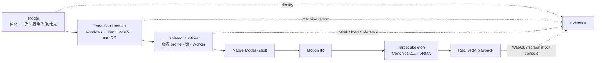

<div align="center">

# VIREA 文档中心

> [中文](README.zh-CN.md) · [English documentation hub](README.en.md)

### 从环境检测、真实模型安装和 Motion IR，到可审计的 VRMA 浏览器播放

[从 clone 开始](getting-started.zh-CN.md) ·
[CLI 参数参考](reference/cli.zh-CN.md) ·
[选择模型](models/README.zh-CN.md) ·
[部署平台](platforms/README.zh-CN.md) ·
[排查问题](operations/troubleshooting.zh-CN.md) ·
[验收证据](quality/production-e2e.zh-CN.md)

</div>

> [!IMPORTANT]
> 文档严格区分产品目标、Runtime 声明、当前实现和带机器身份的实测证据。模型或平台出现在表格中，
> 不自动等于已安装、已实测、可公开再分发或达到 `supported`。

六模型 manifest 保留此前有界 `integrated_experimental`，`supported = 0`；但旧 validated evidence /
validator `v1.0.0` 已被当前 `v1.1.0` policy 判定失效，新的 5 条 Windows-native 与 1 条 PRISM WSL
Ubuntu 24.04 全链正在重采集。在新 record 写入 registry 前，当前有效 `passed` 数量为 0，不能复用旧 result
或预填 ID。最终冻结树的完整测试与 fresh release artifact 仍待重跑，公开 GA 为 No-Go。

仓库当前没有统一的项目代码 `LICENSE`。各目录、Runtime、Web bundle、模型 integration 和媒体可能具有
不同的第三方条款；[`THIRD_PARTY_NOTICES.md`](../THIRD_PARTY_NOTICES.md) 及分目录 notice 只说明来源与
边界，不给整个项目授予统一开源或商业许可。贡献入口见 [CONTRIBUTING](../CONTRIBUTING.md)，安全报告见
[SECURITY](../SECURITY.md)。

## 选择你的路径

| 目标 | 从这里开始 | 完成标志 |
|---|---|---|
| 第一次生成动作 | [安装](getting-started/installation.zh-CN.md) → [首次生成](getting-started/first-generation.zh-CN.md) | 得到绑定模型、Runtime、原生骨骼和目标骨骼的真实结果 |
| 在 Avatar 上播放 | [浏览器播放](getting-started/browser-playback.zh-CN.md) | Avatar 完整可见、动画时钟推进、控制台零错误 |
| 选择正确模型 | [模型目录](models/README.zh-CN.md) → [生成矩阵](models/support-matrix.generated.md) | 明确 task、原生 skeleton/representation、资源和许可边界 |
| 部署 Windows / Linux / WSL2 / macOS | [执行域指南](platforms/README.zh-CN.md) → [平台矩阵](platforms/support-matrix.generated.md) | detector、builder、Worker 在同一目标域运行 |
| 显存不足时选择 RAM/CPU 路径 | [资源准入](operations/runtime-data-and-retention.zh-CN.md) | Runtime 选中 Worker 真正实现的 profile，或在下载前给出可操作拒绝原因 |
| 接入新模型 | [模型适配指南](development/model-adapter.zh-CN.md) | manifest、runtime、native contract、adapter、真实 production acceptance 同步 |
| 审查发布声明 | [Production E2E](quality/production-e2e.zh-CN.md) → [发布验收](refactor/RELEASE_ACCEPTANCE_0.4.0.md) | 每项声明都能回到不可变 job/result/产物与浏览器证据 |
| 维护文档 | [文档规范](development/documentation.zh-CN.md) | 全 Markdown 元数据、链接和生成表门禁通过 |

## 核心心智模型



- **Model** 定义生成任务、固定上游、原生 skeleton/representation 和精确验收请求。
- **Execution Domain** 定义 detector、builder、Python、Worker 和硬件事实实际位于哪里。
- **Result** 保留 model/runtime/checkpoint 和 native → target 身份，不用模糊文件名覆盖差异。
- **Evidence** 证明某个明确环境跑过某条链；它不能由客户端布尔自报，也不能从平台声明推断。

## Tutorial

| 文档 | 内容 |
|---|---|
| [安装与环境检测](getting-started/installation.zh-CN.md) | checkout 外环境、`VIREA_HOME`、setup、doctor、资源准入 |
| [数据根与路径引号](getting-started/persistent-data-root.zh-CN.md) | 一次配置、Windows 复制路径、空格、引号与后续终端继承 |
| [第一次真实生成](getting-started/first-generation.zh-CN.md) | model install/verify、exact request、结果与 artifact |
| [真实 Avatar 播放](getting-started/browser-playback.zh-CN.md) | Web、VRM、VRMA、可见帧和浏览器证据 |
| [完整入门与运维命令](getting-started.zh-CN.md) | 0.4.0 CLI/API 的较完整任务索引与恢复路径 |

## How-to 与运维

| 文档 | 任务 |
|---|---|
| [Runtime 数据与保留策略](operations/runtime-data-and-retention.zh-CN.md) | 外部目录、缓存、日志、失败 staging、清理与恢复 |
| [Troubleshooting](operations/troubleshooting.zh-CN.md) | detector、资源、下载、runtime、Worker、结果和 Viewer 故障 |
| [数据与 canonical 管线](pipeline.zh-CN.md) | legacy dataset adapter、批处理、artifact 和 Viewer 路径 |
| [Showcase](showcase/README.md) | 七数据集 retarget 画廊及媒体许可边界 |
| [SuSu 专项审计](susu-pipeline-audit.zh-CN.md) | official/local profile、轴向、单位和 fail-closed 校准 |

## Reference

| 文档或目录 | 权威范围 |
|---|---|
| [模型目录](models/README.zh-CN.md) | 模型身份、状态维度与 per-model 文档 |
| [模型支持矩阵](models/support-matrix.generated.md) | manifest 生成的 task、骨骼、表示、Runtime 与资源摘要 |
| [平台目录](platforms/README.zh-CN.md) | Windows、Linux、WSL2、macOS 执行域定义 |
| [平台支持矩阵](platforms/support-matrix.generated.md) | Runtime 声明与平台级 evidence 边界 |
| [状态语义](reference/status-semantics.zh-CN.md) | `registered`、`runnable_upstream`、`integrated_experimental`、`supported` 等精确定义 |
| [`packages/contracts/schemas/`](../packages/contracts/schemas) | Model、Runtime、Worker、Result、Motion IR、VRM、Machine JSON Schema |
| [`registries/`](../registries) | Runtime、骨骼、表示、bundle 与执行目标机器事实 |
| [Annotation / Viewer](annotation-viewer.zh-CN.md) | annotation、时间区间、channel 与 Viewer 行为 |
| [数据集审计](dataset-audit.zh-CN.md) | 七数据集来源、shape、FPS、单位与 profile |
| [官方参考资料](references.zh-CN.md) | 论文、规范、官方仓库与固定工程依据 |

## Explanation：动作数学与系统设计

| 文档 | 解释的问题 |
|---|---|
| [工程设计](engineering-design.zh-CN.md) | Adapter、Profile、Codec、Retarget、Artifact、Reader 和 Viewer 分层 |
| [Retarget 数学共同层](math-retarget/README.zh-CN.md) | 坐标、quaternion、FK、Canonical211 与可观测性 |
| [SMPL-H → VRM](math-retarget/smplh-to-vrm.zh-CN.md) | SMPL/SMPL-H body 与 hand policy |
| [SMPL-X → VRM](math-retarget/smplx-to-vrm.zh-CN.md) | fullpose、expression 与目标映射 |
| [BVH / BEAT → VRM](math-retarget/bvh-to-vrm.zh-CN.md) | hierarchy FK 与 joint-centre evidence |
| [HumanML3D 263D → VRM](math-retarget/humanml3d-263d-to-vrm.zh-CN.md) | official RIC 与 position fitting |
| [SuSu → VRM](math-retarget/susu-to-vrm.zh-CN.md) | body/hand 6D、root delta 与 MTA63 |
| [VRM/glTF 目标层](math-retarget/vrm-gltf-target.zh-CN.md) | normalized pose、VRM0/1、VRMA rest hips 与 Viewer |
| [理论与非目标](theory.zh-CN.md) | VRM-native 产品目标和长期边界 |

## Decision records

| 状态 | 文档 | 决定范围 |
|---|---|---|
| Accepted | [RFC-0001](rfcs/0001-annotation-time-retarget-v1.zh-CN.md) | Annotation、时间、迁移和 retarget v1 |
| Proposed | [RFC-0002](rfcs/0002-constraint-aware-hand-retarget-v1.zh-CN.md) | 七库统一 HandEvidence 与约束求解 |
| Accepted | [RFC-0003](rfcs/0003-virea-0.3-multi-model-refactor.zh-CN.md) | 0.3 多包、多模型隔离、Motion IR 与迁移边界 |
| Accepted | [ADR-0001](adrs/0001-versioned-motion-semantics-and-artifacts.zh-CN.md) | 版本化动作语义与自包含 artifact |
| Proposed | [ADR-0002](adrs/0002-canonical-v3-constrained-hand-retarget.zh-CN.md) | canonical v3 与约束手部重定向 |
| Accepted | [ADR-0003](adrs/0003-multi-package-isolated-model-runtimes.zh-CN.md) | monorepo、核心无模型依赖、独立 Worker |
| Accepted | [ADR-0004](adrs/0004-execution-domain-routing.zh-CN.md) | Windows/Linux/WSL2/macOS 执行域路由 |
| Accepted | [ADR-0005](adrs/0005-retire-vmf-stage1.zh-CN.md) | 退役历史训练支线并保留共享动作数学 |

## Evidence 与研究

| 文档 | 用途 |
|---|---|
| [Production E2E 合同](quality/production-e2e.zh-CN.md) | doctor → install → exact inference → Motion IR → VRMA → browser 的完整证明 |
| [Production browser evidence](quality/production-browser-evidence.zh-CN.md) | fresh Web job、真实 Viewer observation 与后端不可变状态绑定 |
| [0.4.0 QA 计划](refactor/QA_PLAN.md) | 软件、模型、平台、packaging 与浏览器分层门禁 |
| [0.4.0 发布验收](refactor/RELEASE_ACCEPTANCE_0.4.0.md) | 当前范围的 Go/No-Go 与精确证据 |
| [WP00–WP15 映射](refactor/WP00_WP15_IMPLEMENTATION_MAP.md) | 原规划到当前实现的逐项状态 |
| [首波模型目录](model-catalog/first-wave-2026-08-20.zh-CN.md) | 2025–2026 候选、固定上游与接入边界 |
| [Motion generation 总 registry](model-catalog/motion-generation-registry-2026-08-20.zh-CN.md) | 用户提供快照的只读归档 |
| [PRISM 模型页](models/prism.zh-CN.md) | PRISM 技术部署、资产与发行边界 |
| [PRISM 官方接入审计](research/prism-official-integration-audit-2026-08-21.zh-CN.md) | 固定上游、补齐资产和真实部署证据 |
| [ACMDM 官方接入审计](research/acmdm-official-integration-audit-2026-08-21.zh-CN.md) | 官方 checkpoint 与 adapter/Worker 合同 |

## 文档维护

文档的字段、状态和平台表由 manifest、RuntimeSpec、registry 与 evidence 生成；不要手工复制同一事实。

```text
python scripts/generate_docs.py --check
python scripts/check_docs.py
python -m pytest tests/test_docs.py tests/test_generated_documentation.py -q
```

新增或改写 Markdown 前阅读 [文档设计规范](development/documentation.zh-CN.md)。新增模型阅读
[模型适配指南](development/model-adapter.zh-CN.md)。贡献、安全与第三方条款分别见
[CONTRIBUTING](../CONTRIBUTING.md)、[SECURITY](../SECURITY.md) 和
[THIRD_PARTY_NOTICES](../THIRD_PARTY_NOTICES.md)。
