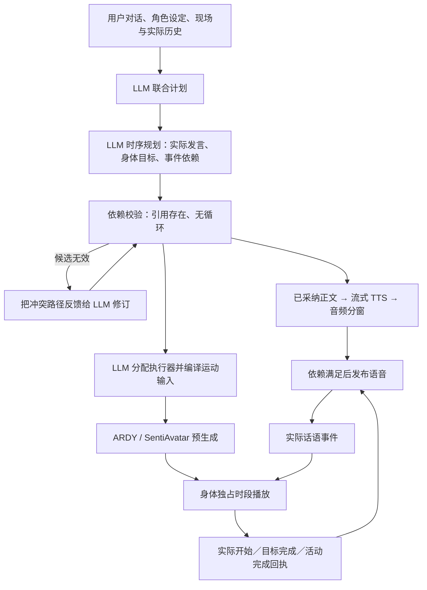

# 在合适的时候说话和行动

后续的身体目标去冗余与持续运动条件修正见 [保留持续运动意图](persistent-motion-intent.zh-CN.md)。下文的多阶段编译说明和测试数据保留为本轮历史记录。

## 目标与结论

用户要求的是符合语境的交流与行动。共同的播放时钟用于记录发生的时间；它不要求所有通道同时开始、同时结束。
本轮把“先做后说”和“说一句、做动作、再说一句”纳入执行契约。普通发言、伴随表达和独立活动仍可分别推进。

内容 LLM 生成实际发言和采纳的身体目标；时序 LLM 联合确定保留哪些实际发言、每句话与每个身体目标的开始条件，形成同一份可执行计划。下层实现这些决定，不能再从口头提纲另起一份时间计划。
模型生成完毕、音频准备完毕、动作预测完成都不是“已执行”。依赖由实际播放回执满足。

## 原始资料与阅读范围

以下是本轮实际阅读的主要原始资料。工程结论是本项目的推论；没有把论文报告的延迟或画面质量写成本机结果。

| 原始来源 | 阅读范围 | 对当前实现的启发及边界 |
| --- | --- | --- |
| [BML 1.0 标准](https://repository.cs.ru.is/attachments/download/843/bml-standard-1.pdf) | SAIBA 分层、同步约束、before/after、反馈章节 | 意图、行为计划、实现和执行反馈各司其职；相对事件关系比固定全局秒数更适合本任务。不采用“全部默认同时开始”作为产品语义。 |
| [AsapRealizer 2.0 原论文](https://noah.nrw/ubbihs/download/pdf/5129476) | §3.1 增量组织与预规划、§3.2 中断、§3.3 PegBoard、§4 比较 | 准备与激活分开，未知执行时刻不伪装成已知时刻；连续运行可更新尚未执行部分。没有照搬自动填充语或固定等待动作。 |
| [Asap TimePeg 源码](https://raw.githubusercontent.com/ArticulatedSocialAgentsPlatform/AsapRealizer/master/AsapRealizer/src/asap/realizer/pegboard/TimePeg.java) | 相对／绝对时间、未知时间值 | 事件是否发生与预测时间是否可用是两种事实。只借鉴结构，没有复制代码。 |
| [Asap BMLScheduler 源码](https://raw.githubusercontent.com/ArticulatedSocialAgentsPlatform/AsapRealizer/master/AsapRealizer/src/asap/realizer/scheduler/BMLScheduler.java) | 预测、激活、中断、无效时序处理及同步反馈方法 | 校验失败应显式反馈，不能悄悄改成另一种行为；执行记录与预订记录分开。 |
| [Holroyd / Rich，HRI 2012](https://web.cs.wpi.edu/~rich/engagement/publications/HolroydRich2012_HRI.pdf) | 两页论文全文 | 事件驱动的多模态调度可用于身体实现；这里使用数字角色播放回执，并不声称具有机器人接触传感。 |
| [Levinson / Torreira 2015](https://www.frontiersin.org/journals/psychology/articles/10.3389/fpsyg.2015.00731/full) | §7 Planning and predicting in turn-taking | 人类可提前准备、择机发言；不能把典型轮换间隔当成全场景固定延迟。当前没有实现人的语音轮换预测器。 |
| [Barthel / Meyer / Levinson 2017](https://www.frontiersin.org/journals/psychology/articles/10.3389/fpsyg.2017.00393/full) | 实验设计与 Discussion | 回复准备和发声启动应区分；语境和结束线索影响启动时机。本文不是本项目的自然度实验证明。 |
| [SignON realizer 官方 BML 文档](https://github.com/upf-gti/SignON-realizer/blob/main/docs/InstructionsBML.md) | composition 的 MERGE / APPEND / REPLACE 语义 | 并行、顺序、替换需要明确的组合语义；不能把同帧关节叠加当作任务协作。 |
| [AgentsUnited intent-planner](https://github.com/AgentsUnited/intent-planner) | 项目 README 中意图计划、BML 反馈、floor 管理 | 交流层需要执行反馈，不应把运动模型视为对话策略本身。本轮未复现其完整系统。 |
| [ARDY 原论文](https://arxiv.org/html/2607.08741v1) | §3.4–3.5、§4.1–4.2 | 自回归历史、滑动未来约束与异步预生成支持连续运动。推理窗口不等于新的交流意图，已生成缓冲也不等于已播放。 |
| [SentiAvatar 原论文](https://arxiv.org/html/2604.02908v1) | §4.1–4.7、§5.4 | 语义运动规划、音频驱动插值、表情通道和延续历史职责不同。该模型的韵律对齐不负责决定角色是否应当此时发言。 |
| [llama.cpp 官方服务文档](https://github.com/ggml-org/llama.cpp/blob/master/tools/server/README.md)与[原生 JSON Schema 实现](https://raw.githubusercontent.com/ggml-org/llama.cpp/master/common/json-schema.cpp) | reasoning 参数与 schema 校验 | 实测暴露服务端 schema 支持差异和 PEG 输出错误。不能把支持 JSON Schema 等同于模型计划一定合法。 |

另查看了 [llama.cpp #27279](https://github.com/ggml-org/llama.cpp/issues/27279) 的结构化输出故障报告，作为定位线索；该报告不是本机故障机制已被证明的证据。

## 实测中发现的根因

1. 原实现主要支持“动作等话语”，缺少“话语等已执行动作”的反向依赖。
2. “理解与提纲 → 再生成正文 → 独立运动规划”存在多个时序决策来源。真实 9B 模型把“静默鞠躬”写进提纲，后续又将它生成可朗读的舞台说明。
3. 把两个独立生成的时序拼在一起可能形成循环：动作等一句话开始，而同一句话又等动作开始。仅有合法 JSON 无法排除它。
4. 语音分窗原本跨话语合并 PCM；如果不在语义依赖变化处截断，动作前后的两句话可能进入同一个已排程音频包。
5. 生成预测和播放完成若使用同一个“ready”概念，会允许角色在动作尚未执行时说“做完了”。
6. 运动编译器接收完整原始对话时，会把口头表达重新编成身体阶段；真实转身测试还曾被编成向杯旁移动。编译器现在只接收已采纳的身体目标、现场能力与必要的语音事件关系，口头内容及随声手势保留在表达通道。
7. 意图层过早要求 ASCII 英文身体目标，真实中文聊天样本在该字段重复输出至 4096 token 上限。现在意图层允许对话语言，英文运动描述由原生模型编译器负责。场景实体也由意图层明确引用，下层只得到这些实体及其能力，输出再校验目标归属；在场实体不会自动成为行动目标。

## 实现与职责

- `communication.py`：联合计划的口头部分包含 `SpeechBeat` 正文、表达意图、开始依赖；执行前检查意图层依赖。
- `providers/plan_review.py`：由 LLM 选出真正发声的内容，并联合分配话语与身体目标的开始依赖；时序理由随采纳的计划记录。内容遗漏等问题送回内容层修订。程序只绑定 LLM 返回的索引与事件，不用关键词过滤、括号删除或预设替换台词。
- `providers/performance.py`：LLM 自主选择交流、身体承诺和各阶段模型。新联合计划的时序来自意图层；运动编译继承目标的开始条件，后续连续窗口不重复等待入口。
- `providers/language.py`：直接逐项发出已采纳正文，不再调用第二次 LLM 重新扩写同一个回复。旧的独立语言接口保留兼容支持。
- `turn_timing.py`：检查依赖图并维护真实事件；候选循环带完整路径返回模型修订。重试仍不合法时显式失败，不偷偷换成一个预设动作。
- `expression_stream.py` / `audio_stream.py`：提前生成音频，但有依赖的音频在服务端等待，不提前暴露给浏览器自动排程。不同开始条件之间保留 PCM 边界；样本不丢失、不插入固定静音。
- `character_behavior.py`：动作播放回执产生事实；生成失败、交接失败、恢复失败会唤醒等待者并明确报错。
- 前端执行链：区分话语规划、等待条件、条件满足和身体实际事件；界面文案改为按计划编排。

### 事件与时间

`immediate` 表示不额外依赖身体事件；有序话语仍按原顺序发声。
`objective_start/end` 对应意图层的目标，跨该目标所有实现阶段；不是一次模型分窗结束。
`body_end` 对应整项活动的完成，包括计划要求的最终恢复。
语音侧仍用实际 PCM 位置产生 `utterance_start/end` 与 `reply_start/end`。

同一目标可以有多个连续运动阶段，只有它的入口继承起始依赖。不同依赖的目标不能被编译器合并成一个无法分别启动的阶段。
同一句话的发声时刻可能晚于准备时刻；本轮事件约束是“最早可执行条件”，不承诺零毫秒的同时启动。

### LLM 决策与程序约束

这里没有新增关键词到模型的映射，没有写死鞠躬、告别、聊天、舞蹈的路线或等待秒数。测试里的请求只是测试数据。
LLM 决定正文、行动采纳、前后关系、模型与动作预算。代码负责引用完整性、图无环、样本顺序、独占身体通道、取消和已执行事实。
这些协议与执行不变量不能交给概率输出决定；把它们移进 prompt 也不会让执行更可靠。

## 验证与复现

本轮真实模型探针使用本机 Qwen3.5-9B Q4_K_M、原有 GPU 栈。`start_gpu_stack.ps1` 新增 `ReasoningBudget` 参数，默认 512，并使用 `--reasoning auto`，使请求的 thinking 选择生效。早期 96 token 和中间架构仍出现重复舞台说明、循环依赖及服务错误；这些失败促成了联合正文计划和校验反馈，不能当作通过样本。

完整角色设定实测另触发单槽 8192 token 上限，服务日志记录 `n_tokens=8191, truncated=1`。启动参数新增 `ContextPerSlot=16384`、`ParallelSlots=2`，总上下文容量按两者乘积设置。长设定不再与两个请求共享一个名义 16K、实际每槽只有 8K 的预算。

最终规划探针覆盖先做后说、说话—动作—说话、边说边动、普通聊天；每项均保存 LLM 结果和校验结果。通过意味着依赖可执行，不意味着该模型已经在所有语境下做出最好的行为选择。
证据目录位于本地 `VIREA-Data/evidence/appropriate-timing-20260930/`；原始会话设置及大体积动作不提交到 Git。

自动测试覆盖真实回执与预测的区分、跨阶段目标、末尾恢复、循环与缺失引用、旧回合隔离、取消、失败传播、PCM 样本完整性、依赖处的分窗以及联合正文不被再次生成。
新增时序复核测试覆盖剔除非发声条目后的索引重绑、悬空引用拒绝，以及保留正文的联合依赖修订。每个被采纳话语的来源索引与开始条件绑定在同一个结构中；身体开始条件的数量由目标数量限制，避免平行数组错位。还验证中文身体意图进入独立编译器、无关场景实体不进入编译输入。角色后端测试为 166 项通过，前端 122 项通过。
前端回归仍覆盖独占身体来源、连续姿态交接、保留静默间隔的完整录制与重播。

### 页面与真实模型证据

使用用户提供的 `miku.vrm` 和浏览器保存的长角色设定，实际运行 Qwen3.5-9B Q4_K_M、Kokoro、ARDY 与 SentiAvatar，导出页面执行链：

| 场景 | 实际结果 | 证据文件 |
| --- | --- | --- |
| 安静鞠躬后再发言 | 动作与恢复期间无语音；`body:end` 回执与 `speech_released` 均在会话 76.078 s；录制中发声从 6.520 s 开始。冷启动阶段 SentiAvatar 未及时交付，不能用此轮评价伴随手势质量。 | `browser-act-then-speak-final.json` |
| 先说心情，静默转身，再告别 | 第一段语音在录制 0–6.100 s；ARDY 在 13.360 s 开始；目标完成回执与放行告别同在会话 105.297 s；告别在录制 21.832 s 开始。预热后 SentiAvatar 3/3 个窗口及时就绪，0 个过期，实际身体来源依次为 SentiAvatar → ARDY → SentiAvatar。 | `browser-speak-act-speak-final.json` |

第二轮首包交付 25.672 s，TTS 合计 0.234 s，SentiAvatar 为 10.225 s 语音生成动作共用 5.750 s，RTF 0.562。不能把动作 RTF 直接当作端到端交互延迟：该轮第一句结束到 ARDY 开始仍有约 7.260 s 的准备间隔，计划编译与启动延迟仍需要改进。两轮执行链均没有报错，但这不足以证明所有动作的审美与自然度。
上述第二轮还暴露了第 6 项编译职责混淆，因此只证明事件顺序与模型互斥，不能作为动作语义正确的通过样本。隔离编译输入后，同样长人设的一次原地转身规划变为一个 `perform` 阶段、3.6 s，没有场景移动目标。

最终页面记录为 `browser-grounded-timing-final.json`：第一句实播 0–8.375 s，告别从 20.760 s 开始，4/4 个语音动作窗口及时就绪、0 个过期、0 个执行错误。身体动作全部为无场景目标的 `perform`，没有再次走向杯子；事件等待在目标完成后释放，结束后回到站姿。11.825 s 语音对应动作推理共用 6.078 s，RTF 0.514，首包仍为 29.641 s。该次 LLM 意图层仍采纳了站立表达、转身、告别姿态三个目标，存在额外的站立阶段；不能声称已消除所有冗余动作或达到最终自然交流体验。截图为 `studio-final.png`，单张截图只用于确认页面和结束姿态。

本轮完成 GitNexus 全量重建及变更检查，主链路改动判定为高影响；`detect_changes(scope=all)` 的完整结果保存在证据目录。全仓库流程提取仍有入口、分支和跨语言解析覆盖限制，已结合调用文本、后端与前端回归及上述真实播放验证，未将图中没有路径解释为不受影响。

## 尚未被这次改动证明的能力

当前会在联合计划校验后流式生成 TTS 和动作，并没有实现人类级增量听觉轮换预测。更长的联合规划仍影响首个输出延迟。
时序规划也是概率模型，会漏检或误判；它增加了一次规划调用。实测曾出现删掉身体任务以消除循环、把开始误当成结束、将舞台说明朗读出来等错误；这促成了执行字段语义、独立时序推理与采纳前图校验的调整。校验和一次修订之后仍不合格的计划明确报错，不会被包装成执行成功。
普通聊天探针仍出现主动走近、坐下等较多身体承诺；场景中没有真实用户位置或座椅观测，不能把它评价为全面恰当。用户明确时长的证据目前检查原文包含关系，仍可能被模型误用为对估计时长的证明。这些是语义质量的剩余限制。
自然度还受语言模型规划质量、TTS 韵律、运动模型、重定向与支撑质量影响；图无环不是动作审美评价。
本轮没有训练新模型，也没有证明 ARDY 在任意地形／交互下的物理正确性；已有支撑判定是运动学检查。
验证事件关系时应查看实际回执和录制，而不是只看 `generation_seconds` 或模型论文的速度。
