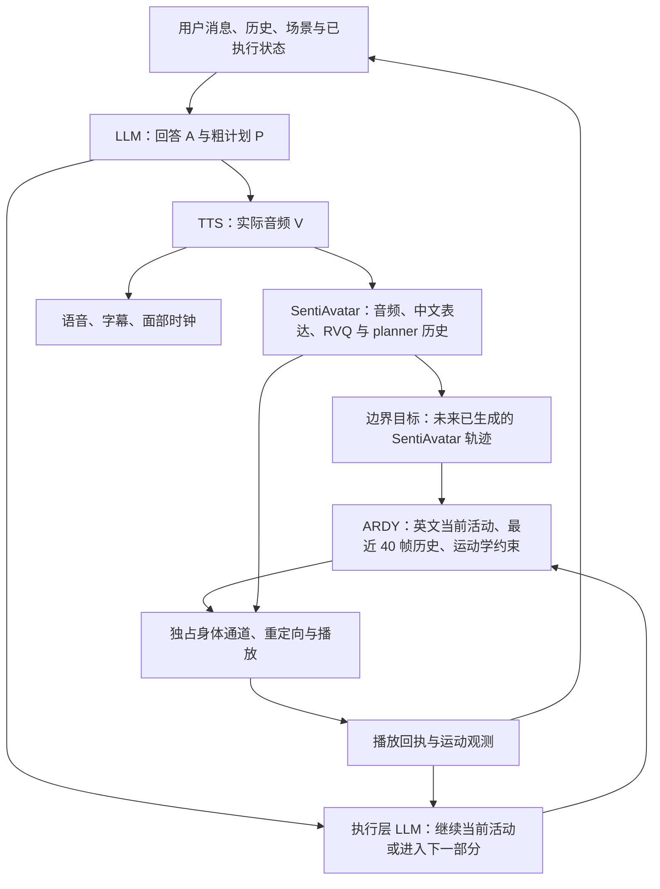

# 回答 A、粗粒度计划 P 与实际音频 V

P 决定任务的顺序或并行、每段身体活动的执行器、中文伴随表达条件与英文持续运动描述。它不再生成动作段秒数。用户明确指定的总时长仍保留为用户约束，不能被窗口长度替代。

回答通过语音流水线形成 V；声音、字幕和独立身体任务分别推进。身体同一时刻只有一个驱动源。P 的语义分段、模型推理窗口、实际播放时长是三个不同概念。



## 本次核对的原始资料

既有广泛阅读清单见 [交互程序研究记录](interaction-program-research.zh-CN.md)。本次进一步核对以下实现细节，而非仅根据项目演示推断接口能力。

| 原始资料 | 阅读结果与实现取舍 |
| --- | --- |
| [ARDY 论文](https://arxiv.org/html/2607.08741v1)、[官方项目](https://research.nvidia.com/labs/sil/projects/ardy/) | 在线文本条件与文本加运动学约束属于同一模型的条件接口。保留原生自回归历史，不把窗口末尾改成站姿。ARDY 没有语义完成 EOS，也不是物理仿真器。 |
| [ARDY constraints.py](https://github.com/nv-tlabs/ardy/blob/main/ardy/constraints.py) | `FullBodyConstraintSet` 生成条件主要包含关节位置、根位置与朝向；不能据此宣称所有局部旋转都精确对齐。约束帧索引按官方实现放在 CPU。 |
| [ARDY postprocess.py](https://github.com/nv-tlabs/ardy/blob/main/ardy/postprocess.py) | 官方完整身体后处理使用旋转目标。适配器只修正新帧并冻结前缀，避免改写已经播放的历史；这里不额外启用预测脚接触锁定。 |
| [SentiAvatar 论文](https://arxiv.org/html/2604.02908v1)、[RVQVAE 实现](https://github.com/SentiAvatar/SentiAvatar/blob/main/motion_generation/models/rvqvae.py) | 其身体条件是模型原生 RVQ 编码与规划历史，不能把 VRM 四元数数组作为 RVQ token 传入。既有 position-fitting 重定向还丢失部分轴向扭转，直接逆编码尚未验证。 |
| [Inner Monologue](https://innermonologue.github.io/)、[SayCan](https://say-can.github.io/) | 借鉴利用执行反馈推进高层计划的分工。当前实现提供运动与语音事实，并未实现论文的视觉成功检测器或学习价值函数。 |

## 执行契约

- `completion_mode=observed` 的身体任务保留活动游标和本活动已播放时间。原有固定时长接口为兼容保留，新规划不使用它。
- 执行层 LLM 根据目标、密集关节轨迹路程和活动范围、稀疏姿态样本、支撑与语音事实，自主决定继续或推进。周期运动的首尾相似不会被直接解释成静止。
- 每项活动累计根路程、关节路程和骨盆展开朝向的净角度、往返路程及覆盖区间；保留原始活动意图。场景变换 yaw 不冒充骨盆朝向，原生世界旋转写入预测历史时也不重复乘场景朝向。这些是观测量，不包含动作名称到完成阈值的规则。
- 预读可以评估正在播放窗口的预测末态；决定只有在有效播放完成回执到达时提交。预测不能提前放行“动作完成后说话”。晚到判断、旧轮次和重复回执分别测试。
- 完成主动活动与执行最终恢复分开。恢复描述由 LLM 提供，原生窗口长度来自 worker 的帧率与 horizon，最终支撑和速度由实际运动检查。
- 用户指定的总预算不会因为最后一个活动被提前判为充分而被缩短；没有时长的活动不会被补上隐藏的固定结束秒数。
- 同一活动延续时沿用真实历史，并允许执行层更新英文持续条件；不重新应用该活动的开场同步点。

`activity_progress.py` 负责回执提交；`activity_review.py` 负责模型判断；API 的 `behavior_progress.py` 和 `behavior_boundary.py` 分别组织预读与交接，空间 worker 只处理原生推理和约束。

## 两个模型之间实际实现了什么

SentiAvatar 内部继续沿用前一窗口的 RVQ 尾部和最近规划历史。ARDY 使用公共骨架的实际前态和最近 40 帧。进入 ARDY 时把前态编码成其原生表示。

离开 ARDY 时，如果未来 SentiAvatar 音频窗口和 canonical 轨迹已经就绪，就按实际 PCM 时刻抽取末端连续四帧，作为 ARDY 完整身体约束；随后使用官方旋转后处理。计算余量与运动时长分别计入目标时刻；提前生成的结果等待预定起点，过期约束不进入播放器。后续边界窗口参考实测生成耗时分配余量。

未知的未来轨迹不会替换成假想站姿。没有已准备目标时仍使用既有姿态连续性机制，因此不能宣称所有交接都已经获得原生约束。这里也没有实现“ARDY 任意姿态无损编码到 SentiAvatar RVQ”；该能力仍需要训练骨架映射与原生编码验证。

## 实测与负例

本机 RTX 5090 共享 GPU；报告区分 warm native 生成、执行层判断、实际页面播放。测量是样本，不是延迟承诺。

| 测试 | 结果 |
| --- | --- |
| 不含秒数的静默舞蹈规划 | P 的活动与恢复均无时长字段输入；模型选择持续舞蹈描述。 |
| ARDY warm 6.4 秒窗口 | 约 0.59–0.83 秒；6.4 秒是执行缓冲窗口，不是 P 的语义长度。冷启动样本约 14.42 秒。 |
| 执行层判断 | 改进后的样本约 2.1–2.6 秒，决定进入下一部分，等播放回执提交。 |
| Miku 真实页面静默舞蹈 | 主活动 6.4 秒、最终恢复 2 秒，总实播约 8.45 秒，只有两个身体时段，0 执行错误。 |
| 固定 SentiAvatar 轨迹的原生约束探针 | 只用生成约束平均末端旋转误差约 19.02°；增加官方旋转后处理后约 0.0073°。后处理后的入口最大关节速度约 34.8°/s，根第一步约 1.48 cm。 |
| 并行语音/ARDY | 真实页面语音连续播放，字幕 PCM 段没有整句重复；独立身体任务正常完成，语音继续。完整跨模型交接还受 SentiAvatar 就绪情况限制。 |
| SentiAvatar 常驻后真实页面 | 同一轮 5/5 窗口就绪，约 0.69–1.69 秒；后续窗口保留原生历史。 |
| 最终真实页面跨模型交接 | 挥手、放下手两个活动由执行 LLM 分别判定完成，随后一次 2 秒恢复和一次 2 秒原生约束桥接，桥接生成约 0.297 秒，接入后续 SentiAvatar。7 个表达窗口就绪、0 个执行错误，最终脚底距地面约 0。 |

保留的失败证据包括：稀疏观测漏掉周期运动；把完成理解为等待静止导致 70 秒续播；thinking 模式增加判断耗时但仍未修正该逻辑；一个含“边讲边跳”的请求被 LLM 错排为顺序；SentiAvatar 冷启动未完成便随语音结束取消。

转圈测试还暴露了执行判断的能力限制：原实现误把场景 yaw 当作身体朝向，且每次只看单窗。补充累计观测后，真实 ARDY 仍可能改变旋转方向，9B 执行 LLM 也出现把往返累计角度误读为单向整圈、继续重复条件的情况。`native-turn-progress` 与 `native-turn-interval` 保留该负例；没有用固定超时或“转圈”关键词规则伪装成成功。一个复杂并行请求还出现结构化规划未自然结束。完成判断和语义规划的可靠性仍需更强的模型与系统性评测，当前版本不宣称任意活动都能准确自动终止。

冷启动修复使用首个真实请求完成常驻准备。过期请求的结果不会被用于新语音；下一请求等待准备结束后生成自己的动作。关闭服务仍取消其拥有的准备任务。没有增加虚构用户台词或固定动作暖场。

边界探针使用已保存的两秒 SentiAvatar 轨迹，并以四秒音频时间缩放抽取目标，属于几何与接口验证；它不是整段真实用户对话的主观自然度评分。完整序列仍可能受到重定向、运动模型质量、规划语义错误和共享 GPU 延迟影响。

最终真实页面证据为 `browser-handoff-verified.json` 与 `frontend-verified.png`。该轮首音约 23.03 秒，语言规划约 22.88 秒；恢复结束至首次桥接开始还出现约 2.08 秒计算预留空档。后续预留会参考测得的桥接耗时，但本次尚未把终态桥接全部提前到恢复播放期间完成。因此无错误、完成交接不等同于全程无停顿；该空档和首音延迟均是当前限制。

## 重现与回归

```powershell
.venv/Scripts/python.exe -m pytest tests/character -q
# apps/web 下使用 npm test 与 npm run build
.venv/Scripts/python.exe scripts/character/benchmarks/verify_coarse_execution.py --help
```

原始证据保存在 `<DATA_ROOT>/evidence/coarse-plan-20261001`：规划 JSON、逐窗 native 输出、旋转误差、真实页面 trace 和测试日志。体积较大的模型输出、音频和用户角色设定不纳入源码提交。

最终角色回归 228 项通过，前端 124 项通过，常驻 worker 回归另 10 项通过；Ruff、TypeScript 与 Vite 构建通过。构建保留既有 viewer 大 chunk 提示。本次没有重跑全部仓库测试，也不覆盖先前报告的无关 API 路由清单失败。

图分析已覆盖规划、调度、播放与 worker。当前 GitNexus 对部分函数产生空符号 ID，跨语言字段和执行流也存在裁剪；零调用者不作为无影响结论。报告应与调用点核对和行为测试一起阅读。
