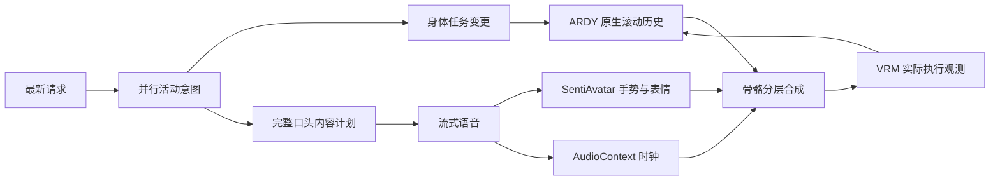

# 持续身体任务与混合表达

> 此文保留旧版实验记录。身体残差叠加方案已删除，当前架构与验证结果见 [对话驱动的分时身体执行](temporal-behavior.zh-CN.md)。以下旧实验不代表当前组合方案已经通过验证。

一轮聊天的结束、一个语音窗口的结束、一个动作阶段的结束，是三种不同事件。身体任务独立于语音 epoch；新问题可以中止旧回复，同时保留正在执行的身体任务。界面使用混合表达，不再要求先选择 ARDY 或 SentiAvatar。

## 根因和修复

旧版自由动作阶段没有直接插入自然站姿关键帧，但存在三个产生类似效果的机制：

1. `SpatialPlan.constraints` 的行走轨迹在 `frames - 20` 达到终点，随后保持一秒，且每个阶段的 smoothstep 都以零速度结束。现在使用 Hermite 根轨迹，同向连续路点共享非零目标速度，下一段从实际历史速度进入。
2. 起步、维持、退出写在同一个反复使用的描述中，会反复触发动作起止。现在阶段有独立的进入描述、持续描述和可选过渡描述；后续原生窗口使用持续描述。阶段间保留原生历史，不插入站姿或全身恢复曲线。阶段描述由语言模型生成。
3. 提交新聊天以前会调用全局 stop；SentiAvatar 全身动画和 ARDY 又可能同时写同一骨架。现在中止语音与中止身体分开，渲染阶段集中合成骨骼。

替换身体任务时传递最近约两秒、20 Hz 的已渲染姿态观测，保留位移和转动信息。初次启动没有历史时才填充静态起始姿态。语音结束只释放语音残差，不回收整个身体；可选放松恢复只发生在整个身体任务完成以后。

## 数据流

活动意图只解释最新消息的增量语义，不携带旧动作列表供模型复制。普通交流保持身体任务；明确的延续、替换、停止是任务操作，而不是模型选择。新的身体任务编排完成后即可播放，口头内容计划、语音和手势随后并行准备。`body_program.id` 在后续聊天中保持不变；新任务或明确停止才使旧流失效。

初版混合规划实验把所有旧动作、回复提纲和新动作放进一个大输出，实测出现重复替换。改成独立的活动意图契约，并启用现有 Qwen 的短推理后，普通聊天、明确延续加问答、停止且安静、两分钟安静舞蹈、新活动加故事、多阶段活动加故事的六个实测用例全部符合预期。输出通道为集合，组合请求同时包含身体活动和口头内容。没有按用户关键词匹配的动作表。

## 骨骼所有权和时钟

| 输出 | 所有者 / 合成方式 |
|---|---|
| 世界位置、髋部、腿、支撑 | ARDY；语音动画不能覆盖 |
| 躯干、头、肩臂 | 在身体姿态上叠加相对标定自然姿态的局部旋转残差；阶段权重由计划提供 |
| 手部细节 | SentiAvatar 语义手势；接触链保留身体约束 |
| 口型、脸部表情 | SentiAvatar 音频条件表情轨道 |
| 没有身体任务时 | 标定的自然姿态和轻量 idle 作为基底，语音残差仍使用相同合成路径 |

两个不兼容的潜空间没有直接混合。骨骼残差、淡入淡出、语音窗口之间的旋转桥接在统一 VRM 局部坐标下完成。采样语音动画时保存并恢复骨架，最终每帧按“身体 → 语音残差 → 表情”呈现，避免写入次序竞争。接触目标保护躯干及对应手臂链。

身体与音频使用同一个 AudioContext 时钟；暂停冻结两者。新的聊天可在当前身体时间点加入，彼此没有必须同时结束的限制。字幕跟随实际音频窗口，界面身体进度不会因下一段语音开始而归零。

## 原论文与项目依据

| 一手来源 | 对本次实现的直接影响 |
|---|---|
| [ARDY 原论文 §4](https://arxiv.org/html/2607.08741v1) / [官方代码](https://github.com/nv-tlabs/ardy) | 自回归历史、未来约束、交互重规划；官方方案没有要求每个阶段回到站姿。对照 `autoregressive_step` 和 interactive demo 的生成代码核实历史/新帧边界。 |
| [SentiAvatar 原论文 §4、附录 B](https://arxiv.org/html/2604.02908v1) / [官方代码](https://github.com/SentiAvatar/SentiAvatar) | 语义关键帧、音频条件补帧和独立面部支路；保留跨语音窗口原生历史。其面部表现还取决于音频韵律，骨骼合成不能替代富有变化的语音。 |
| [EMAGE，CVPR 2024](https://openaccess.thecvf.com/content/CVPR2024/html/Liu_EMAGE_Towards_Unified_Holistic_Co-Speech_Gesture_Generation_via_Expressive_Masked_CVPR_2024_paper.html) | 身体区域和表情的组合建模支持分层接口设计；本次没有声称复现其联合训练。 |
| [MECo，SIGGRAPH 2025](https://robinwitch.github.io/MECo-Page/) | 语音手势与动作条件可以共存，并可按身体区域控制；对任务动作和语义手势使用不同关节权限。 |
| [PriorMDM / DoubleTake / DiffusionBlending](https://priormdm.github.io/priorMDM-page/) | 长运动要处理相邻片段的条件和过渡；其同类模型的扩散混合不能直接移植到 ARDY 与 SentiAvatar 的不同表示。 |
| [MixerMDM，CVPR 2025](https://openaccess.thecvf.com/content/CVPR2025/papers/Ruiz-Ponce_MixerMDM_Learnable_Composition_of_Human_Motion_Diffusion_Models_CVPR_2025_paper.pdf) | 学习融合需要专门训练和兼容的模型输入，本次使用可测的运行时骨骼合成，不称作训练后的联合生成器。 |
| [NVIDIA ACE Animation Pipeline](https://docs.nvidia.com/ace/animation-pipeline/1.0/index.html) | 面部与身体独立生成、统一动画执行的工程分工参考。 |

## 可复现实测

环境：RTX 5090 Laptop 24 GB，ARDY 官方 H40 / 40 帧历史，LLM2Vec NF4；Qwen3.5 9B Q4_K_M；现有常驻 SentiAvatar 与 CUDA Kokoro。没有再加载一份 GPU 动作模型来跑基准。

`scripts/character/benchmark_hybrid.py` 向已运行的原生 worker 请求三个同向路点，每段四秒；在两个内部边界前后各取半秒，速度低于 0.05 m/s 计为近乎静止帧。

| 三次运行、六个内部边界 | 修改前 | 修改后 |
|---|---:|---:|
| 每个边界近乎静止帧 / 20 帧 | 6–10 | 0 |
| 边界平均平面速度 | 0.161–0.182 m/s | 0.453–0.540 m/s |
| 热启动生成 12 秒动作 | 0.98–1.08 s | 0.97–1.00 s |

两组为独立随机采样，不是同种子质量评分；速度指标证明该路点停稳问题被消除，不等同于所有动作自然度都已得到证明。修改后第一次冷文本编码运行耗时 2.16 秒。

原始窗口及报告位于 `D:/AI-Program-Project/VIREA-Data/evidence/hybrid-character-20260929/`。后端角色回归 87 项、前端回归 105 项通过，覆盖聊天保留身体身份、替换使旧流失效、重复领取与回执拒绝、身体根节点所有权、接触链保护、叠加不累积、路点速度连续。

页面真实模型验证包含两分钟舞蹈中插入普通聊天（身体任务 ID 不变，语音回执中的执行位置持续变化），以及单次请求“连续跳舞六十秒，同时讲星星故事”。后者在身体时间 37.775 秒记录到身体仍在播放、语音有效、口型值 0.179；45.790 秒暂停后，后续采样的身体时间保持不变，恢复后继续前进。显式停止同时终止身体任务和语音，并清除口型。截图和 DOM 状态分别存于 `hybrid-speaking.png` 与 `browser-speaking.json`。

延迟仍有明显改进空间：普通交流实测首个表达约 11.4 秒；上述组合请求先启动身体，首个语音表达约 27.3 秒。原生 ARDY 的热生成速度不能当作整个语言、语音、手势流水线的首包延迟。该次故事实际音频约 50.4 秒，未严格满足请求的“约半分钟”；内容时长控制和首包延迟仍需后续专项优化。

本实现是运行时分层协作。它不改变两套模型的训练分布，不能承诺任意组合、任意地形都物理正确；复杂动作与语义手势的权重还需要更多真实动作样本评估。原生 ARDY 对照骨架保留在工作室中，便于区分生成与重定向问题。
