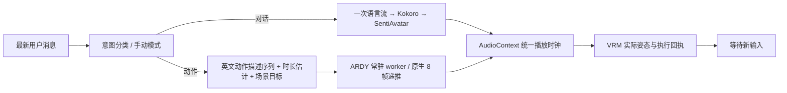

# Motion Studio：按意图分流，按原生时间轴执行

## 发现的问题与改动

1. 原先一边输出对话一边附带动作，ARDY 会收到适合聊天的描述，而不是连续运动条件。现在先分类最新意图，英文描述经过输出语法及服务端双重校验，再进入 SentiAvatar 语音表达或 ARDY 动作编排。分类结果及动作序列可见；也可手动选择模式。
2. 每个动作独立 HTTP 请求、重建短历史、再收势，导致阶段之间停顿。现在一个动作程序只有一次流请求、一个本地时钟和一份递推历史；换提示词不重置姿态。每次仍原生产生 8 帧，绝对帧号贯穿所有阶段。
3. 旧适配在 reach 时冻结腿、骨盆并压低躯干旋转，会直接损失全身表达。现在 ARDY 独占全身；行走使用根平面轨迹，触碰只给接触时刻稀疏的手部目标及必要的根平面参考，不锁腿、骨盆高度或手腕方向。仅在目标附近使用小幅接触 IK。
4. 模型解码会重建历史前缀。已执行样本必须保留，只追加新生成帧，不能用重新解码的前缀改写历史。
5. 多轮实测发现新动作规划会累加之前中断的用户请求。规划接口现在只把最新消息作为请求，旧轮次放在标明“仅供引用”的上下文中；不会把未完成历史当作待执行队列。已知物体触碰误写为 `perform` 时，最多修正一次；仍未绑定目标就报错。
6. 暂停期间不消耗服务端播放回执的超时时间。会话租约仍负责清理失联客户端。打断通过 epoch 撤销旧结果，历史区区分完成、打断和失败。

内部动作阶段不收势；完整程序结尾才由原生收势阶段和连续速度恢复进入自然 idle。明确要求坐下、躺下等保留姿态时使用 `end_state=hold`。用户不必填写时长；明确给出整段总时长时按原生帧网格分配预算，不依赖模型自行加总；每阶段支持 0.8–60 秒，一个程序最多 12 阶段、180 秒，另有收势尾部。时长按 8 帧网格向上对齐。接触动作至少留 2.4 秒供模型协调身体。

## 原论文与官方实现的核对

| 一手资料 | 核对内容与实际选择 |
| --- | --- |
| [ARDY 项目与演示](https://research.nvidia.com/labs/sil/projects/ardy/)、[论文](https://research.nvidia.com/labs/sil/projects/ardy/assets/ardy_paper.pdf) | 自回归扩散支持可变历史、交互重规划和长动作；论文性能不能直接当成本机性能。 |
| [ARDY 官方源码](https://github.com/nv-tlabs/ardy)，本地固定 `693f74d13b3d04a0a22ce127ee79c929dd89756b` | 核对 `autoregressive_step`、历史坐标变换、`generation.py` 和 `window_budget.py`。模型内部已处理根平移/朝向，调用方不再重复变换。 |
| 同仓库 `gui/model.py`、`loading.py`、`common.py` | 演示默认历史是一个 4 帧 token，文本/空间引导权重均为 2；不是历史越长越好。后处理默认关闭，开启时只优化新生成区间。 |
| 同仓库 `ardy_motionrep.py` | 世界坐标手部目标必须附带根参考和根平面约束。根参考行参与坐标转换，不等于固定骨盆高度。CPU 实际构造 mask 检查通过。 |
| [three-vrm Humanoid API](https://pixiv.github.io/three-vrm/docs/classes/three-vrm-core.VRMHumanoid.html) | 使用 normalized humanoid；折叠额外脊柱节点时使用全局旋转差，缺失 upperChest 时合并旋转；提供原生骨架叠加，便于区别生成问题与重定向问题。 |
| [Kimodo](https://github.com/nv-tlabs/kimodo)、[DART](https://github.com/zkf1997/DART) | 作为可控全身生成与自回归运动的对照，没有在当前系统虚构第二套物理控制器。 |

当前权重是 **ARDY-Core-RP-20FPS-Horizon8 / Core 27 骨架**，不是 SMPL-X 网格。VRM 的骨长、关节比例、手指和表情通道也与论文人物不同。原生运动、骨架重定向、角色外观应分别验收。

## 历史长度消融：连续不代表响应新动作

RTX 5090 Laptop 24 GB；同一随机种子 2、同一自然初始姿态、相同文本、10 步采样、NF4 LLM2Vec。先伸展 8 秒，再舞蹈 8 秒。保持已执行末帧，改变模型历史长度。数值为舞蹈阶段双手竖直范围：

| 条件历史 | 左手 / 右手范围 | 观察 |
| --- | --- | --- |
| 120 帧 / 6 秒 | 1.72 / 1.08 cm | 前段结束后的静止状态压住新舞蹈指令 |
| 40 帧 / 2 秒 | 45.60 / 44.74 cm | 恢复明显运动 |
| 16 帧 / 0.8 秒 | 32.93 / 17.66 cm | 此样本响应弱于 40 帧 |
| 4 帧 / 0.2 秒 | 47.55 / 43.85 cm | 更强的躯干和脚步响应，采用为交互默认 |
| 120 帧，换阶段时裁到 16 帧再增长 | 2.40 / 1.30 cm | 仅换阶段裁一次不足以解决 |

这是一组固定种子的条件比较，不是自然度排行榜。不能从该表推出所有复杂动作都应使用最短历史。worker 的 `history_frames` 可配置为 4–160、4 的整数倍，供进一步任务相关测试；完整播放录制仍保留所有窗口。

复现：在 ARDY runtime 中设置 `PYTHONPATH=<repo>/scripts/character`，运行
`scripts/character/benchmarks/compare_spatial_history.py --data-root <DATA_ROOT> --output <FILE>`。
该实验直接加载模型，运行前释放已有空间 worker，避免重复占用显存。

## 本机连续程序测量

通过常驻 worker 生成伸展 8 秒、舞蹈 16 秒、挥手 8 秒、收势 2 秒，共 **34 秒**：

| 指标 | 2026-09-28 实测 |
| --- | --- |
| 首个 0.4 秒窗口到达 | 1.038 秒 |
| 全程序生成墙钟耗时 | 11.444 秒 |
| 每窗口生成中位数 / 最大值 | 0.117 / 0.594 秒 |
| 窗口共享端点的根偏差 | 0 m |
| 窗口共享端点的旋转偏差 | 5.17e-8 rad 以下 |
| 舞蹈阶段右手竖直范围 | 60.16 cm |
| 此直立程序原生头部相对骨盆最低高度 | 68.86 cm |

共享端点一致只验证传输和递推边界，不等于运动加速度或主观自然度合格。舞蹈窗口首个新采样的最大手部位移约 11.7 cm / 50 ms，应结合运动类型和画面判断。首包测量不包含路由、语言编排和前端预缓冲。浏览器默认预缓冲 4 窗口、队列上限 12 窗口，降低窗口供给波动产生的停顿。

运行 `evaluate_spatial_program.py --home <VIREA_HOME> --output <FILE>` 保存原始窗口和到达时间。完整原始证据在本机仓库外 `VIREA-Data/evidence/character-studio-20260928/`，不把模型或大体积动作数据提交到 Git。

## 界面与使用

参考 [Beautiful UI](https://www.beautifului.dev/) 与 [HeroUI](https://www.heroui.com/docs/components) 的轻量布局、圆角、留白、对话侧栏和可访问控件风格，保留现有 Vite/Three.js 技术栈。

- 主画面保留 3D 舞台、视角/网格/原生骨架工具；窄聊天面板放在右下角，可收起。
- 历史抽屉按会话保存用户消息、路由、回复、动作描述与执行状态；支持搜索和 JSON 导出，保留最近 30 个本地会话。
- 统一进度、暂停、音量、语音重播和动作重播。ARDY 重播读取本地已完成录制，不再请求模型或重复领取动作。
- 动作可导出带绝对偏移、阶段、根坐标和四元数的 JSON。坐标为右手 Y-up，四元数 xyzw；该文件不是 SMPL-X、BVH 或 VRMA。
- 桌面和窄屏按角色包围盒重新构图，给聊天面板预留空间。Enter 发送、Shift+Enter 换行，保留中文输入法组合键行为。

## 浏览器和自动回归

- 实际执行杯子旁站位 → 右手触碰 → 收势，原生约束与小幅 IK 后手部控制点距离低于 0.1 mm；该结果只代表此 VRM 的这次接触，不是物体抓取或刚体交互。
- ARDY → SentiAvatar → ARDY 多轮切换：问候只输出一次自然台词，语音、动作和文本同步完成；问候实测首表达约 4.83 秒，TTS 0.20 秒，动作生成 0.78 秒。
- 带旧舞蹈上下文的 14 组真实 Qwen 路由测试通过：普通问候进入 SentiAvatar，明确挥手/点头进入 ARDY，动作知识问答和否定动作保持对话。分类器只把最新消息当作任务；可运行 `evaluate_routing.py --output <FILE>` 复现。
- 本机连续播放测试记录到 0 次队列欠载。动作重播不调用模型。
- 导出对话框提供保存链接、JSON 预览与复制。当前应用内浏览器未能触发文件下载，程序化剪贴板访问也被限制；自动展开内容后，手动全选复制并解析 JSON 已通过。普通浏览器的文件下载尚未实测。
- 72 项后端角色/路由/API/时钟测试、99 项前端测试及 TypeScript/Vite 构建通过。长暂停实测约 163 秒后继续成功。图变更检查覆盖消息处理、打断、加载和播放等流程，整体风险 critical；没有把索引的动态调用缺口当成无影响。

## 验证边界

这是连续的运动学生成与 VRM 播放。尚不具备全场景物理碰撞、任意楼梯地形、游泳流体和抓取后物体刚体跟随；不能把论文演示推断为这些能力已部署。接触以模型手部控制点为参考，VRM 比例可能影响可达性；接近失败会明确报告，不以完成回执掩盖失败。SentiAvatar 的情绪范围仍受语音表现、模型训练分布、手指模板及角色 morph 支持限制。尚未完成多人自然度盲评。
