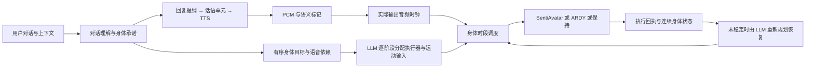

# 对话、身体意图与实际播放的协调

本轮改造的核心是拆开三种不同的边界：对话的意义、身体任务的阶段、模型推理的分窗。用户的话先被理解为回复内容和角色采纳的身体目标；语音、文本独立产出；执行器在每个可交接的时间点选择一个身体源。LLM 从可用执行器目录选择回复的伴随表达执行器、每个身体阶段的执行器，以及终态恢复的目标、执行器和时长。运行时依照分配和已发生的语音标记执行，整个身体不叠加两个模型的姿态。

## 从原始资料得到的结论

以下是本轮实际阅读的原论文、标准和官方源码。采用的是明确列出的思想，不宣称移植整套系统或复现论文指标。

| 一手资料与阅读范围 | 对当前系统的直接影响 | 采用边界 |
| --- | --- | --- |
| [BML 1.0 官方规范](https://projects.cs.ru.is/projects/behavior-markup-language/wiki)：SAIBA 分层、同步点、增量块、prediction/feedback、失败与中断 | 分开意图、行为约束和实现；“说完”引用真实语音事件，不引用资源 ready | 使用类型化 JSON 契约，没有宣称实现完整 BML XML 协议 |
| [An Architecture for Fluid Real-time Conversational Agents](https://noah.nrw/ubbihs/download/pdf/5127974)，Kopp 等，2014，§2、§4.2–4.3、§5 | 增量单元保留依赖关系；预备和激活分开；实际执行反馈修正后续调度 | 保留已执行活动，允许新对话更新未来；没有移植完整 ASAP/IU 网络 |
| [AsapRealizer 官方源码](https://github.com/ArticulatedSocialAgentsPlatform/AsapRealizer)：TimePeg、AfterPeg、BMLScheduler | 未知时间不等于零；时间约束和实际执行状态分别保存 | 同步点未知时保持未满足；已取消或不存在的依赖显式失败，不无限等待 |
| [ARDY 原论文](https://arxiv.org/html/2607.08741v1)，§3.4–3.5、§4.1；[官方 generation.py](https://github.com/nv-tlabs/ardy/blob/main/scripts/interactive_demo/generation.py) | 保留提交前缀和原生历史，重规划未来缓冲；模型窗口不是活动阶段 | 沿用原生连续历史和单个未来预订；论文模型推理延迟不等于本应用首响应延迟 |
| [SentiAvatar 原论文](https://arxiv.org/html/2604.02908v1)，方法及 Appendix B；[官方项目](https://github.com/SentiAvatar/SentiAvatar) | 语义规划与音频韵律有不同时间尺度；先前音频/动作必须成对作为上下文 | 保留自身原生上下文；不把 ARDY 原生状态伪装成 SentiAvatar 的训练条件 |
| [EMAGE](https://arxiv.org/html/2401.00374v3)，§3、§4 | 面部、身体和音频的协同依赖训练时的掩码条件和解码器设计 | 不能据此把两个独立全身模型逐关节相加 |
| [DiffSHEG](https://arxiv.org/html/2401.04747v2)，§3.3、§3.5 | 稠密音频条件、面部到手势的方向性融合与连续扩展各有训练前提 | 当前采用独立面部通道和独占身体源，不声称实现其训练融合 |
| [Co³Gesture](https://arxiv.org/html/2505.01746v1)，§3.2–3.3 | 并发交谈与角色间条件依赖需要明确建模 | 论文是训练过的双角色上半身交互，不是单角色两个运动源的叠加许可 |
| [Automating the Production of Communicative Gestures in Embodied Characters](https://www.frontiersin.org/journals/psychology/articles/10.3389/fpsyg.2018.01144/full)，§4.3、§4.4.2 | 同一意念单元中的手势可以共构、保持和衔接；每句归零会破坏表达 | 采用语义单元连续性，没有移植该项目的人工词典和动作规则 |
| [Virtual Character Performance from Speech](https://www.khoury.northeastern.edu/~marsella/publications/pdf/marsellasca13.pdf)，Marsella 等，2013，方法部分（本地保留的原论文） | gesture preparation/stroke/hold/retraction 属于表达结构；内容、韵律、时序不能互相替代 | 终态回收仍需上下文姿态；不把低速度视为审美质量证明 |
| [W3C Web Audio：getOutputTimestamp](https://www.w3.org/TR/webaudio/#dom-audiocontext-getoutputtimestamp)，§1.2.3 | AudioContext 的调度时间可能领先扬声器实际输出；播放事件使用输出设备对应的 contextTime | 依赖浏览器时钟估计；不是声卡外部回环的端到端测量 |

官方源码进一步核对了 ARDY 的历史裁剪、对齐和未来约束，以及 AsapRealizer 的时间依赖传播。没有复制第三方实现代码。SmartBody 和 AsapRealizer 2.0 的部分原文链接访问失败，未列为本轮完整阅读依据。

## 实现边界

### 对话与运动编译

`DialogueAppraisal` 负责回复计划、身体任务操作和有序 `ActivityIntent`。每个目标可引用 `immediate`、`reply_start/end`、`utterance_start/end`。引用话语单元时必须提供编号，引用整段回复时必须没有编号；生成 Schema 与服务端验证采用同一个关系。

运动编译器收到原始请求、已理解的身体目标、口头回应计划、实际身体状态、环境和模型能力。原始请求让它能识别意图层转述中的时序错误；语音内容仍由独立对话层生成。LLM 输出原子 `RealizationPhase`：每个阶段将目标来源、最终语音依赖、执行器与动作描述/时长绑定在一起，避免平行列表长度错位。LLM 可以拆分、合并或继续目标，代码只校验来源覆盖与可执行条件，不强制一目标对应一阶段，也不规定目标编号的访问顺序。意图层提供候选依赖，运动层结合原始请求决定最终依赖。最终恢复是可空的原子 `recovery`（模型、目标、时长、理由），只应用于整项活动末尾。旧单目标输入仍保留为一个目标。

角色仍可能理解错意图或生成质量不佳的动作描述。结构契约约束职责与执行安全，不能证明语言模型的理解总是正确。

### 一个活动、多个推理窗口

调度器不再每个短时段调用语言模型选择身体源。已采纳的目标满足起始条件后，执行其 `executors[phase]` 分配；原生运动窗口截止于生成能力范围或语义阶段末尾，不截止于当前 TTS 包。音频条件执行器必须同时具备对应音频样本。后继窗口沿用前驱原生历史，LLM 给出的活动时长不再被压缩到一个推理窗口。

同步条件尚未达到时，只有 LLM 明确分配的 `expression_executor` 可使用当前语音；没有分配或对应样本时保持实际姿态。模型分配缺失时明确拒绝。已分配输入消失（例如语音早于活动结束）时，LLM 根据剩余目标、已执行进度和当前能力重新分配，记录 `body_replanned`；执行器不自行替换模型。重规划无效时明确失败，不循环重试。没有采用按用户关键词选模型的规则，也没有按 TTS 包重新理解用户请求。

阶段之间需要等待时，如果前驱仍离地，将当前姿态、支撑反馈和已执行描述交给 LLM，规划到可交接状态的恢复，保留下一目标的门控和预算。恢复有上限，失败显式记录；不会偷偷执行下一阶段来填补等待。整个活动结束后进入其最终恢复流程。即使 LLM 没有预先写入恢复，只要末帧支撑/速度检查仍未稳定，也会基于反馈请求恢复规划。生产逻辑不再固定追加四秒或反复使用同一句落地/站立描述。

### 把声音事实与模型就绪分开

`SpeechObservation.active` 表示声音实际播放，`available` 表示当前语音包的 SentiAvatar 身体样本可用。两者不再共用一个布尔值。

`PCMWindows` 在重分窗前记下回复与话语单元的采样边界，重分窗只搬运这些标记。前端 `SpeechClock` 把相对偏移绑定到实际安排的音频开始时间，只公开已经越过的标记。暂停时音频时钟冻结；打断清除未说出的事件；不同 epoch 的事件不能触发旧依赖，已经发生的事件保留在身体任务中。

这里的话语单元是语言流的 SpeechBeat/TTS 输入单元，不保证每个标点对应一个单元；字幕仍是窗口内近似切片，不宣称逐字强制对齐。语音无需等待可选身体生成完成，ARDY 活动也不占用语音输出通道。

### 可观察性与失败语义

执行链导出包含声音 active、动作 available、已发生标记及音频时钟。每次身体预订记录起始约束、等待原因、活动进度、支撑交接和独占模型来源。播放回执在本段实际结束时立即提交，不再等待下一段推理完成才回报本段结束。

依赖的回复已经结束却没有目标标记，或回复在标记发生前被替换/打断时，身体任务显式失败。语音/文本继续遵循自己的生命周期。新对话可以继续当前活动；尚未执行的旧预订不能跨 epoch 偷跑。

## 验证与已知边界

自动回归覆盖：声音/模型就绪分离、微小 TTS 尾部不切断 ARDY、目标间同步门控、已发生事件跨轮保留、未发生事件取消、原子阶段分配、目标来源覆盖与 LLM 合并/延续目标、缺失事件失败、离地交接不消耗下一目标、暂停与中断、PCM 样本与标记完整性。Python character 回归 140 项通过；前端 122 项串行运行通过（默认并行运行曾出现已有 bootstrap 状态测试的时序失败）；TypeScript/Vite 构建和改动文件 Ruff 检查通过。

使用 RTX 5090 Laptop 24 GB、Qwen3.5-9B Q4、CUDA Kokoro、SentiAvatar 和 ARDY，以及用户提供的同一 Miku VRM/现有角色设定，完成以下第一阶段浏览器实播（逐阶段 LLM 分配与恢复闭环调整之前的测量，不能当作最终版本的性能数字）。原始 JSON、角色信息、音频和模型留在仓库外 `VIREA-Data/evidence/semantic-coordination-20260929`。这是功能复测，不是多次随机种子的性能统计；期间还有代码图索引任务，不能作为空载性能基准。

| 输入情景 | 实际观测 |
| --- | --- |
| 先自我介绍，说完再轻轻鞠躬 | 8.25 秒语音、3/3 个 SentiAvatar 窗口及时就绪；ARDY 在音频末尾后 0.856 秒启动。一个 4 秒鞠躬目标和一个 4 秒终态恢复，任务完成、无错误；没有新增“等待介绍”的身体阶段 |
| 原地连续舞蹈十二秒，同时介绍制作过程 | 一个持续目标，ARDY 执行 6.4 + 5.6 秒，窗口间约 44 ms 调度间隔，无中间站立阶段；39.675 秒语音持续输出。最终恢复第一窗未通过速度条件，第二窗通过，共 8 秒；随后 SentiAvatar 接续剩余语音，9/9 个语音动作窗口及时就绪、无错误 |
| 播放中暂停/恢复 | 两次分别导出的实际音频时钟均为 133.941333333 秒，暂停期间变化为 0；恢复后继续，活动与语音均正常结束 |
| 讲述朋友摔倒，明确是叙述 | 新一轮没有 ARDY 活动，只有随声表达和一次手势回收；提到动作没有触发对应表演 |

保留的失败样本同样重要：早期版本的语言规划把自我介绍误列为身体目标，运动编译器还给出低于契约下限的 0.5 秒阶段，导致动作被拒绝。语音仍然完整播放。最终移除了阶段数量与目标数量一一对应的限制，采用原子阶段及目标来源校验，并对结构/数值验证失败增加一次有界修复；这不等于已证明所有语义错误都能消除。语言输出仍偶尔带有括号动作说明，现有 9B 模型对“只说一句”等要求也不总准确。

出声延迟仍明显：上述两次表演首次表达分别约 27.1、29.2 秒。舞蹈首个 ARDY 窗口在语音开始后约 6.09 秒才出现，该窗生成约 6.16 秒，后续窗约 2.30 秒；音频没有因此停下来，但开头的身体等待需要进一步优化。去掉每个短时段的 LLM 选择并没有消除意图理解、并行语言生成和 GPU 资源争用的成本。

当前同步是身体对已发生语音事件的依赖，不是完整的双向行为约束求解器；尚未支持“等某个模型动作完成后再开始指定下一句”的语音阻塞依赖。首个受门控的 ARDY 窗口仍需要在门控满足后准备，存在模型与资源加载延迟；后续同一活动窗口可以预生成。模型自身的动作美感、语义理解、场景接触和任意地形泛化需要独立评价，不能用调度正确替代。

## 决策规则清理

检查范围覆盖 `src/virea/character` 的意图、语言、语音、运动、调度和会话路径，API `character_behavior`，前端 `BehaviorPlayer`、`CharacterStage`、时钟与诊断，以及运行配置和相关回归测试。

| 原先由代码决定的行为 | 现在由谁决定 |
| --- | --- |
| `output_engines` 将意图类别固定映射到模型 | LLM 读取执行器能力目录后输出明确的 executor ID；支持自定义目录别名 |
| 每个短窗口重新问同一问题，或活动自动等于 ARDY | LLM 规划的逐阶段分配持续有效；运行时窗口只执行当前阶段 |
| legacy ARDY route 自动关闭语音 | 对话流独立继续；选模型不能修改 SPEAK 的决定 |
| 未指定阶段时间自动补 4.8 秒；未指定总时长就截断到 6.4 秒 | 可执行阶段必须有模型给出的时长；显式总时长按用户证据校验 |
| 每次收势固定四秒、重复固定描述 | LLM 一起给出模型、恢复目标和时长；未稳定时再读执行反馈规划 |
| `无动作` 被规则改写成情绪动作、普通描述被补成默认手势 | 适配器只解析上游标签协议，保持模型输出的实际意图 |
| SentiAvatar ID、采样温度、top-p 写在请求构造中 | 集中到 CharacterConfig 的运行配置，与语义决策分离 |

能力目录中的模型源名称、所需输入和时间格点是已安装适配器的接口事实，不是“某句话必须选某模型”的策略表。JSON 类型、时间上限、单身体通道互斥、取消/epoch、原生帧网格、测得的支撑阈值和关节插值仍由确定性代码执行。它们验证与实现计划；把这些交给 LLM 每帧决定会破坏可复现性和音频时钟。当前仍只有两个实现完备的模型适配器；给目录添加新名称不等于自动获得一个新模型实现。

这次还查阅了 [SayCan 官方项目的方法与局限](https://say-can.github.io/) 和 [VoxPoser 原论文](https://arxiv.org/html/2307.05973v2)、[官方方法说明](https://voxposer.github.io/)。前者把语言的任务适合度与实际可执行能力分开，后者将语言生成的目标/约束交给闭环运动规划器；这些工作支持职责分离，不等于让 LLM 替代实时控制或证明任意动作都可执行。本项目采用能力描述、执行反馈和模型规划边界，没有复现其机器人价值函数或视觉三维地图。

真实 9B 模型的三条独立规划探针保留在仓库外：先介绍后鞠躬、讲故事后鞠躬，均产生一个 ARDY 鞠躬目标和独立 SentiAvatar 表达；十二秒舞蹈产生一个十二秒 ARDY 阶段。初次舞蹈探针暴露了三个独立 nullable 终态字段可能不一致的问题，现改为原子 recovery 对象；修正后的模型允许不预设额外恢复，运行时再根据实际末态闭环规划。它们是功能样本，不能作为普遍语义正确率。

### 反馈重规划与配置兼容

`providers/reallocation.py` 将输入丢失转成一次未来阶段分配修订；`providers/recovery.py` 区分活动完成与交接，结合现有身体姿态、支撑/速度测量规划恢复。二者都通过正式用户消息承载现场反馈，符合 Qwen 的聊天模板要求，并采用已配置的 reasoning 开关。真实接口复测验证了 ARDY 接续语音结束后尚未完成的舞蹈，以及在已完成舞蹈后生成两秒停止/稳定动作；早期关闭 reasoning 的失败样本也保留，不能只报告修正后的成功样本。

`end_state=hold` 表示保留任务自身的终态；`relaxed` 表示终态必须有完整的恢复分配。编译器同时收到整体身体目标和逐阶段目标，避免最后的“恢复”要求在拆分时丢失。这是可执行契约，不指定固定站姿；模型仍需正确理解与实现目标。终态支撑/速度通过不代表姿态审美或语义任务一定成功。

旧自定义配置中的 `output_engines` 已移除；请移除该字段，按需提供 `body_executors` 能力目录。默认目录描述现有两个适配器，无默认意图类别到执行器映射。LLM 的候选范围随当前能力与输入可用性变化。用于受控基准的固定窗口位于 `evaluate_settlement.py --window-seconds`，不参与线上身体规划。

### 静态影响范围

使用 GitNexus 1.6.12 全量无缓存重建（14,089 个节点、33,031 条边）后运行 `detect_changes(scope=all)`，覆盖全部 40 个改动文件，返回 289/289 个改动符号和 30/30 条受影响流程，没有返回部分或截断结果。整体风险为 CRITICAL，涉及会话触发、语音播放、回放与模型载入；改动保留在功能分支。动态图解析仍可能漏掉 plain-object/cross-language 调用，UNKNOWN 结果另外核对了文本调用点与测试。重建过程中曾出现 BM25 全文检索扩展失败，图查询和变更分析可用；索引的全局流程追踪仍受候选数量/深度上限限制；不把这当作全项目静态可达性的证明。

### 原子阶段的真实模型复测

后续实播暴露了三类失败：SentiAvatar 所依赖的语音先结束、意图层将一个持续目标拆成入口与延续、平行分配数组长度不同。输入失效现在触发反馈重分配；阶段结构改成原子对象，LLM 不再受一对一阶段数约束。修正后一次完整的真实规划耗时 23.45 秒，将两个候选舞蹈目标合并为一个 12 秒 ARDY 阶段、引用 reply:start，并规划 1 秒最终恢复。此前 4 秒舞蹈后等待 reply:end 再继续的错误规划也保存为失败样本。该测量是规划接口探针，不能代替实播时序与末态质量验证。

最终浏览器实播（`atomic-dance-playback.json`）：LLM 把两个候选目标合为一个 12 秒 ARDY 阶段，原生窗口为 6.4 + 5.6 秒，随后执行 LLM 给出的 1 秒恢复；末态支撑、根速度和关节速度检查通过。22.375 秒语音完整输出，6/6 个随声窗口及时就绪，执行链无错误。第一身体窗口仍在声音开始后约 5.30 秒出现；首次表达 34.281 秒、首音频生成 32.469 秒，不能称为低延迟或严格同时起步。最终截图确认模型回到稳定站姿，未把单个样本推广为全部动作都自然。

回放交互复测中，两次暂停导出时钟均为 253.760 秒；恢复后停止关闭了音频。该测试还发现停止没有清除预览标记，已在取消入口修复，以免后续真实录制被误判成预览。修正后全前端 122 项测试及 Vite 构建再次通过。
