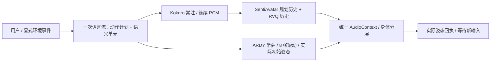

# 语义连续表达与空间控制

> 本文保留 2026-09-27 的实现与实验记录。当前路由、原生历史、接触约束与 UI 以
> [2026-09-28 Motion Studio 升级](motion-studio-upgrade.zh-CN.md)为准；已移除本文旧版的支撑姿态冻结和讲话上身叠加。

## 重复和停顿的原因

原状态机把播放结束当作一次新的自主决策触发器。语言模型因此再次看到相同的最后一条用户消息，
即使换了措辞，也是在重新回答。现在播放回执只更新已执行状态并进入等待；用户输入或显式环境事件
才触发新决策。一次输入只有一个语言请求，JSON 流里的 `beats` 依次携带本句动作意图和实际台词。
完整 beat 到达就进入语音队列，结束标记不会重放累计文本。输入打断会换 epoch，旧动作结果作废。

PCM 按真实采样数连续聚合：首窗口 2.4 秒，后续 4.8 秒，保留至少 0.6 秒尾部直到 EOF，避免极短末段。
缓冲器同时标记是否有后续窗口，首包不再等待下一窗口的 TTS 才发布。队列最多预生成三个未播放窗口。
讲话动作仍使用 SentiAvatar 的有界前视音频窗口、前两对规划历史和 RVQ 历史，**不是零前视因果模型**。
同一表达内部不恢复站姿；整轮表达结束才惯性收势。

## 为什么动作表现不能只调采样精度

| 一手资料 | 直接相关的事实 | 本次选择 |
| --- | --- | --- |
| [SentiAvatar 论文](https://arxiv.org/html/2604.02908v1)、[官方代码](https://github.com/SentiAvatar/SentiAvatar) | 语义规划稀疏关键帧，语音韵律驱动补帧；公开训练与演示带有特定人物、声音与表演风格 | 按语义单元传动作意图，遵循原始动作文本提取逻辑，保留原生补帧六步 |
| [EMAGE / CVPR 2024](https://arxiv.org/abs/2401.00374) | 身体、手部、面部各有不同的信息需求 | 身体路由不占用语音面部轨；不能把扩大手臂摆动当成情绪提升 |
| [SemGes / ICCV 2025](https://www.openaccess.thecvf.com/content/ICCV2025/papers/Liu_SemGes_Semantics-aware_Co-Speech_Gesture_Generation_using_Semantic_Coherence_and_Relevance_ICCV_2025_paper.pdf) | 手势与话语语义的一致性、相关性需要显式关注 | 后续 beat 推进语义和动作，不复用整轮开场意图；跨句 PCM 采用占时最长语义单元的意图 |
| [ZeroEGGS](https://arxiv.org/abs/2209.07556) | 动作风格需要条件或参考，而非单一音量值 | 不宣称中性 Kokoro 能复现原 demo 的情绪表演 |
| [LiveGesture](https://arxiv.org/html/2604.10927v1)、[StreamTalk](https://arxiv.org/html/2608.01643v1) | 因果生成、滚动前文和边界控制属于模型与系统的共同设计 | 保留真实模型历史、时钟和取消语义，不把片段交叉淡化称为完整模型流式 |

上游 UI 文本标记与低层规划输入不是同一接口：原始 `extract_description` 提取最后一个动作标签，
无动作时回退表情。现在兼容 `【】` / `〖〗`，普通描述补充 `动作：`，不把完整多标签台词直接喂给动作规划器。

补帧的多个五帧窗口在原算法中相互独立。本次批量放到 GPU，保留六轮置信度解码与固定关键帧，
移除逐 token `.item()` 的 CPU 同步。同输入实测批量与串行离散 token 完全一致。
规划器偶发过早结束、少于两个完整关键帧时，只允许一次相同上下文的低温重采样；仍失败就报告错误，
不伪造动作。面部仍受中性语音、VRM 形变通道、上游固定手指模板限制，尚未做主观自然度盲评。

## 空间模型选择

采用 [NVIDIA ARDY](https://research.nvidia.com/labs/sil/projects/ardy/) 的
[官方 Core 20 FPS / Horizon 8 权重](https://huggingface.co/nvidia/ARDY-Core-RP-20FPS-Horizon8)。
[原论文](https://research.nvidia.com/labs/sil/projects/ardy/assets/ardy_paper.pdf)和
[代码](https://github.com/nv-tlabs/ardy)支持前文条件、文本和空间约束，每次原生产出 8 帧（0.4 秒），
历史最多保留 40 帧。新窗口以上一窗口的真实模型结果为条件，并携带最后一帧供播放器插值。
不是先生成完整长片再切成网络包。

ARDY 动作网络约 326M 参数，保留 FP32 与十步采样。显存主要开销来自 8B LLM2Vec 文本编码器；
使用 [voxta NF4 合并版本](https://huggingface.co/voxta/Llama-3-8B-LLM2Vec-ARDY-NF4)，
先合并原始模型和两个适配器再量化，缓存最多 64 条语义嵌入。这是第三方量化发布物，
不是 NVIDIA 发布的量化精度认证；本地未复验它与 BF16 的向量相似度。
模型、源码修订和许可证分别固定在 `scripts/character/spatial/models.json`。

对比过 [DART](https://github.com/zkf1997/DART)（自回归潜空间扩散、轻量文本编码，需 SMPL 资产与不同控制适配）、
[PACER](https://github.com/nv-tlabs/pacer)（物理地形控制、仿真训练链较重）、
[LAMA](https://github.com/jiyewise/LAMA)（场景交互）和 [Kimodo](https://github.com/nv-tlabs/kimodo)（完整动作生成）。
本轮选择 ARDY 是因为可直接部署的原生短窗口、历史条件和关节/根位置约束，不代表它覆盖所有场景。

## 路由与身体所有权



- 原地讲话由 SentiAvatar 控制身体与面部。
- `move_to` 由 ARDY 控制根位置、腿部和步态；同时讲话时，上身叠加适量 SentiAvatar 手势，面部继续跟随语音。
- `reach` 约束骨盆、双脚和右手轨迹，目标附近做小范围接触 IK；播放时固定近距离触碰的站立支撑，
  手臂由模型驱动，躯干只叠加 12% 的旋转，避免模型通过深蹲、折腰代替伸手。`sit`、`stand`、`perform` 由 ARDY 控制身体。
- 位置来自环境目标或用户明确坐标。目标不存在就询问，禁止猜坐标；不能重复领取已执行动作。
- 讲话使用音频输出时钟；空间动作准备好后也用该时钟推进，暂停冻结，两者持续时间可以不同。
  当前空间动作尚无逐词动作时序标注，不能声称“伸手触碰”恰在某个词上发生。
- VRM 缺失 upperChest 时合并旋转；模型骨盆高度按 avatar 比例缩放。行走结束收势，坐下保持坐姿。
  镜头跟随真实根位置平移。接触以手部控制点 5 厘米内为验收阈值；失败也恢复自然姿态，
  不把明显失败的末帧留在画面中。近距离接触的支撑约束不等于全身碰撞求解。

## 部署与检查

先完成既有 SentiAvatar / Kokoro / Qwen 部署。外部 DataRoot 的结构为 `models/`、`runtimes/`、`research/`、`logs/`。
安装 ARDY 原生足部修正需要 CMake 和 MSVC C++ 工具链；本机已构建通过。

```powershell
./scripts/character/install_spatial.ps1 -DataRoot <DATA_ROOT>
uv pip install --python <HOME>/runtimes/sentiavatar-susu-cu128/Scripts/python.exe --no-deps --reinstall ./plugins/models/sentiavatar-susu/runtime
pnpm --filter @virea/web build
./scripts/character/start_gpu_stack.ps1 -VireaHome <HOME> -LlamaServer <LLAMA_BIN>/llama-server.exe -ModelFile <DATA_ROOT>/models/Qwen3.5-9B-Q4_K_M.gguf -HfHome <HF_CACHE>
```

`start_gpu_stack.ps1` 从语言权重路径推导 DataRoot，自动启动/检查 8085 空间服务；所有服务仅绑定 loopback。
其他配置可省略 `spatial_url`。ARDY 目前是独立实验 worker，尚未纳入主 ModelPool 的统一显存预约；
并行执行会共享显卡，应以真实并发实测为准。文本编码器占用约 4.7 GB 权重文件，整套常驻测得约 19 GiB 显存。

原生约束格式验证（CPU，不加载生成网络）：

```powershell
$env:PYTHONPATH = (Resolve-Path scripts/character).Path
<DATA_ROOT>/runtimes/ardy/Scripts/python.exe -B scripts/character/benchmarks/verify_spatial_constraints.py --model-dir <DATA_ROOT>/models/ardy-core-20fps-h8
```

性能及浏览器结果见 [本轮证据](evidence/semantic-spatial-20260927.json)。串行/批量补帧比较入口为
`scripts/character/benchmarks/compare_infill.py`。应用回归使用 `uv run pytest tests/character` 和 Web 测试。

## 尚未达到的能力

ARDY 是运动学生成模型。上游也明确没有通用物理动力学保证；本轮没有接入导航网格、障碍碰撞、
自动地形重建、足底地形采样、浮力/流体或物体抓取动力学。XYZ 目标约束不等于能安全走任意楼梯，
游泳描述也不等于水中物理交互。杯子测试是接触，不是抓取搬运。
坐下/站起/自由描述接口已接通，但未获得各类体型和场景下的质量认证；没有把它们写成“全场景全动作已完成”。
情绪语音可继续评估 [CosyVoice](https://github.com/QwenAudio/CosyVoice) 和
[Qwen3-TTS](https://github.com/QwenLM/Qwen3-TTS)，本轮没有部署或宣称验证这些模型。
