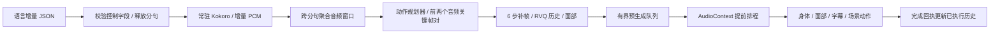

# 自然待机与连续表达

本轮把“完整表达结束”与“内部推理窗口结束”分开。完整表达结束后回到自然站姿；
表达内的窗口持续衔接，不反复收手、停声、重新起步。动作生成开始前不再等待整篇回复和整段音频。

## 研究依据与选择

| 一手来源 | 与本次问题直接相关的结论 | 本次落实 |
| --- | --- | --- |
| [SentiAvatar 原论文](https://arxiv.org/html/2604.02908v1)、[官方项目与演示](https://sentiavatar.github.io/) | 语义规划稀疏关键帧，音频驱动补帧；附录 B 使用前两个音频/动作关键帧对作为前文 | 给规划器传递这两对历史，同时保留 RVQ 补帧边界与重叠解码；不把播放插值冒充模型上下文 |
| [LiveGesture](https://arxiv.org/html/2604.10927v1)、[作者项目](https://m-usamasaleem.github.io/publication/LiveGesture/LiveGesture.html) | 真正零前视需要因果音频编码器和流式运动表示 | 本地 SentiAvatar 的 HuBERT 仍是有界前视，因此不宣称零前视；检索时未在作者页面找到可直接部署的完整发布物 |
| [StreamTalk](https://arxiv.org/html/2608.01643v1)、[官方代码](https://github.com/Xiangyue-Zhang/StreamTalk) | 滚动窗口需要前文姿态条件和漂移控制 | 保留原生前文，窗口入口匹配实际姿态/角速度，根位置锚定；没有把论文的检索模块宣称为已实现 |
| [Accelerated Rolling Diffusion, AAAI 2026](https://ojs.aaai.org/index.php/AAAI/article/view/39807)、[代码](https://github.com/andrewbo29/co-speech-gestures-rolling-diffusion) | 连续流需要跨窗口生成依赖，不能只靠独立片段后处理 | 编排、生成和播放分别有显式的窗口顺序及上下文，不临时更换成尚未适配本地骨架的扩散模型 |
| [EMAGE 原项目](https://pantomatrix.github.io/EMAGE/)、[ZeroEGGS 原论文](https://arxiv.org/abs/2209.07556) | 自然表达涉及身体、手部、面部及风格条件，不能以增大手臂幅度代替 | 保留原生面部数据、增加具体情绪/动作规划、移除所有回复固定同一种采样种子的做法 |
| [OSHA 工作姿势说明](https://www.osha.gov/etools/computer-workstations/checklists/evaluation)、[呼吸与安静站立研究](https://pmc.ncbi.nlm.nih.gov/articles/PMC5973601/) | 放松肩部、手臂靠近躯干，以及小幅姿态调整，比关节完全锁定更符合放松状态 | 采用真实 idle 动作参考；待机添加很小的呼吸、上身摆动和眨眼。这是动画选择，不是医学姿势标准 |

已在官方页面观看演示片段，观察到手臂动作同时伴随头部、肩部、躯干与面部变化。
公开资源里的手部流来自固定 idle 模板；不能由演示观感推断当前公开模型会生成手指动作。
不同 VRM 的面部形变通道也会影响最终观感。本轮没有声称复现 SuSu 专用模型的全部细节。

## 自然姿态独立于导入姿态

`build_neutral_pose.py` 从已安装、已许可的 `Daiji_A_001_V001.npy` 提取 59 帧 idle 参考，
使用既有 SuSu → VRM 转换，并在四元数符号对齐后求平均。读取 pickle 前检查固定 SHA-256。
输出包含 52 个关节，覆盖躯干、四肢、手腕和手指，不再只把两根上臂从 T-pose 旋转下去。
衍生姿态和许可证保存在外部 `VIREA_HOME/characters`，不将上游受许可数据拷入仓库。

浏览器按 VRM 版本转换参考旋转；完整表达末尾用现有惯性收势到达该姿态，保留地面位置与朝向。
随后开启小幅待机动作，脚部和根位置保持不动。用户打断时保留实际姿态，下一次从那里平滑接入。
没有加入足部 IK 或碰撞求解，因此仍需检查具体 avatar 的体型与附件穿插。

## 持续生产与同一时钟



- 结构化语言先确定 `mode / motion_intent / actions`，再增量释放 `text`。未完成的 JSON 转义不进入语音。
- Kokoro 在分句就绪后生成音频，PCM 重新聚合不会复制样本、丢样本或在窗口间插入静音。
  首窗口目标 3.2 秒，后续 4.8 秒；不足 0.6 秒的尾部并入前窗。字幕是对应语音分句，不宣称逐字强制对齐。
- 最多三个未播放完成的动作包；语言、语音和动作之间均有有界队列。模型推理与播放回执不串行等待。
- 每窗携带 `stream_id / sequence / offset_seconds / parent_id / continues`。接续历史属于该表达，
  收势或打断后清空；生成了但没播放的文本不会进入已说出的历史。
- 浏览器预加载并在同一个 AudioContext 上排程后继声音。HTTP 回执不再决定下一个音源的起播时间。
  下载乱序时等待前驱固定起点；迟到时明确记录 underrun，不让两个音源重叠。
- 首播默认需要后继包；当已测得的单包生成开销低于当前音频时长的 70% 时，可以提前开播。
  这不是任意 GPU 负载下的无卡顿保证。暂停冻结同一时钟；打断停止所有已排程音源。

这里实现的是**增量语言驱动、有界前视、带原生上下文的连续生产**。
公开 SentiAvatar Worker 仍按窗口返回最终产物，未变成逐帧推送协议；HuBERT/Kokoro 也未被重新训练成样本因果模型。

## 同一动作模型的执行后端加速

剖析发现 Windows 上主要开销在 Transformers 的动作 token 自回归解码，而不是 6 步补帧。
因此保留权重、音频编码器、补帧步数和身体/面部解码器，增加可选的本机 llama.cpp 执行后端。
使用官方 b11146 转换器把 BF16 权重写为 FP16 GGUF，推理使用 CUDA；本轮默认未采用 INT4 动作权重。
[官方转换说明](https://github.com/ggml-org/llama.cpp/blob/b11146/docs/development/HOWTO-add-model.md)
和[服务接口](https://github.com/ggml-org/llama.cpp/blob/b11146/tools/server/README.md)是实现依据。

动作规划器使用原 HF tokenizer 生成输入 token IDs，也用它解码输出 IDs，绕开聊天模板与显示层特殊 token 处理。
已核对全部 500 个音频 token 和 4×512 个有效动作 token 的 ID 一致性。
特别注意：原生拼写是 `[res_1_0]`，不是 `[res1_0]`；后者会分裂为普通文本 token。
错误服务、截断输出、越界码仍报错，不静默降级到别的模型。

固定三条真实音频、同一组条件、两种执行器的后端观察如下；包含冷核初始化的首条单独保留，
不能拿此表直接充当页面延迟或主观质量评分。

| 输出时长 | Transformers BF16 | llama.cpp FP16 |
| ---: | ---: | ---: |
| 2.8s | 2.30s | 0.46s |
| 4.6s | 1.84s | 0.59s |
| 4.1s | 1.62s | 0.67s |

两种执行器都通过原生码范围、有限数值、帧数和上下文传递检查；采样器实现不同，输出不保证逐码一致。
目前没有盲评 MOS 或覆盖所有情绪、体型的自然度评测。

## 当前真实联调结果

RTX 5090 Laptop（24,463 MiB），真实 Qwen、Kokoro、SentiAvatar 和 Chrome 页面。
[便携测量摘要](evidence/streaming-20260927.json)记录证据文件哈希、配置、通过项与失败实验。

| 最终 3.2 / 4.8 秒窗口配置 | 首播等待 | 输出语音 | 窗口数 | 音频断点 |
| --- | ---: | ---: | ---: | ---: |
| 长回复 run5 | 11.08s | 28.275s | 7 | 0 |
| 长回复 run6 | 11.53s | 28.275s | 7 | 0 |
| 开心庆祝 | 6.98s | 6.20s | 2 | 0 |
| 温柔安慰 | 7.17s | 6.75s | 2 | 0 |
| 分步解释 | 7.01s | 6.90s | 2 | 0 |

长回复相邻音源的排程间隔误差低于 2ms，实际观测接近浮点零；两次动作流水线 RTF 为 0.65 / 0.60。
同时通过全文守恒、两类原生历史传递、内部窗口无收势、暂停同钟、打断清队列及复用常驻 Worker 检查。
较早 2.4 秒首窗的 run4 首播为 9.34s、RTF 为 0.49，也保留在摘要中；不能把窗口调整宣称为普遍提速。
当前首播仍有约 7–11.5 秒等待，未达到 2 秒目标。

三个固定真实动作分别验证自然收势与下一次入口：身体姿态误差小于 1e-6 rad，
收势时暂停 400ms 不前进，打断保持实际姿态；待机允许小幅呼吸，不再断言角色完全静止。
三种情绪输入另有完整浏览器录像与截图，观察到不同手势和面部权重，但这些不是自然度盲评分数。

角色 Python 测试 50 项、模型 Runtime 测试 19 项、文档与公共契约检查 15 项通过。
前端串行运行 94 项全过；并行运行曾有一项既有 bootstrap-browser 时序断言失败，保留该观察，未修改或放宽断言。
TypeScript 构建和 Ruff 检查通过。GitNexus 将跨层改动整体标为 CRITICAL；
全量变更检测之外，显式检查了 HTTP 路由、动态 Worker 分发及浏览器调用这些图索引不完整的入口。

## 部署与复现

已有 SentiAvatar 0.3.0 安装、外部数据目录及 b11146 的源码与二进制后：

```powershell
uv pip install --python <HOME>/runtimes/sentiavatar-susu-cu128/Scripts/python.exe --no-deps --reinstall ./plugins/models/sentiavatar-susu/runtime
uv run python scripts/character/build_motion_planner.py --home <HOME> --llama-source <LLAMA_SOURCE> --output <MODELS>/sentiavatar-planner-f16.gguf
pnpm --filter @virea/web build
./scripts/character/start_gpu_stack.ps1 -VireaHome <HOME> -LlamaServer <LLAMA_BIN>/llama-server.exe -ModelFile <MODELS>/Qwen3.5-9B-Q4_K_M.gguf -HfHome <HF_CACHE>
```

转换时先停止正在使用该 GGUF 的规划器服务。转换器记录输入权重、tokenizer、转换脚本和输出的 SHA-256，
并保存上游非商业许可证。`-MotionPlannerFile` 可指定另一处同权重 GGUF；默认在语言模型同级目录寻找它。
启动器启动或检查端口 8080（语言）、8083（语音）、8084（动作规划）、8000（API），并构建自然姿态资源及预热。
不用该后端时将 `motion_planner_url` 留空，继续使用 Runtime 内的 Transformers。

```powershell
uv run python -m pytest tests/character -q
pnpm --filter @virea/web test
node scripts/character/continuous_e2e.mjs <AVATAR.vrm> <EVIDENCE>/continuous
node scripts/character/ending_e2e.mjs <AVATAR.vrm> <EVIDENCE>/rest <FIXED_CAPTURE>
```

模型独立测试使用已安装 Runtime 的 Python，设置 `PYTHONDONTWRITEBYTECODE=1`，避免 Python 缓存改变不可变源码资产。
`compare_planner.py` 复现两种动作执行器与原生 token 检查。原始本机证据保存在外部
`VIREA-Data/evidence/streaming-upgrade`。此前每窗 2.4 秒的实验生成追不上播放，以及后续一次 221ms underrun，
均保留失败观察；没有用最终成功结果覆盖它们。
