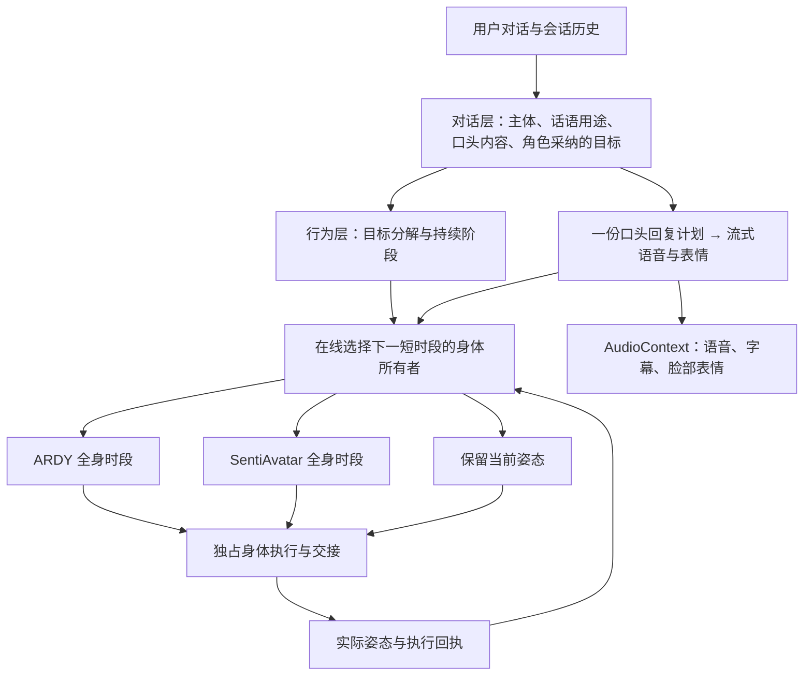

# 对话驱动的分时身体执行

同一帧的全身骨骼只有一个生成模型拥有写入权。ARDY 与 SentiAvatar 不再做身体残差叠加或按部位混权。语音与脸部表情是独立通道，可以在 ARDY 驱动身体时继续播放。

## 研究依据与边界

| 原始资料 | 与本次改造有关的机制 | 在 VIREA 中的用途 |
| --- | --- | --- |
| [ARDY 原论文 §4.1](https://arxiv.org/html/2607.08741v1)、[官方代码](https://github.com/nv-tlabs/ardy) | 自动回归历史、近期动作的提前提交与延迟感知重规划 | 当前窗口播放时准备下一窗口；已提交的窗口继续执行，新意图使未来预测失效 |
| [SentiAvatar 原论文 §4.1、4.5、4.7 与附录](https://arxiv.org/html/2604.02908v1)、[官方代码](https://github.com/SentiAvatar/SentiAvatar) | Plan-then-Infill 的身体生成、历史条件与独立音频驱动面部通道 | 被选中时执行完整交际身体动作；脸部通道随语音继续，不与 ARDY 全身混合 |
| [SAIBA/BML 原论文](https://alumni.media.mit.edu/~kris/ftp/BML-IVA-06-KoppEtAl.pdf) | 意图、行为规划、行为实现分离，行为间同步约束 | 先解释对话并形成角色目标，再编译动作；共同表演具有同步起步关系 |
| [AsapRealizer 原论文](https://research.utwente.nl/files/6473000/EntCom.pdf)、[官方项目](https://github.com/ArticulatedSocialAgentsPlatform/AsapRealizer) | 可增量调整的行为实现与执行反馈 | 行为预订、准备、播放和完成回执相互区分，不能把计划当作已执行事实 |
| [Inertialization，GDC 原始演讲](https://www.gdcvault.com/play/1025331/Inertialization)、[原始幻灯片](https://media.gdcvault.com/gdc2018/presentations/bollo_david_inertialization_high_performance.pdf) | 新动画采样时衰减交接处的姿态/速度误差 | 切换所有者时保持当前实际姿态，再收敛到新源，不同时采样两套身体动画 |
| [Ubisoft Learned Motion Matching](https://www.ubisoft.com/en-us/studio/laforge/news/6xXL85Q3bF2vEj76xmnmIu/introducing-learned-motion-matching) | 运动历史、未来意图与交接平滑各司其职 | 区分语义选择、原生运动预测和渲染端边界校正 |

这些资料支持上述分工，并不直接验证“任意 VRM、任意姿态、任意地形”上的组合效果。论文原生模型的速度也不能当作这套本地多模型系统的响应时间。

## 两层语义与执行路径

对话层读取完整的有界会话历史，区别角色自己、叙述中的别人、引用、假设和实际邀请。动作编译器只接收角色已经采纳且解析了指代的目标。用户原句不再直接作为运动提示。

`speech` 表示上层是否决定发声；`reply` 描述真正要说的内容。已经承诺的口头回应由下层生成正文，下层不能再次选择 WAIT。对话层的静默决定则不启动语音生成。阶段目标的 `keep / replace / stop` 与语音生成互不等价。

`coordination=with_reply` 表示共同表演：首个动作时段提前生成，但等语音就绪再起步。普通行动的口头确认不强制延迟行动。该关系由语义模型决定，没有关键词触发动作的路由表。

## 时段生命周期和连续性

- 后端保存一个正在执行的时段，以及有界的未来预订和诊断记录。每个时段只有 `ardy / sentiavatar / hold` 一个身体所有者；接管前必须收到前一时段的完成回执。
- 用户新消息使未开始的旧 epoch 计划失效。正在播放的时段允许结束，随后根据新对话重规划。推理期间收到新消息，不会把被丢弃的预测误记为当前身体任务失败。
- 当前时段播放时准备后继。连续 ARDY 时段使用前一已提交时段的预测尾部历史；从别的身体模型切换至 ARDY 时使用渲染器最近约两秒的实际观测。预测与执行回执分别存储。
- 原生生成保留整个剩余阶段的目标和时限，`max_seconds` 只限制此次输出量。短时段边界不会被解释成空间目标终点，不插入自然站姿或静态末帧。
- SentiAvatar 动画采样在临时骨骼快照中完成，随后恢复现场。只有被选中的源能写入最终身体；手势权重契约和叠加器已经删除。
- 所有者切换时只衰减边界姿态误差。没有让两套运动在同一帧共同驱动骨架。语音、口型和表情继续使用音频时钟。
- 语音可用性改变时，尚未开始的交际/保持时段会重新评估；保持时段不会在新语音到来后继续等待整个旧时长。小于一秒的尾段是合法调度输入。
- 播放失败释放身体预订；暂停保持音频时钟。连续 ARDY 时段的导出与重播会累积整个身体任务，而不是只留下最后一个时段。

角色的身体目标不等于必须轮流使用模型。一个持续舞蹈可能由多个连续 ARDY 时段执行，舞蹈结束后再交给 SentiAvatar；过程中仍可说话和变化表情。没有为“展示混合”而强制轮换。

## 代码位置

| 责任 | 文件 |
| --- | --- |
| 对话理解、目标采纳、动作阶段编译 | `src/virea/character/providers/performance.py` |
| 在线时段选择、剩余目标、预测历史 | `src/virea/character/behavior.py` |
| 预订、生成、回执与并发约束 | `apps/api/src/virea_api/routes/character_behavior.py` |
| 执行与下一时段准备 | `apps/web/src/character/behavior_player.ts` |
| 单一身体所有者、隔离采样和交接 | `apps/web/src/character/body_authority.ts` |
| ARDY 原生短输出、长期目标保留 | `scripts/character/spatial/program.py` |

当前 GPU 启动脚本为语言模型配置两个并行推理槽位（总上下文 16384，每槽 8192），避免长口头回复完全阻塞下一时段的规划。使用 [llama.cpp server 官方并行解码接口](https://github.com/ggml-org/llama.cpp/blob/master/tools/server/README.md)。

## 可复现实测

环境：RTX 5090 Laptop 24 GB；Qwen3.5-9B Q4_K_M；ARDY H40 核心与 NF4 文本编码器；本机 SentiAvatar/Kokoro 常驻服务。并发服务显存观测约 18.9 GB。

1. `scripts/character/benchmarks/evaluate_dialogue_grounding.py`：9 个确定意图用例覆盖第三人称叙述、引用翻译、假设、故事、建议、邀请、安静表演、共同表演和说完等待。另有一个开放的安慰探针：模型曾主动采纳前倾和递水式关怀手势，并未复制用户的跑步或坐下。它允许角色自主行为，不计入“必须保持原任务”的二元断言。另测多轮指代、已有身体任务时的发言控制，以及简短问候的真实正文生成。
2. `scripts/character/benchmarks/evaluate_temporal_handoffs.py`：24 秒舞蹈分成 6.4、6.4、6.4、4.8 秒，4 次原生调用分别约 0.625、0.700、0.575、0.453 秒。后继均使用 40 帧历史；三个交接点的根位置误差为 0，最大旋转误差约 0.000011°。这是边界一致性测量，不是自然度评分。
3. 浏览器真实 VRM 的 24 秒舞蹈与完整故事：四个 ARDY 时段连续结束并交给 SentiAvatar；146 个后端状态采样中同时播放的身体所有者最多 1 个，未记录会话错误。首个动作已经准备好时保持等待，直到语音可播才接管。并发实播中后继 ARDY 生成约 0.58–0.98 秒。
4. 40 秒四阶段舞蹈实播中，末段插入“别人走两步然后坐下”的叙述后，身体任务 ID 保持不变并完成原舞蹈。热启动首个完整包约 19.8 秒、TTS 单次约 0.235 秒、末次 SentiAvatar 动作生成约 1.218 秒；整体首包等待仍主要来自上游语言规划与内容生成。完整身体任务回放也经过浏览器检查。
5. 自动回归覆盖上层决定不可被下层 WAIT 覆盖、完整历史传输、仅采纳目标进入动作编译、未来计划失效、进行中的时段保留、生成中收到新消息、独占骨骼、失败释放与同步起步。后端角色测试 96 项、前端测试 107 项通过，TypeScript/Vite 构建通过。

本次原始记录存放于工作区外的 `VIREA-Data/evidence/temporal-behavior-20260929/`，不把用户角色文件、人设或模型权重提交到仓库。运行基准时通过参数指定自己的 neutral-pose 文件和输出目录。

实播仍暴露出语音动作冷启动的明显等待：24 秒舞蹈案例首个完整语音动作包约 39.9 秒才就绪，首次音频约 15.2 秒。同步起步解决了“动作先做完、声音后来才开始”的错序，但并没有消除冷启动成本。预热入口已实测。早期试验还出现过“说完等待”被编成静态身体任务、下层直接 WAIT、不一致的空目标；修复记录与失败样本均保留，不能把有限用例通过当成语言模型的通用语义保证。跨模型切换的主观自然度、足底接触与任意地形仍需扩大素材和场景评测。
