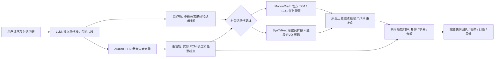

# MotionCraft / SynTalker 独立轨道表演

[English](unified-motion.en.md) · [16 段视频](../assets/unified-motion-demos/index.html) · [执行清单](../assets/unified-motion-demos/manifest.json)

一次会话选择一条动作路线：已有 SentiAvatar + ARDY、MotionCraft、SynTalker。默认仍是已有路线，新路线不会加载或静默回退到 SentiAvatar / ARDY。这里的“单模型”指一个动作模型家族；LLM、TTS、文本编码器、模型内部的控制分支 / VAE 仍是必要组件。

## 技术梗概



`PerformancePlan.motions` 给出互不重叠的多个动作段，`speech` 给出台词及绝对 `start_seconds`，或者前一台词的 `after_clip + gap_seconds`。LLM 不猜测语音长度；以克隆 TTS 实际 PCM 样本数为准。语音可跨动作边界，音频结束不会触发动作停止或归零。动作间空白和超出动作末尾的语音由 `idle_prompt` 覆盖。若需要收势，要显式规划收势动作。

动作描述采用简短英文，通常 3–12 个词，最多 20 个词。一个简单完整动作可以包含自然的小组合，例如 `A person raises both arms and lowers them.`；不强制把准备、保持、收势机械拆开。只有过长编舞、不同动作目标或需要单独安排时间的内容才拆段。

规划后立即准备 TTS，并生成不依赖该语音的原生窗口；只有窗口条件范围覆盖到某片段时才等待该片段。两个会话共享 TTS 请求队列，以适配 Audio8 的单流限制；动作推理另有队列，两类工作可以重叠。当前实现准备完整表演再播放，**不是低延迟实时流式播放**。CPU 可运行，但复杂表演的准备时间可能明显长于最终视频。

音频统一到 16 kHz，动作 30 fps，通过绝对帧到样本的位置换算避免逐帧舍入累计误差。播放器用同一个 AudioContext 时钟调度动作和音频，暂停两轨一起冻结；在动作尚未结束时仍保持模型的身体所有权。长度上限 180 秒，每轨最多 32 段。不支持台词互相重叠；冲突明确报错，不裁切或压缩声音。

## 论文与官方代码如何对应

完整阅读了 MotionCraft 论文及补充内容、SynTalker 论文及补充内容，并核对了发布仓库的模型、推理器、训练特征与表示转换。论文架构图不能直接当作现成 HTTP 服务的能力承诺。

| | MotionCraft | SynTalker |
|---|---|---|
| 一手资料 | [论文全文](https://arxiv.org/html/2407.21136v3)、[官方仓库](https://github.com/cure-lab/MotionCraft) | [论文全文](https://arxiv.org/html/2410.00464v1)、[官方仓库](https://github.com/RobinWitch/SynTalker) |
| 固定源码 | `a72b1327b5ffefa4f1a9e3ffa2427b9b83f840f9` | `4301ada4d5affe6a77beaf5f8e19bc1904d3ea41` |
| 本次实际图 | 同一家族的官方 T2M 与 S2G 检查点，按任务加载，各用对应统计 | 完整 H3D 路线，TMR 文本条件、MDM 扩散、上身/手/下身三个 RVQ-VAE |
| 窗口 / 历史 | T2M 单段最多 196 帧；S2G 64 帧、16 帧历史；协议每次交付 48 帧 | 128 帧窗口，16 帧历史（4 个潜变量），每次交付 112 帧；最后拼接潜变量整体解码 |
| 原生表示 | Motion-X 322 → SMPL-X → canonical211 | H3D 623 → `recover_from_ric` 的 52 关节 → VRM |
| 音频输入 | BEAT amplitude + onset 特征，非原始波形直接输入 | 相同训练风格的音频特征；当前 word 条件使用空 token，没有强制对齐转写 |
| 本项目的扩展 | 分段 T2M、官方逐步噪声前缀约束、原生姿态接缝校正、会话手势区间与身体区域控制 | 按潜变量时间位置组合文本/音频 CFG、每步 x0 历史约束、完整解码接口 |

**时序掩码和长序列连接是 VIREA 推理扩展，需要用真实检查点评估；不是对上游原生能力的重新命名。** 两个适配器都保留发布代码的音频 onset 索引行为，避免未经训练的特征分布修改。MotionCraft 保留 BEAT 统计中的零方差非活动通道。SynTalker 只安全读取 tensor 权重；上游初始化要求的词表从检查点嵌入重建，不下载和反序列化外部数据集 pickle。

MotionCraft 的明确物理动作由 T2M 生成，语音照常并行播放。仅 `speech_gestures=true` 的讲解/会话段及动作空白处启用 S2G 上身手势；其影响在真实语音区间内渐入渐出，不覆盖根位移、腿部和躯干。两个检查点没有拼接权重或混用归一化，也不是一个 S2G 检查点同时完成所有任务。T2M 按动作段生成并缓存；长动作使用原生前缀继续，接缝姿态校正于 0.4 秒内衰减。

SynTalker 的逐窗口结果只是临时结果。`POST /streams/{id}/finalize` 将整段潜变量交给时间卷积 RVQ 解码器，客户端验证完整帧数后才重定向和播放，避免窗口边缘 padding 造成跳变。真实 12 秒探针的三个接缝，RIC 关节位置跳变量从 0.588/0.545/0.934 降至 0.103/0.040/0.103；这是该探针的接缝对照，不是全数据集质量指标。

原生历史属于有租约的 worker stream；序号、起点和历史帧必须连续。重复、丢失、过期或错误模型的窗口被拒绝。取消时，正在后台线程执行的模型先结束，再释放串行推理锁；会话结束后删除状态和临时播放资源。模型不可用时显示失败，不换成另一条动作路线。

重定向只对最终轨迹做固定、可复现的处理：根位置 median + Gaussian 滤波；四元数同半球对齐和平滑；手腕 450°/s、手指 720°/s 速度上限以抑制退化关节位置产生的翻转。滤波会小幅改变轨迹和姿态，不能证明接触正确，也不会创造模型未生成的目标动作。

SynTalker 的上身与手部由不同 RVQ 解码器输出。先利用五个掌指关节拟合刚性手掌，将其锚定到上身输出的手腕，消除两部分的位置偏差对掌面朝向的放大；该步骤明确使用标准手掌比例作为重定向先验，保留各手指的观测节段方向。之后应用项目已有的解剖约束求解器。没有指尖的关节位置不能恢复末节旋转、轴向扭转或完整拇指对掌；这些自由度显式采用中性先验，不冒充模型恢复出的精细手势。

新路线的播放窗口启用 `grounding=prevent_penetration`。在没有源接触关节的情况下，只在脚底低于角色校准地面时抬高根节点，不压低离地姿势；跳跃高度仍保留。这是防穿地校正，不是脚步锁定或接触物理模拟。已有带接触关节的路线继续使用原有对齐逻辑。

## 安装与运行

先完成项目的 `uv sync --locked --all-packages --extra dev`、`pnpm install --frozen-lockfile` 和 `pnpm --filter @virea/web build`。安装 Git、uv，并按 [Audio8 文档](audio8-tts.zh-CN.md) 启动 LLM 与 TTS。模型代码、权重及训练数据的各自许可仍适用；权重不随本仓库提交。

```powershell
$motionDataRoot = Join-Path $env:LOCALAPPDATA "VIREA/unified-motion"
# 二选一；安装程序输出实际 Python 和 worker.json 路径。
./scripts/character/install_unified_motion.ps1 -Backend motioncraft -DataRoot $motionDataRoot -Device cuda
./scripts/character/install_unified_motion.ps1 -Backend syntalker -DataRoot $motionDataRoot -Device cpu

# 在独立终端启动所需 worker；传入上一步输出的真实路径。
./scripts/character/start_unified_motion.ps1 -Python <WORKER_PYTHON> -Settings <WORKER_JSON>

# 另一个终端；VIREA_HOME 必须在源码仓库以外。
$env:VIREA_HOME = (Join-Path $env:LOCALAPPDATA "VIREA/home")
$env:VIREA_CHARACTER_CONFIG = (Resolve-Path 'configs/character/motioncraft.json').Path
uv run uvicorn virea_api.app:app --host 127.0.0.1 --port 8000
```

SynTalker 将配置换成 `configs/character/syntalker.json`。要在同一个 API 里选择两条新路线，把 `motioncraft_url` 和 `syntalker_url` 同时写入本地配置。默认 worker 端口分别是 **18086、18087**；8086 留给现有 Audio8 引擎。也可使用升级后的 `start_gpu_stack.ps1 -MotionBackend ... -MotionPython ... -MotionSettings ...`，新路线不启动旧动作规划器和 ARDY。

打开 `/app/character.html`，选择已就绪路线，载入 VRM。在声音克隆中导入用户提供的 `audio_reference_chu2.mp3` 及 `chu2.txt` 原文，选择该声音后开始会话。Demo 固定使用该参考生成的声音；执行清单保存输入文件 SHA-256，没有提交原始参考录音或模型权重。原参考是日语、示例台词是中文，跨语言声音相似度没有单独量化验收。

## 接口与复现

`GET /api/v1/characters/motion-backends` 返回配置与真实 worker 就绪状态。创建会话时指定 `motion_backend`；会话内不能换模型。普通 `messages` 接口通过 LLM 编排，精确时间表使用 `POST /api/v1/characters/{session_id}/performances`，请求示例见 [performance.example.json](../../configs/character/performance.example.json)。`GET .../performances/{id}` 仅在播放回执到达前提供活动资源，保留证据必须在确认完成前读取。

```powershell
# 真权重窗口探针。默认声音明确标为测试音调；用 --audio 提供 PCM16 / mono / 16kHz 语音。
<WORKER_PYTHON> -m scripts.character.unified_motion.acceptance --settings <WORKER_JSON> --output <PROBE_JSON>

# 实际页面、真实 LLM、克隆 TTS、模型推理和正常速度录像。
node scripts/character/unified_demo_e2e.mjs motioncraft <AVATAR_VRM> <OUTPUT_DIR> http://127.0.0.1:8000 all
node scripts/character/unified_demo_e2e.mjs syntalker <AVATAR_VRM> <OUTPUT_DIR> http://127.0.0.1:8000 all
```

可将最后一个参数换成 `02-warmup,03-story` 来重跑指定任务。Demo 脚本保存完整视频、PCM、重定向 JSON、浏览器诊断和完成回执；这些大的中间文件默认留在忽略目录。`build_unified_gallery.py` 只接受实际浏览器测试通过的 16 份结果，转码并生成双 README 的 2×4 图表。它需要输出目录的上级提供 `voice-receipt.json` 和两家模型的 `asset-receipt.json`。MP4 为正常速度转码，没有剪去动作区间；准备等待单独列在清单中。

角色或播放器适配更新后，可用 `scripts/character/replay_unified_assets.mjs <OUTPUT_DIR> <AVATAR_VRM>` 在 Vite（默认 18091）上重新播放已保存的真实轨迹与 PCM，使用同一个 `CharacterStage` 和录像器，按正常速度重新录制。它不重新生成或伪造动作，记录源文件、角色、渲染源码和视频 SHA-256，并检查防穿地结果。打包时传入 `--require-render --receipts <RECEIPT_ROOT>`，确保 16 段均有匹配的角色重录证据。

## 能力边界与验收

八类请求涵盖迎宾、热身、故事、舞步、服装展示、情绪转折、导览、拳击，每次至少五段动作、两段独立语音及真实静默段。任务请求与实际模型执行应分开判断：连续生成、时间轴正确、录像完整不等于走位、步数或肢体细节全部符合文字。

- MotionCraft 使用同一家族的 T2M/S2G 任务配置。明确动作期间的语音不会改写其身体轨迹；只有会话段/空白段使用语音控制手势。这不是所有阶段都由同一个联合检查点生成，也不是精确轨迹控制器。
- SynTalker 能产生提示词相关全身动作，但位置反解的手部姿态、脚部滑动及跨窗口姿态仍可能不自然。平滑只是工程缓解。
- 两条新路线均不提供 SentiAvatar 等价的面部表情或音素口型；当前嘴部是实际语音能量驱动的预览。也没有物体抓取、碰撞、落脚接触或地形约束保证。
- 当前历史在一次完整表演内连续。新一轮或打断后的生成没有把实际已执行姿态重新编码成原生模型历史；不能宣称跨轮严格原生闭环。
- 单动作家族降低了双动作模型切换复杂度，但未证明整体延迟或显存一定更低。执行清单逐段给出真实准备时间；不同设备的 MotionCraft / SynTalker 时延不能直接作模型速度对比。

自动测试覆盖独立时间轴、语音越过动作边界、静默/纯语音、实际 TTS 长度、原生历史序列、取消与租约、无回退、单一身体所有权和共享播放时钟。主观自然度与复杂任务语义仍须看完整录像评审；不能把数值通过写成这两项已全部通过。

### 本次执行记录

[验收记录](../assets/unified-motion-demos/verification.json)保存测试结果、原生检查点探针、浏览器解码检查和暂停 / 打断回执。两家各 8 段、各 276 秒，总计 552 秒。每段包含至少五段动作和两段克隆语音；完整录像保留静默动作。桌面画廊为每家 2 列 × 4 行，手机为单列。

最终 Demo 统一使用用户指定的 `VRM-Model-1.vrm`，文件内署名为 **Reira**。画廊清单记录角色、声音与权重的摘要及每次真实准备耗时；原始 VRM 不随 Demo 分发。本机 MotionCraft 使用 CUDA，SynTalker 使用 CPU。准备耗时包含规划、TTS、推理和队列等待，不是模型裸推理速度。暂停、打断与功能测试结果以本次验收记录为准。

本次 MotionCraft 的准备时间为 53.6–144.8 秒，SynTalker 为 58.9–117.7 秒。新角色使用降低后的场景灯光，避免浅色皮肤与服装过曝；录制前完成着色器编译和音频解码，消除首次渲染黑屏。16 段均保留完整动作与静默区间，没有通过剪辑隐藏接缝。
