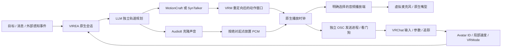

# VIREA → VRChat

[English](vrchat.en.md) · [桌面配置](../../integrations/vrchat/desktop.example.json) · [VR 配置](../../integrations/vrchat/vr-trackers.example.json) · [Unity 安装工具](../../integrations/vrchat/unity/Editor/VireaAvatarSetup.cs)

VIREA 负责推理、语音克隆、动作生成与时间轴；VRChat 是执行端。新的原生桥接拥有独立会话和播放任务，关闭浏览器控制页不会中断任务。当前在线接入 MotionCraft、SynTalker 两条独立轨道路线；已有 SentiAvatar + ARDY Studio 路线保留，其转换后的 canonical Motion IR 可通过离线 CLI 接入。桥接不更换任何动作模型检查点。

**2026-10-08，用户已发布 VIREA Independent AI，两个账号进入同一个在线私有房间，完整实例标识一致。** AI 客户端已穿戴发布角色，9 个参数全部可用；本地镜面 `AI_Smile=0/1` 对照已确认实际笑脸变化。观察者曾显示自定义角色，但 AI 再次入房时，观察者出现 `FailedFetchingSecurityScan` 与 API 401，显示替代机器人；认证失败的根因尚未确定。远端稳定可见性、手势、表情同步与虚拟麦克风仍未验收。401 可以与游戏场景在线同时出现，应仅恢复受影响客户端的登录会话，再走正常角色加载。标准 OSC 不提供世界画面、完整场景或其他玩家语音；本分支没有自动识别玩家对话、视觉导航或虚拟 HMD 驱动。

## 能力与执行契约

| 输出 | Steam 桌面版 | VR 设备模式 |
| --- | --- | --- |
| TTS | 指定播放设备 → 虚拟线缆 → VRChat 麦克风 | 相同 |
| 嘴型 | VRChat 原生麦克风 lip sync | 相同 |
| 字幕 | 可选聊天框，按语音片段时间发送 | 相同 |
| 移动 | 可选 OSC 输入轴，速度限幅 | 相同 |
| 表情 | 6 个自定义参数；外部 `/expression` 接口驱动 | 相同 |
| 手部 | 从模型手指旋转归类为 5 类手势；自定义 Gesture 层 | 可继续使用；精细骨骼手追踪需要其他驱动 |
| 眼神 | `/expression` 的 pitch/yaw/blink；无输入时使用 VRChat 默认行为 | 相同 |
| 全身动作 | 不支持通过标准 OSC 任意驱动全部骨骼 | FK → 最多 8 个身体追踪点；VRChat IK 重建 |
| 世界位置 | 未观测；不把积分出的命令当作真实位置 | 未观测；同样不伪造位置回执 |

OSC 的 `GestureLeft`、`GestureRight`、`Viseme` 等内置参数只读；桥接仅写 `AI_*` 自定义参数。[官方参数说明](https://creators.vrchat.com/avatars/animator-parameters/)

身体追踪点不是完整骨骼传输，也不能代替头显与双手设备。`/tracking/trackers/head/*` 只用于追踪空间对齐；默认关闭。进入 `vr_trackers` 必须收到实际 `VRMode=1` 回传并完成 VRChat FBT 校准。[官方 OSC Trackers](https://docs.vrchat.com/docs/osc-trackers)

## 技术梗概



* **时间轴**：动作窗口保持原始段长，采用根位置插值与四元数 SLERP；语音位于独立的绝对时间范围，可多段、跨动作边界、提前结束。动作结束以完整表演时长为准。
* **时钟**：启用声音时以 PortAudio 的 DAC 时间估算可听到的采样位置；不开声音时用单调时钟。暂停时保存已播放位置，恢复不会把缓冲中尚未听到的样本计入进度。设备错误或时钟停止前进时释放输入。
* **调度**：30 Hz 默认目标帧率，按绝对截止时间调度，落后时跳过过时采样，避免积压后加速回放。模型仍先准备完整表演，当前不声称低延迟逐帧生成。
* **坐标**：canonical VRM 位置反射 X 到 Unity 坐标；四元数按同一基变换后再转换为 Unity Z→X→Y 外旋欧拉角。身体尺度、原点、朝向可校准。启用移动输入时，从追踪数据中移除根平移与根 yaw，防止重复移动。
* **失效处理**：独立发送进程在 0.75 秒没有输出帧、父进程管道断开、暂停、取消或关闭时发送输入归零。UDP 不提供执行确认，归零重复发送仍不是网络交付保证。眼睛回到中性后停止发送，由 VRChat 超时恢复自动行为。
* **会话**：默认每个用户目标最多 3 次自主跟进，可配置 0–10。急停取消当前生成、播放与后续跟进；断开释放会话及端口。回执表示“输出已完成”，不声称身体、位置或碰撞已经测量。
* **反馈**：按配置的 UDP 端口找到唯一 VRChat 进程，再只读查询同进程的 loopback OSCQuery 服务，核对其端口与角色参数。页面默认仅在 9 个 AI 参数齐备时自动绑定首次识别的角色；播放中换角色会中止，不自动跟随另一个 ID。支持正式 `avtr_*` 和 SDK 的 `local:sdk_*` 身份。查询超过 3 秒未成功会关闭输出门控。局部速度反馈仅使用一秒内的值；事件型 OSC 回传年龄本身不作为心跳。
* **本机边界**：控制 API 限制 loopback 客户端、loopback Host 和浏览器同源请求；OSC 仅发往 `127.0.0.1`。默认不打开声音、不发送聊天框、不移动角色。

## 启动桌面版

1. 按[独立动作轨道指南](unified-motion.zh-CN.md)准备 LLM、Audio8 及 MotionCraft/SynTalker worker，并在 `VIREA_CHARACTER_CONFIG` 中指定服务地址。声音继续选用已导入的参考声音，不需要把原始录音放入仓库。
2. 在仓库安装可选依赖、构建页面，明确启用仓库内的忽略目录作为运行目录：

```powershell
uv sync --all-packages --extra dev --extra vrchat
npm --prefix apps/web run build
$env:VIREA_ALLOW_CHECKOUT_RUNTIME = '1'
$env:VIREA_HOME = Join-Path $PWD '.virea-runtime/vrchat/home'
$env:VIREA_CHARACTER_CONFIG = Join-Path $PWD '.virea-runtime/vrchat/config/character.json'
uv run --package virea-api python -m uvicorn virea_api.app:app --host 127.0.0.1 --port 18001
```

3. 打开 `http://127.0.0.1:18001/app/vrchat.html`，选模型、声音和自主跟进次数。先保持声音、聊天框、移动关闭。
4. 保留当前 Steam 观察者窗口。用 `scripts/vrchat/start_ai_client.ps1 -VRChatExe <已安装的VRChat.exe>` 启动第二个客户端，默认 profile 2、`--no-vr --osc=19010:127.0.0.1:19011`。**只在第二个窗口登录 AI 专用 VRChat 账号**。profile 隔离本地配置，不保证自动登录不同账号，需要核对身份；不要复用观察者已占用的 profile 或端口。[官方启动参数](https://docs.vrchat.com/docs/launch-options)
5. 在 AI 客户端启用 OSC。页面默认自动连接、发现角色并绑定已安装 VIREA 参数的角色；也可在设置中关闭自动绑定并手动确认。刷新页面和服务恢复后会按保存的设置重连，主动断开后不自动重连。默认发送端口为 **19010**、接收端口为 **19011**；只读 OSCQuery 探测不会发布 mDNS 或改写其他客户端的输出路由。[官方 OSC 端口说明](https://docs.vrchat.com/docs/osc-overview)
6. 启用语音时，桥接选择虚拟线缆的**播放端**，VRChat 选择其配对的**录音端**。先在设备自己的监听工具及 VRChat 麦克风电平中验证。设备列表显示实际名称及 Host API，不会凭名称自动认定某设备是正确的虚拟线缆。
7. 默认由用户在 VRChat 开麦。可选“语音段期间按住说话”，但必须先关闭 VRChat 的 **Toggle Voice**，否则连续的 Voice 输入可能产生错误的切换语义。[官方输入说明](https://docs.vrchat.com/docs/osc-as-input-controller)
8. 在私有测试实例发送目标，检查暂停、继续、急停；确认麦克风与角色参数正常后再按需要打开字幕和移动。

仓库的 `.virea-runtime/vrchat/` 按用途分为 `config/`（本机服务配置）、`home/`（会话数据）、`unity/avatar/`（角色工程）、`logs/`、`evidence/`。正式工具保留在 `scripts/vrchat/` 与 `integrations/vrchat/unity/Editor/`。仓库内运行目录需要上述环境变量显式启用，且根 `.gitignore` 必须包含 `/.virea-runtime/`。`scripts/vrchat/start.ps1` 按本机 `config/stack.json` 启动服务；`-CheckOnly` 只检查服务状态。

已配置本机服务后，一次启动使用：

```powershell
./scripts/vrchat/launch.ps1 -VRChatExe '<已安装的VRChat.exe完整路径>'
```

该入口构建前端、复制工程中的 VRM 到固定本机预览位置、启动或复用健康服务，并复用专用端口上已运行的 AI 客户端。不会关闭观察者窗口。脚本解析安装目录中的官方 `launch.exe`，缺失时直接报错；直接运行 `VRChat.exe` 会进入离线测试模式，不能代替线上启动。页面的模型预览支持旋转查看，明确标为“非 VRChat 游戏画面”。只读诊断将本机 OSC、明确的离线测试日志和同房间记录分开显示；仅在两个运行中进程分别确认本账号到达同一个完整实例时匹配房间，不返回账号、实例标识或原始日志。场景外观、动作和声音仍需实测。

已有登录配置应按实际 profile 和端口复用，不能根据窗口启动顺序判断账号。项目内 `.virea-runtime/vrchat/config/stack.json` 可设置 `"ai_client": {"profile": 1, "send_port": 19000, "receive_port": 19001}`；这是本机 2026-10-08 核验后的 AI 配置。观察者使用 profile 2、9000/9001。无配置时默认 AI profile 2、19010/19011；`-AIProfile` 可覆盖启动 profile。页面高级设置中的 Profile 和端口也必须对应同一个账号。

如果 Unity 显示 `No valid Unity Editor license found`，先在 Unity Hub 的许可证设置刷新已有许可证，再从 Hub 打开项目。本次已验证该路径可恢复 E 盘的 2022.3.22f1 编辑器；Unity 许可证、VRChat SDK 登录和上传等级是三个不同的状态。

## 安装用户 VRM 角色

使用自己的 `VRM-Model-1.vrm`，原文件不进入仓库。VRChat 不能直接把 VRM 文件当作已上传 Avatar 使用。

1. 用 [VRChat Creator Companion](https://vcc.docs.vrchat.com/) 创建 Avatars 工程，按其当前版本要求安装 Unity 和 SDK。
2. 按 [VRM Converter for VRChat](https://github.com/esperecyan/VRMConverterForVRChat) 的兼容说明导入并转换 VRM，确认 humanoid、材质、眼睛和原生 lip sync。转换器对 VRM 版本的支持以项目文档为准。
3. 把仓库 `integrations/vrchat/unity/Editor` 放进工程的 `Assets/VIREA/Editor`。打开 **VIREA → Prepare VRChat Avatar Copy**，选场景中的转换后 Avatar。
4. 检查六个面部参数的 blendshape 名称。工具按明确的名称匹配绑定；不存在的 shape 会报警告，不会把别的曲线当作面部能力。
5. 工具生成一个禁用的 Avatar 副本、新的 Parameters、FX、Gesture 控制器和手指曲线。已有控制器复制后再扩展，原角色与资产保留。若无法找到 SDK 默认控制器，需要先导入 SDK 示例或给原角色指定明确控制器。
6. 激活副本、停用原实例，在 Unity Preview 中检查每个表情与 0–4 手势，再 Build & Test。`AI_Active=false` 时生成层权重归零，原控制器重新接管。不要重复在已经安装过 `AI_*` 的副本上运行安装器。

新增同步预算为 **65 bits**：`AI_Active` Bool；`AI_LeftHandPose` / `AI_RightHandPose` Int；`AI_Smile`、`AI_Sad`、`AI_Angry`、`AI_Surprised`、`AI_BrowUp`、`AI_Cheek` Float。与现有参数合计超过 256 时安装器拒绝生成。`AI_*` 默认不保存状态。

本机已准备的工程使用 E 盘 Unity **2022.3.22f1**、VRChat Base/Avatars **3.10.5**、UniVRM/UniGLTF **0.128.1**、UniVRM Extensions **10.4.0** 和 VRM Converter for VRChat **41.5.2**。旧的独立 `com.vrmc.vrmshaders` 包不能与新版 UniGLTF 并存。`scripts/vrchat/prepare_avatar_project.ps1 -Project <工程> -VRM <源文件.vrm>` 复制模型和工具；`scripts/vrchat/build_avatar.ps1 -UnityEditor <Unity.exe>` 先初始化 SDK 编译标记，再等待 VRM 延迟导入并生成 `Assets/VIREA/Scenes/IndependentAI.unity`。已有场景使用 `-ValidateOnly`，不会重复生成或上传。

已通过的结构校验包括：唯一激活的 AI 角色、保留但停用的转换后源角色、Humanoid、9 个 AI 参数、自定义 FX/Gesture 层和 15 个原生嘴型。用户 VRM 匹配到四组面部曲线；BrowUp、Cheek 缺少同名 shape，目前只报告警告，不能当作已实现效果。SDK Build & Test 曾生成约 4.2 MB 的本地角色包；用户随后已成功发布 **VIREA Independent AI**，真实 AI 客户端现在回传已发布的 `avtr_*` 身份。用户提供的公开角色页显示 **Very Poor** 性能评级，尚未完成性能优化。

本地测试角色仅对穿戴它的客户端可见；要从另一个在线账号看到自定义角色，需要上传。上传要求 VRChat 账号达到 **New User** 或更高等级，未达到时仍可本地 Build & Test。[官方角色要求](https://creators.vrchat.com/avatars/creating-your-first-avatar/)

手势编号：0 中性、1 握拳、2 张开、3 指向、4 胜利。它们是粗粒度分类，不等价于模型的逐指关节输出。Unity 肌肉名称与动画曲线属性名称有区别，工具采用 `LeftHand.Index.1 Stretched` 一类曲线属性。[UniVRM 官方工具中的名称映射](https://github.com/vrm-c/UniVRMUtility/blob/master/Assets/UniHumanoid/Scripts/AnimationClipUtility.cs)

## 实时双视角与故障恢复

右上角展开按钮显示两个真实游戏窗口，上方观察者、下方独立 AI。宽屏与聊天并排，窄屏覆盖展开，支持 Escape 收起与键盘焦点恢复。采集只绑定对应 OSC 端口的 VRChat 进程，目标最高 15 fps；最小化、窗口消失、画面过期均显示等待原因。收起或隐藏页面后停止请求并释放闲置采集。画面不自动送入视觉模型，也不转发点击。详见[采集架构及验收边界](vrchat-views.md)。

保留窗口模式，最小化时恢复游戏窗口。线上错误应检查对应进程的最新日志：OSC 连通或场景可见都不能证明线上 API 认证正常。2026-10-08 20:36–20:38，两端仍有新的 `401 Missing Credentials`。用户在 20:46 重新认证成功，其后未新增 401，但登录后界面初始化抛出空引用异常并停留在加载背景；随后逐个重启，两个账号于 21:02／21:04 分别进入 Home，当前日志未新增 401；21:15 两端已恢复同一私有房间，观察者解包 VIREA Independent AI；截至 21:20 未新增 API 401 或 FailedFetchingSecurityScan。双视角已验证新进程绑定；远端渲染姿态质量仍待验收。

签名有效的官方 VB-CABLE 驱动已安装，Windows 状态为 OK，未重启电脑。**CABLE Input** 播放端和 **CABLE Output** 录音端已通过 48 kHz 双声道格式检查。用户要求公共区域保持静音：当前 5 个播放端点已静音，VIREA 语音关闭，不播放测试音。后续获准有声测试时，应仅将 AI 客户端的麦克风设为 CABLE Output，并验证麦克风电平和观察者听到的声音。设备出现、PCM 回环、游戏麦克风活动与远端语音是不同验收步骤，目前仅设备枚举及格式支持通过。

## API 与显式时间轴

所有路径前缀为 `/api/v1/vrchat`。接口只在本机开放。

| 方法 / 路径 | 用途 |
| --- | --- |
| `GET /` | 会话、反馈、时钟、错误及最近 20 次播放结果 |
| `GET /audio-devices` | 枚举实际播放设备 |
| `GET /avatar-preview` | 返回固定本机 VRM 文件；不存在时 404，不接受任意文件路径 |
| `GET /views/{observer\|ai}/frame` | 按进程绑定的游戏窗口 JPEG；要求 `X-Virea-Capture: 1` 且同源 |
| `POST /connect` | 配置桥接并创建专属角色会话 |
| `POST /bind-avatar` | 空闲时绑定 AI 客户端实际回传的 Avatar ID |
| `POST /messages` | 用户目标；替换并取消当前任务 |
| `POST /performance` | 直接提交 `PerformancePlan`；该次不自主跟进 |
| `POST /environment` | 外部感知事件，summary 应标明观测来源；不是内置视觉或 ASR |
| `POST /expression` | 6 个表情值及 pitch/yaw/blink，短暂诊断输出 |
| `POST /control` | `pause` / `resume` / `interrupt` / `disconnect` |

`/expression` 接口是可控输出，并不是从 MotionCraft/SynTalker 自动恢复语义表情；这两个路线当前不提供经过验证的面部模型输出。无外部眼神输入时，桥接不持续覆盖 VRChat 自动眼神。眼神协议只选用一类方向地址。[官方眼神协议](https://docs.vrchat.com/docs/osc-eye-tracking)

显式时间轴示例（动作 8 秒，台词第 2 秒开始；实际 TTS 长度由服务测量）：

```json
{
  "motions": [
    {"id":"wave","start_seconds":0,"duration_seconds":4,"prompt":"A person waves one hand."},
    {"id":"idle","start_seconds":4,"duration_seconds":4,"prompt":"A person stands calmly."}
  ],
  "speech": [{"id":"hello","start_seconds":2,"text":"你好，我是 Virea。"}],
  "seed": 42
}
```

不强制把“抬手—保持—放下”拆成三段；简单完整动作保留为短英文句。时间轴用来区分阶段和并行语音。

## 离线复现与 VR 扩展

```powershell
uv run --extra vrchat python -m virea.vrchat devices
uv run --extra vrchat python -m virea.vrchat inspect --windows X:\VIREA-DATA\motion.json
uv run --extra vrchat python -m virea.vrchat replay --windows X:\VIREA-DATA\motion.json --performance X:\VIREA-DATA\performance.json --audio X:\VIREA-DATA\mixed.wav --config integrations/vrchat/desktop.example.json
```

`inspect` 不打开网络或音频设备；逐帧验证 FK、坐标转换和 OSC 编解码。`replay` 等待实际 Avatar 回传，按正常速度播放。`--motion-ir` 可代替 `--windows`，要求 `vrm1.humanoid52.v1`、局部旋转与非空帧；`--hip-height` 指定 canonical 根位移所基于的静态髋高。其它骨架需要先重定向，不能只改 profile 名字。

未来接入头显和手柄后，先用腰、双脚三点配置进行静态校准，再逐个增加胸、膝、肘。追踪坐标采用 canonical 身体比例，不会自动适配用户 VRM 的骨长；应校准 scale、origin、yaw，并目视验收脚接触与手臂 IK。完整虚拟 HMD/控制器和 SteamVR skeletal driver 不在本分支内；后续驱动应使用独立设备标识、正确的 SkeletonLeftHand/RightHand 绑定，不能伪装成 Knuckles，也不能把生成姿态标成真实 Full tracking。[VRChat 官方驱动指南](https://creators.vrchat.com/platforms/pc/steamvr-drivers/)

## 验证记录

见[机器可读证据](../quality/vrchat-evidence.json)。MotionCraft 和 SynTalker 均已完成真实模型 + 本地 LLM + 指定克隆声音的 8 秒表演到 loopback OSC 接收器的运行，每次采样 241 帧；音频设备在这次验证中关闭，所以不声称虚拟麦克风已经接通。另对此前 16 个真实模型 Demo 的全部 552 秒、16,576 个采样位置进行了 FK/OSC 离线转换验证。原来的 Studio 视频不能当作 VRChat 游戏内 Demo。

```powershell
uv run --extra dev --extra vrchat python -m pytest tests/vrchat -q
uv run --extra dev ruff check src/virea/vrchat apps/api/src/virea_api/routes/vrchat.py tests/vrchat
npm --prefix apps/web test
npm --prefix apps/web run build
```

游戏内验收还需确认：所选角色与参数实际生效、虚拟麦克风电平与嘴型、暂停和急停释放、改变角色时中断、桌面移动方向与速度、VR 校准及身体 IK、远端玩家看到的同步效果。完成这些后才能录制并标注为 VRChat 实机 Demo。
