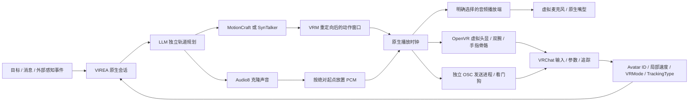

# VIREA → VRChat

[English](vrchat.en.md) · [桌面配置](../../integrations/vrchat/desktop.example.json) · [VR 配置](../../integrations/vrchat/vr-trackers.example.json) · [Unity 安装工具](../../integrations/vrchat/unity/Editor/VireaAvatarSetup.cs)

VIREA 负责推理、语音克隆、动作生成与时间轴；VRChat 是执行端。新的原生桥接拥有独立会话和播放任务，关闭浏览器控制页不会中断任务。当前在线接入 MotionCraft、SynTalker 两条独立轨道路线；已有 SentiAvatar + ARDY Studio 路线保留，其转换后的 canonical Motion IR 可通过离线 CLI 接入。桥接不更换任何动作模型检查点。

首次操作请看[操作指南](vrchat-operations.zh-CN.md)：启动双客户端、确认账号绑定、进入同一实例、完成原地校准，再使用对话与直接控制。[验收记录](../quality/vrchat-recordings.md)分别列出真实生成动作录像、房间／认证验证和仍存在的限制。早先的桌面 SDK 预设动作录像不计入生成动作证据。本实现参考仍待维护者复核。

## 能力与执行契约

| 输出 | 旧桌面路线 | 生成动作的虚拟 VR 路线 |
| --- | --- | --- |
| TTS | 指定播放设备 → 虚拟线缆 → VRChat 麦克风 | 相同 |
| 嘴型 | VRChat 原生麦克风 lip sync | 相同 |
| 字幕 | 按语音片段时间发送 | AI 回复、前端用户消息分别发送到各自客户端，不触发提示音 |
| 移动 | 可选 OSC 输入轴，速度限幅 | 相同 |
| 表情 | 明确的面部提示或外部表情接口 | 模型面部输出未验收；旧 FX 门控保持关闭 |
| 手部 | 从模型手指旋转归类为 5 类手势 | 模型 FK → 腕部姿态和两套 31 骨骼 OpenVR 手部数据，不使用手势分类 |
| 眼神 | `/expression` 的 pitch/yaw/blink；无输入时使用 VRChat 默认行为 | 相同 |
| 全身动作 | 不支持通过标准 OSC 任意驱动全部骨骼 | 模型 FK → 虚拟头显、手部及完整 8 个身体目标；VRChat IK 重建 |
| 身体预设 | 历史兼容功能 | `generated_vr` 配置及播放器均拒绝使用 |
| 世界位置 | 未观测；不把积分出的命令当作真实位置 | 未观测；同样不伪造位置回执 |

OSC 的 `GestureLeft`、`GestureRight`、`Viseme` 等内置参数只读；手指和表情写入 `AI_*` 自定义参数。`VRCEmote` 是可写整数，开启桌面预设前还会检查当前角色的 OSCQuery 写入能力。[官方参数说明](https://creators.vrchat.com/avatars/animator-parameters/) · [官方 VRCEmote OSC 示例](https://docs.vrchat.com/docs/osc-avatar-parameters)

## 对话中切换与生成动作

顶部下拉框直接切换 MotionCraft / SynTalker，无需断开或新建聊天。设置中的声音、角色设定、自主跟进次数和桌面预设也可在线保存；端口、设备和运行模式仍需重新连接。`POST /settings` 先在锁外检查目标 worker 和声音，失败保留当前任务；成功后取消旧推理／播放、释放 OSC 输入，替换会话 provider，保留历史、会话 ID、角色绑定和暂停状态。预检期间发生新消息或停止操作时，旧设置请求会被拒绝。前端忽略旧 epoch 的轮询响应，避免选项回跳。

`generated_vr` 没有预设动作或粗粒度手势回退。播放器保持 `AI_Active=false`，释放旧 Gesture 层；头、双腕和手指来自模型 FK，通过本仓库的 OpenVR 驱动进入游戏，腰、双脚、胸、双膝、双肘共八个身体目标通过 OSC 传递。省略目标列表时自动启用全部八个，显式省略其中任何目标会被拒绝。输出要求专用 AI 的进程、角色反馈和 SteamVR 当前场景进程一致，并回传 `VRMode=1`、`TrackingType=6`，不能静默接管观察者。TrackingType 只证明游戏进入全身追踪模式，不证明每个额外目标或逐关节精度。驱动收包与画面验收分开，`rendered_pose_verified` 不因 ACK 或参数回传变成 true。[官方 TrackingType 定义](https://creators.vrchat.com/avatars/animator-parameters/#trackingtype-parameter)

新版驱动使用 VIREA 独立设备身份和明确的 VRChat pose/skeleton 绑定。生成估计不宣称为真实 Full 手追踪，避免触发自动捏合输入。2026-10-10 已确认 SteamVR 为 AI 客户端加载这些绑定，v2 驱动回执三个追踪设备及双手骨骼输入；角色最终画面仍待独立验收。[官方驱动指南](https://creators.vrchat.com/platforms/pc/steamvr-drivers/)

这是模型生成的追踪输入，并不是任意逐骨骼动画注入接口。角色比例、VRChat IK 和手部重定向会影响最终画面，必须从观察者客户端验证。头部和手部设备由软件提供，设计不要求实体 VR 硬件；AI 仍需使用 VR 运行模式，回传 `VRMode=1` 并完成 FBT 校准。[官方 OSC Trackers](https://docs.vrchat.com/docs/osc-trackers)

旧桌面预设和手势分类仅保留为历史兼容功能，生成动作实录必须关闭它们。双视角画面不等于视觉感知、ASR 或自主导航，这些能力未实现。

## 无实体设备的虚拟角色控制（实验中）

`scripts/vrchat/setup_pose_driver.ps1 -SteamVR '<已安装的 SteamVR 目录>' -BuildOnly` 只编译到项目内忽略的 `openvr-build-only`，不触碰已注册驱动。安装注册前必须关闭 SteamVR，再省略 `-BuildOnly` 运行。驱动使用公开 OpenVR 接口和离屏虚拟显示。

观察者保留桌面模式。只给 AI 使用 `scripts/vrchat/start_ai_client.ps1 -VRChatExe '<已安装的 VRChat.exe>' -Profile 1 -SendPort 19000 -ReceivePort 19001 -VR`。脚本解析官方线上启动器并防止重复 profile、端口。页面选择 `generated_vr`，确认实际 AI 账号后进行身体校准。profile 只是本地配置编号，不代表登录身份。

AI 实时画面的“接管 AI”提供有时限的直接键鼠控制：鼠标移动瞄准手柄，左键扳机，右键拖动头部视角。首次接管会从游戏画面测量投影和真实射线的方向、起点；请保持 VRChat 菜单可见，等待“游戏射线已校准”。工具条的“对齐准星”可重新测量。收起或租约失效时释放按键。登录前可在进程与专用端口匹配时接管，模型自动输出仍要求角色反馈验证。已验证的登录前 OSCQuery 端点显示“AI 窗口已连接，等待登录或角色加载”。手动身体校准可在 `TrackingType=6` 前发送静态校准骨架，使游戏发现身体目标；自动动作必须等全身追踪回传后才开启。所有物理播放设备保持静音，`audio_enabled=false`；用 `chatbox` 与 `observer_chatbox` 显示双方字幕。完整步骤见[键鼠与射线校准](vrchat-views.md#direct-mouse-and-keyboard-control)及[实录说明](../quality/vrchat-recordings.md)。

## 自动校准与房间命令

`BridgeConfig.auto_calibrate=true` 默认在生成式 VR 连接绑定角色后尝试一次自动校准。程序独占虚拟设备，持续发送八个身体目标，打开校准入口，定位按钮并对齐真实射线，发送标准 T 姿态及双手确认。只有确认之后取得新的 `TrackingType=6` 回传才记为完成；静态 T 姿态仅用于校准，不是表演动作。新角色或新客户端会重新检查，失败后可通过按钮或命令重试。暂停、打断、人工接管和断开会停止自动校准并释放输入。

AI 视角的“自动校准”按钮下方直接显示百分比进度条、`[当前步骤/8]`、当前操作及失败原因，也可原地取消。进度依据已完成的步骤更新，不按计时伪造；只有游戏确认全身追踪、自然站姿输出获完整设备回执，才显示 100%。确认后用 1.5 秒平滑过渡到双臂自然下垂、手指轻弯的站姿，头部与脚部位置保持连续。身体目标、手腕与手指来自同一套骨骼计算，等待任务期间持续保持；模型开始播放前释放站姿控制，避免两套姿态同时写入。

目前公开的 [OSC 输入](https://docs.vrchat.com/docs/osc-as-input-controller)没有开始 FBT 校准的指令，因此入口由本地 OCR 与虚拟手柄操作完成，姿态、双手确认和回传检查均由代码执行。OCR 模型随依赖安装，截图在内存中处理，不上传外部服务。程序定位唯一的中英文校准标签，校正真实射线，再用新画面的按钮或明确的全身校准悬停提示复核。进入校准引起的同一角色重载最多等待 8 秒，期间释放按键且不重复点击；角色／进程变化立即停止，整个流程限时 120 秒。[官方 FBT 流程](https://docs.vrchat.com/docs/full-body-tracking)

从项目根目录运行（服务和两个游戏客户端应先启动）：

```powershell
./scripts/vrchat/setup_session.ps1 -Action calibrate
./scripts/vrchat/setup_session.ps1 -Action cancel-calibration
./scripts/vrchat/setup_session.ps1 -Action join -Target auto
./scripts/vrchat/setup_session.ps1 -Action invite -Target ai
./scripts/vrchat/setup_session.ps1 -Action accept -Target ai
./scripts/vrchat/setup_session.ps1 -Action status
```

“同房间”和 `join` 默认使用 `Target=auto`：只读核对本机启动管道的所属进程，优先让观察者加入 AI，保留 AI 的镜前站位。如果只有 AI 具备可用管道，则让 AI 加入观察者。按钮下方持续显示实际方向与到达进度。部分 VRChat 双客户端只暴露一个全局入房管道，不能假定每个 profile 都有管道。明确指定 `ai`／`observer` 时，绝不自动换成另一个账号；发送回执不确定时也不重复发送。

`Target` 是接收邀请／进入房间的一方，另一个本地账号是房主。邀请／接受必须明确指定目标，例如 `invite -Target ai` 由观察者邀请 AI；`accept -Target ai` 只接受来自已绑定观察者、且匹配其当前实例的邀请。房间操作仅支持这两个不同的本地账号，不能指定任意第三人。

自动校准的专用输入控制禁止行走、跳跃、身体转向和头部平移，只允许菜单定位、观察和双手确认。头部与双脚的位置保持不变；校准后恢复自然站姿。观察者入房时，AI 的站姿控制持续保持，不会因为等待另一端而释放。程序不会为了寻找镜子自动走动或转身。游戏窗口刚重启时，校准会限时等待首帧，而不是立即报 `waiting_for_frame`。

底层接口是 `POST /api/v1/vrchat/calibration`（`action: start/cancel`）及 `POST /api/v1/vrchat/rooms`（`action: join/invite/accept`, `target: auto/ai/observer`，其中 `auto` 仅用于 `join`）。邀请调用 API；入房通过 [VRChat 本机启动管道](https://github.com/vrcx-team/VRCX/blob/master/Dotnet/IPC/VRCIPC.cs)发送实例链接，写入前核对管道所属 PID 及进程创建时间，避免双客户端时启动错账号。当前桌面客户端收到链接后仍可能要求点击加入：程序会在 20 秒内核对观察者 PID、进程创建时间、两个新画面的目标实例编号与唯一加入按钮，再将这个窗口置前并确认一次；焦点或身份变化会停止，取消时释放按键。如果 AI 游戏只打开实例详情，程序会在 35 秒内核对目标实例编号、识别唯一的 Join／加入按钮并对齐虚拟手柄，最多确认一次；不会点击权限或登录提示。发送命令或确认后，仍须在 45 秒内通过两端日志确认同一实例，管道回执与点击均不算入房成功。暂停、打断和断开会取消房间操作并释放输入，模型播放与人工接管不能抢占这一过程。

程序还会核对 SteamVR 场景 PID 和 VIREA 虚拟头显、双手的设备序列号，关闭虚拟手柄空闲休眠，并通过 SteamVR 本机接口加载按内容哈希命名的新版绑定。全局及单手模式都包含菜单与扳机绑定，解决手柄休眠后菜单失效和同名绑定文件缓存的问题；仅更新绑定无需重编译驱动 DLL。运行时绑定保存在项目内 `.virea-runtime/vrchat/openvr-bindings`。

私人房间的 `join`／`accept` 先核对当前客户端收到的真实邀请：必须来自另一个绑定账号，接收账号和完整实例一致，创建时间在十分钟内，且没有被移除或因重新登录失效。这里只读取邀请元数据，不读取 Cookie、密码或聊天内容。没有该证据时，`join` 通过房主 API 发送邀请并核对返回的账号及实例；`accept` 通过接收方 API 查找匹配通知。没有有效邀请就不会发送私人实例的启动链接；`shortName`／`secureName` 只用于定位实例，不能授予权限。游戏收到的有效邀请可用于自动加入，不需要额外配置 API 会话。

邀请 API 的会话由后端进程环境提供：`VIREA_VRCHAT_AI_AUTH`、`VIREA_VRCHAT_OBSERVER_AUTH`；需要双因素会话时对应 `VIREA_VRCHAT_AI_TWO_FACTOR_AUTH`、`VIREA_VRCHAT_OBSERVER_TWO_FACTOR_AUTH`。不从游戏、浏览器或日志提取登录凭据，也不在页面、URL、仓库中保存它们。请求先核对 API 账号与所选客户端身份；401、403（好友或邀请权限不足）和 429 分别停止，同一个邀请一分钟内不重复发送，超时也不会假定已授权。这部分基于[社区维护的 API 规范](https://github.com/vrchatapi/specification)，不是官方稳定接口。缺少工具会话只报告未配置，不要求退出现有游戏。游戏自身的 401 则单独显示受影响账号，并在入房前或等待途中立即停止；旧的场景到达记录不能证明 API 认证仍然有效。

**2026-10-11 复验：** 未重启两个客户端，已完成双方各一次有认证的原生邀请写入，以及两轮实际同房间进入；第二轮通过部署后的“同房间”命令及修正的目标卡片识别完成。将两个 API 域名持久加入代理旁路后，观测窗口内出口稳定，未出现新的 401；这不等于永不失效的认证保证。发送方新的邀请写入由另一端收到的原生记录印证，可解除其历史 401 锁存；只收到邀请不能解除接收方的认证错误，更新的 401 会再次阻止入房。完整证据见[网络与同房间记录](../quality/vrchat-recordings.md#network-session-investigation-2026-10-11)。

长程录制前重新完成了八步原地校准。播放始终要求新的 `TrackingType=6`、正确身份和设备回执。本机仍未配置独立的后台邀请 API 会话：已实测原生邀请与同房间重入，Cookie API 路径只有自动测试覆盖。

游戏明确拒绝访问时，前端会显示“实例不存在或当前账号没有访问权限”，并说明仅限邀请房间需要有效邀请。该提示来自所选 PID 的新画面，只读识别，不会点击权限弹窗，也不会把拒绝误当作管道故障或同房成功。

## 技术梗概



* **时间轴**：动作窗口保持原始段长，采用根位置插值与四元数 SLERP；语音位于独立的绝对时间范围，可多段、跨动作边界、提前结束。动作结束以完整表演时长为准。
* **时钟**：启用声音时以 PortAudio 的 DAC 时间估算可听到的采样位置；不开声音时用单调时钟。暂停时保存已播放位置，恢复不会把缓冲中尚未听到的样本计入进度。设备错误或时钟停止前进时释放输入。
* **调度**：30 Hz 默认目标帧率，按绝对截止时间调度，落后时跳过过时采样，避免积压后加速回放。模型仍先准备完整表演，当前不声称低延迟逐帧生成。
* **坐标**：canonical VRM 位置反射 X 到 Unity 坐标；四元数按同一基变换后再转换为 Unity Z→X→Y 外旋欧拉角。身体尺度、原点、朝向可校准。启用移动输入时，从追踪数据中移除根平移与根 yaw，防止重复移动。
* **失效处理**：独立发送进程在 0.75 秒没有输出帧、父进程管道断开、暂停、取消或关闭时发送输入归零。UDP 不提供执行确认，归零重复发送仍不是网络交付保证。眼睛回到中性后停止发送，由 VRChat 超时恢复自动行为。
* **会话**：默认每个用户目标最多 3 次自主跟进，可配置 0–10。急停取消当前生成、播放与后续跟进；断开释放会话及端口。回执表示“输出已完成”，不声称身体、位置或碰撞已经测量。
* **反馈**：按配置的 UDP 端口找到唯一 VRChat 进程，再只读查询同进程的 loopback OSCQuery 服务，核对其端口与角色参数。页面默认仅在 9 个 AI 参数齐备时自动绑定首次识别的角色；播放中换角色会中止，不自动跟随另一个 ID。支持正式 `avtr_*` 和 SDK 的 `local:sdk_*` 身份。查询超过 3 秒未成功会关闭输出门控。局部速度反馈仅使用一秒内的值；事件型 OSC 回传年龄本身不作为心跳。
* **本机边界**：控制 API 限制 loopback 客户端、loopback Host 和浏览器同源请求；OSC 仅发往 `127.0.0.1`。默认不打开声音、不发送聊天框、不移动角色。

## 启动服务与客户端

页面连接卡片下方提供“启动观察者”“启动 AI”和各自的“重启此窗口”。它们分别使用固定 Profile、独立 OSC 端口和官方 `launch.exe`：观察者为桌面模式，AI 为虚拟 VR 模式。重复点击复用已有启动任务；两个启动请求按顺序执行，重启只向核验过 PID、进程创建时间和 HWND 的那个窗口发送关闭请求，超时不强杀也不另开一份。启动前静音所有活动的 Windows 播放端点；页面显示百分比、`当前步骤/5`、等待登录、场景加载、账号不匹配和 API 401 状态。场景到达不代表同房间或全身动作已验收。

将[启动配置示例](../../integrations/vrchat/client-launch.example.json)放到 `VIREA_HOME/config/vrchat-clients.json`，填写本机已安装程序路径及两个真实的 `usr_…` 账号 ID（示例 ID 仅是占位符），AI 端口须与页面桥接配置一致。Profile 隔离、已保存的登录会话由 VRChat 管理；此配置不接收密码、Cookie 或任意启动命令。接口 `GET /api/v1/vrchat/clients` 返回状态，`POST /api/v1/vrchat/clients/{observer|ai}` 接收 `{"action":"start"}` 或 `{"action":"restart"}`，沿用回环地址和同源限制。自动登录依赖 Steam/VRChat 的有效保存会话；过期、退出登录或验证码仍需要在相应游戏窗口完成验证，程序不会把“窗口已启动”报成“登录成功”，也不会循环重启 401 窗口。

1. 按[独立动作轨道指南](unified-motion.zh-CN.md)准备 LLM、Audio8 及 MotionCraft/SynTalker worker，并在 `VIREA_CHARACTER_CONFIG` 中指定服务地址。声音继续选用已导入的参考声音，不需要把原始录音放入仓库。
2. 在仓库安装可选依赖、构建页面，明确启用仓库内的忽略目录作为运行目录：

```powershell
uv sync --all-packages --extra dev --extra vrchat
npm --prefix apps/web run build
$env:VIREA_ALLOW_CHECKOUT_RUNTIME = '1'
$env:VIREA_HOME = Join-Path $PWD '.virea-runtime/vrchat/home'
$env:VIREA_CHARACTER_CONFIG = Join-Path $PWD '.virea-runtime/vrchat/config/character.json'
uv run --package virea-api python -m uvicorn virea_api.app:app --host 127.0.0.1 --port 18001
```

3. 打开 `http://127.0.0.1:18001/app/vrchat.html`，选模型、声音和自主跟进次数。静音使用时保持声音、移动关闭，开启双方聊天字幕，执行模式选择 `generated_vr`。
4. 保留当前 Steam 观察者桌面窗口，启动已注册虚拟驱动的 SteamVR。用 `scripts/vrchat/start_ai_client.ps1 -VRChatExe '<已安装的VRChat.exe>' -Profile 1 -SendPort 19000 -ReceivePort 19001 -VR` 启动 AI；该命令通过官方线上启动器运行，不含 `--no-vr`。**只在第二个窗口登录 AI 专用 VRChat 账号**。profile 隔离本地配置，不保证自动登录不同账号，需要核对身份；不要复用观察者已占用的 profile 或端口。省略此底层脚本的 `-VR` 会进入旧桌面模式，无法执行生成全身动作。[官方启动参数](https://docs.vrchat.com/docs/launch-options)
5. 在 AI 客户端启用 OSC，页面端口与上述命令对应设为 **19000/19001**。页面默认自动连接、发现角色并绑定已安装 VIREA 参数的角色；也可在设置中关闭自动绑定并手动确认。刷新页面和服务恢复后会按保存的设置重连，主动断开后不自动重连。未配置的新安装默认 **19010/19011**，需要保证页面与客户端一致；只读 OSCQuery 探测不会发布 mDNS 或改写其他客户端的输出路由。[官方 OSC 端口说明](https://docs.vrchat.com/docs/osc-overview)
6. 启用语音时，桥接选择虚拟线缆的**播放端**，VRChat 选择其配对的**录音端**。先在设备自己的监听工具及 VRChat 麦克风电平中验证。设备列表显示实际名称及 Host API，不会凭名称自动认定某设备是正确的虚拟线缆。
7. 默认由用户在 VRChat 开麦。可选“语音段期间按住说话”，但必须先关闭 VRChat 的 **Toggle Voice**，否则连续的 Voice 输入可能产生错误的切换语义。[官方输入说明](https://docs.vrchat.com/docs/osc-as-input-controller)
8. 静音全身测试跳过第 6、7 步。在 AI 窗口完成 Calibrate FBT，确认回传 `TrackingType=6` 后，在双方同处的私有测试实例发送目标，检查真实动作、双方字幕、暂停、继续与急停。

仓库的 `.virea-runtime/vrchat/` 按用途分为 `config/`（本机服务配置）、`home/`（会话数据）、`unity/avatar/`（角色工程）、`logs/`、`evidence/`。正式工具保留在 `scripts/vrchat/` 与 `integrations/vrchat/unity/Editor/`。仓库内运行目录需要上述环境变量显式启用，且根 `.gitignore` 必须包含 `/.virea-runtime/`。`scripts/vrchat/start.ps1` 按本机 `config/stack.json` 启动服务；`-CheckOnly` 只检查服务状态。

已配置本机服务后，一次启动使用：

```powershell
./scripts/vrchat/launch.ps1 -VRChatExe '<已安装的VRChat.exe完整路径>' -VR
```

该入口构建前端、复制工程中的 VRM 到固定本机预览位置、启动或复用健康服务，并复用专用端口上已运行的 AI 客户端。不会关闭观察者窗口。脚本解析安装目录中的官方 `launch.exe`，缺失时直接报错；直接运行 `VRChat.exe` 会进入离线测试模式，不能代替线上启动。页面的模型预览支持旋转查看，明确标为“非 VRChat 游戏画面”。只读诊断将本机 OSC、明确的离线测试日志和同房间记录分开显示；仅在两个运行中进程分别确认本账号到达同一个完整实例时匹配房间，不返回账号、实例标识或原始日志。场景外观、动作和声音仍需实测。

已有登录配置应按实际 profile 和端口复用，不能根据窗口启动顺序判断账号。项目内 `.virea-runtime/vrchat/config/stack.json` 可设置 `"ai_client": {"profile": 1, "send_port": 19000, "receive_port": 19001, "vr": true}`；本机已持久化此设置，统一启动入口会把 VR 模式传给客户端脚本。2026-10-10 核验的观察者使用 profile 0、9000/9001。无配置时默认 AI profile 2、19010/19011、桌面模式；`-AIProfile`、`-VR` 可显式覆盖。页面高级设置中的 Profile 和端口也必须对应同一个账号。虚拟驱动注册与 SteamVR 启动见前文。

如果 Unity 显示 `No valid Unity Editor license found`，先在 Unity Hub 的许可证设置刷新已有许可证，再从 Hub 打开项目。本次已验证该路径可恢复 E 盘的 2022.3.22f1 编辑器；Unity 许可证、VRChat SDK 登录和上传等级是三个不同的状态。

## 安装用户 VRM 角色

使用自己的 `VRM-Model-1.vrm`，原文件不进入仓库。VRChat 不能直接把 VRM 文件当作已上传 Avatar 使用。

1. 用 [VRChat Creator Companion](https://vcc.docs.vrchat.com/) 创建 Avatars 工程，按其当前版本要求安装 Unity 和 SDK。
2. 按 [VRM Converter for VRChat](https://github.com/esperecyan/VRMConverterForVRChat) 的兼容说明导入并转换 VRM，确认 humanoid、材质、眼睛和原生 lip sync。转换器对 VRM 版本的支持以项目文档为准。
3. 把仓库 `integrations/vrchat/unity/Editor` 放进工程的 `Assets/VIREA/Editor`。打开 **VIREA → Prepare VRChat Avatar Copy**，选场景中的转换后 Avatar。
4. 检查六个面部参数的 blendshape 名称。工具按明确的名称匹配绑定；不存在的 shape 会报警告，不会把别的曲线当作面部能力。
5. 工具生成一个禁用的 Avatar 副本、新的 Parameters、FX、Gesture 控制器和手指曲线。已有控制器复制后再扩展，原角色与资产保留。若无法找到 SDK 默认控制器，需要先导入 SDK 示例或给原角色指定明确控制器。
6. 激活副本、停用原实例，在 Unity Preview 中检查每个表情与 0–4 手势，再 Build & Test。`AI_Active=false` 时生成层权重归零，原控制器重新接管。不要重复在已经安装过 `AI_*` 的副本上运行安装器。

新增同步预算为 **65 bits**：`AI_Active` Bool；`AI_LeftHandPose` / `AI_RightHandPose` Int；`AI_Smile`、`AI_Sad`、`AI_Angry`、`AI_Surprised`、`AI_BrowUp`、`AI_Cheek` Float。与现有参数合计超过 256 时安装器拒绝生成。`AI_*` 默认不保存状态。

本机已准备的工程使用 E 盘 Unity **2022.3.22f1**、VRChat Base/Avatars **3.10.5**、UniVRM/UniGLTF **0.128.1**、UniVRM Extensions **10.4.0** 和 VRM Converter for VRChat **41.5.2**。旧的独立 `com.vrmc.vrmshaders` 包不能与新版 UniGLTF 并存。`scripts/vrchat/prepare_avatar_project.ps1 -Project <工程> -VRM <源文件.vrm>` 复制模型和工具；`scripts/vrchat/build_avatar.ps1 -UnityEditor <Unity.exe>` 先初始化 SDK 编译标记，再等待 VRM 延迟导入并生成 `Assets/VIREA/Scenes/IndependentAI.unity`。已有场景使用 `-ValidateOnly`，不会重复生成或上传。

已通过的结构校验包括：唯一激活的 AI 角色、保留但停用的转换后源角色、Humanoid、9 个 AI 参数、自定义 FX/Gesture 层和 15 个原生嘴型。用户 VRM 匹配到四组面部曲线；BrowUp、Cheek 缺少同名 shape，目前只报告警告，不能当作已实现效果。SDK Build & Test 曾生成约 4.2 MB 的本地角色包；用户随后已成功发布 **VIREA Independent AI**，真实 AI 客户端现在回传已发布的 `avtr_*` 身份。用户提供的公开角色页显示 **Very Poor** 性能评级，尚未完成性能优化。

本地测试角色仅对穿戴它的客户端可见；要从另一个在线账号看到自定义角色，需要上传。上传要求 VRChat 账号达到 **New User** 或更高等级，未达到时仍可本地 Build & Test。[官方角色要求](https://creators.vrchat.com/avatars/creating-your-first-avatar/)

手势编号：0 中性、1 握拳、2 张开、3 指向、4 胜利。它们是粗粒度分类，不等价于模型的逐指关节输出。Unity 肌肉名称与动画曲线属性名称有区别，工具采用 `LeftHand.Index.1 Stretched` 一类曲线属性。[UniVRM 官方工具中的名称映射](https://github.com/vrm-c/UniVRMUtility/blob/master/Assets/UniHumanoid/Scripts/AnimationClipUtility.cs)

## 实时双视角与故障恢复

右上角展开按钮显示两个真实游戏窗口，上方观察者、下方独立 AI。宽屏与聊天并排，窄屏覆盖展开，支持 Escape 收起与键盘焦点恢复。采集只绑定对应 OSC 端口的 VRChat 进程，目标最高 15 fps；最小化、窗口消失、画面过期均显示等待原因。收起或隐藏页面后停止请求并释放闲置采集。画面不自动送入视觉模型；AI 菜单操作由另行启用的短期接管租约处理。详见[采集架构及验收边界](vrchat-views.md)。

保留窗口模式，最小化时恢复游戏窗口。线上错误应检查对应进程的最新日志：OSC 连通或场景可见都不能证明线上 API 认证正常。2026-10-08 20:36–20:38，两端仍有新的 `401 Missing Credentials`。用户在 20:46 重新认证成功，其后未新增 401，但登录后界面初始化抛出空引用异常并停留在加载背景；随后逐个重启，两个账号于 21:02／21:04 分别进入 Home，当前日志未新增 401；21:15 两端已恢复同一私有房间，观察者解包 VIREA Independent AI；截至 21:20 未新增 API 401 或 FailedFetchingSecurityScan。双视角已验证新进程绑定；远端渲染姿态质量仍待验收。

签名有效的官方 VB-CABLE 驱动已安装，Windows 状态为 OK，未重启电脑。**CABLE Input** 播放端和 **CABLE Output** 录音端已通过 48 kHz 双声道格式检查。用户要求公共区域保持静音：当前 5 个播放端点已静音，VIREA 语音关闭，不播放测试音。后续获准有声测试时，应仅将 AI 客户端的麦克风设为 CABLE Output，并验证麦克风电平和观察者听到的声音。设备出现、PCM 回环、游戏麦克风活动与远端语音是不同验收步骤，目前仅设备枚举及格式支持通过。

## API 与显式时间轴

所有路径前缀为 `/api/v1/vrchat`。接口只在本机开放。

| 方法 / 路径 | 用途 |
| --- | --- |
| `GET /` | 会话、反馈、时钟、错误及最近 20 次播放结果 |
| `GET /audio-devices` | 枚举实际播放设备 |
| `GET /avatar-preview` | 返回固定本机 VRM 文件；不存在时 404，不接受任意文件路径 |
| `GET /views/{observer\|ai}/frame` | 按进程绑定的游戏窗口 JPEG；要求 `X-Virea-Capture: 1` 且同源 |
| `POST /connect` | 配置桥接并创建专属角色会话 |
| `POST /settings` | 在线切换动作方法、声音、角色设定、自主次数及桌面预设；保留会话与历史 |
| `POST /bind-avatar` | 空闲时绑定 AI 客户端实际回传的 Avatar ID |
| `POST /messages` | 用户目标；替换并取消当前任务 |
| `POST /performance` | 直接提交 `PerformancePlan`；该次不自主跟进 |
| `POST /environment` | 外部感知事件，summary 应标明观测来源；不是内置视觉或 ASR |
| `POST /expression` | 6 个表情值及 pitch/yaw/blink，短暂诊断输出 |
| `POST /control` | `pause` / `resume` / `interrupt` / `disconnect` |
| `POST /manual` | `begin` / `update` / `align` / `end` 菜单接管与射线校准；与模型输出分开 |

`/expression` 接口和动作短句面部提示都是显式控制，不是从 MotionCraft/SynTalker 自动恢复语义表情；这两个路线当前不提供经过验证的面部模型输出。无外部眼神输入时，桥接不持续覆盖 VRChat 自动眼神。眼神协议只选用一类方向地址。[官方眼神协议](https://docs.vrchat.com/docs/osc-eye-tracking)

显式时间轴示例（动作 8 秒，台词第 2 秒开始；实际 TTS 长度由服务测量）：

```json
{
  "motions": [
    {"id":"wave","start_seconds":0,"duration_seconds":4,"prompt":"A person waves one hand."},
    {"id":"idle","start_seconds":4,"duration_seconds":4,"prompt":"A person stands calmly."}
  ],
  "speech": [{"id":"hello","start_seconds":2,"text":"你好，我是 Virea。"}],
  "seed": 42
}
```

不强制把“抬手—保持—放下”拆成三段；简单完整动作保留为短英文句。时间轴用来区分阶段和并行语音。

## 离线复现与 VR 扩展

```powershell
uv run --extra vrchat python -m virea.vrchat devices
uv run --extra vrchat python -m virea.vrchat inspect --windows X:\VIREA-DATA\motion.json
uv run --extra vrchat python -m virea.vrchat replay --windows X:\VIREA-DATA\motion.json --performance X:\VIREA-DATA\performance.json --audio X:\VIREA-DATA\mixed.wav --config integrations/vrchat/desktop.example.json
```

`inspect` 不打开网络或音频设备；逐帧验证 FK、坐标转换和 OSC 编解码。`replay` 等待实际 Avatar 回传，按正常速度播放。`--motion-ir` 可代替 `--windows`，要求 `vrm1.humanoid52.v1`、局部旋转与非空帧；`--hip-height` 指定 canonical 根位移所基于的静态髋高。其它骨架需要先重定向，不能只改 profile 名字。

身体校准先使用腰和双脚，再增加胸、膝、肘。虚拟设备与 OSC 身体目标使用同一个坐标系；`generated_vr` 拒绝额外的 OSC 头部对齐、移动输入、非零 origin/yaw 与桌面预设，避免重复变换或替换动作。追踪坐标仍采用 canonical 身体比例，校准后必须目视检查脚接触、手臂和手指。

## 验证记录

见[机器可读证据](../quality/vrchat-evidence.json)。MotionCraft 和 SynTalker 均已完成真实模型 + 本地 LLM + 指定克隆声音的 8 秒表演到 loopback OSC 接收器的运行，每次采样 241 帧；音频设备在这次验证中关闭，所以不声称虚拟麦克风已经接通。另对此前 16 个真实模型 Demo 的全部 552 秒、16,576 个采样位置进行了 FK/OSC 离线转换验证。原来的 Studio 视频不能当作 VRChat 游戏内 Demo。

```powershell
uv run --extra dev --extra vrchat python -m pytest tests/vrchat -q
uv run --extra dev ruff check src/virea/vrchat apps/api/src/virea_api/routes/vrchat.py tests/vrchat
npm --prefix apps/web test
npm --prefix apps/web run build
```

四条静音实录要求确认：观察者看到新生成的身体及手指动作、双方游戏聊天气泡、VR 校准及身体 IK、对话中切换方法、暂停与急停释放、改变角色时中断。完成这些后才能标注为合格 VRChat 实录。有声语音、虚拟麦克风与嘴型仍未验收，不属于本次静音录制的前置条件。
