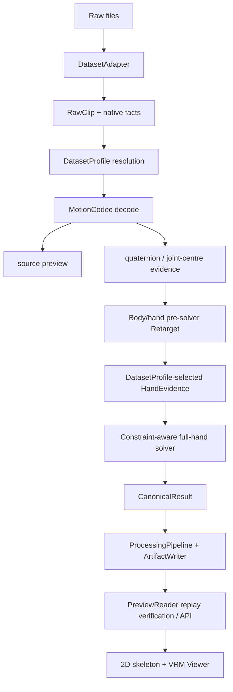

# Pipeline 工程设计

本页解释 RFC-0001 以及当前 working tree 中 RFC-0002/ADR-0002 提议的工程落点。JSON Schema 与实现是当前数据契约的事实源；RFC-0002/ADR-0002 仍为 `Proposed`，本页记录“已实施中”不等于将其写成 `Accepted`。

## 模块与唯一职责



| 层 | 负责 | 不负责 |
|---|---|---|
| Adapter | 发现样本、读取文件、保留字段、裁剪、声明源引用 | basis 猜测、VRM 骨骼重定向、UI 文案 |
| Dataset Profile | FPS 优先级/fallback、basis、unit、rotation encoding/space、root semantic、切片、手部证据模式与两组验证状态 | 读取大数组、渲染 |
| Codec | axis-angle、322D、263D、6D 或 positions 的源解释；joint mapping | dataset 路径发现、Viewer 布局 |
| Retarget | world basis、unit、rest correction、scale、body fitting 与预求解手部证据 | 数据集文件名规则、Viewer 补丁 |
| Hand solver | 以同一 policy 处理 30 个 hand bones、90 个 DOF、可观测性、约束与连续段；生成证书 | 按 dataset/sample/Avatar 写特例，修改 raw/source |
| Canonical | 211 维 pack/unpack、有限值、quaternion norm/连续性 | 从 raw 解码 |
| Artifact | 固化 sequence、预求解 hands、32-joint position evidence/空哨兵、solver report/certificate、FK、profile snapshot、rest、时间映射、annotations、channels 与 hash | 读取时重新扫描本机 VRM |
| PreviewReader | 验证 processing v0.4/canonical v3，从持久化证据重放 solver 并精确对比输出 | 补造缺失语义、信任只重签 manifest 的证书、重新 retarget raw |
| Viewer | 验证 v3 payload 契约，按已证明 pose 播放、筛选、空间锚定与降级说明 | 修正手指、冻结/夹角、重算轴、数据集或 Avatar 专用坐标补丁 |

## 三条相互独立的数据流

1. Motion：源 tensor 经过 Codec 和 Retarget 进入 canonical sequence。
2. Annotation：Adapter 保留原生标注，normalizer 只规范字段、时间和 provenance，不改变事实来源。
3. Channel：object/contact/face/audio 使用 descriptor 与 sidecar；“通道存在”不等于“有逐帧曲线”。

三者共享 clip、FPS、crop/resample map 和 hash，但不能互相冒充。例如对话文本不能被当作 audio waveform，GRAB 的 contact label 不能被简化后覆盖 native categorical map。

## Raw 信任边界

Raw dataset 一律视为不可信输入。数值型 AMASS/BABEL/BEAT/Motion-X/SuSu face 入口只允许
`allow_pickle=False`；路径在 resolve 后必须仍位于对应 dataset root。GRAB 与 SuSu 的历史嵌套
对象容器只有在 `VIREA_ALLOW_TRUSTED_RAW_PICKLE=1` 的显式本地信任会话中才能解码，默认预览、
API 与批处理均 fail-closed。该开关不是数据验证或再分发授权，公开服务不得开启；迁移目标是
数值数组、JSON 与内容寻址 sidecar。

## Dataset Profile 状态机

```text
draft -> source_verified -> regression_verified -> release_ready
```

- `draft`：字段或数学仍未校准；只允许带醒目 warning 的调试，正式写入 fail-closed。
- `source_verified`：与上游字段、shape 和数学定义一致。
- `regression_verified`：真实样本通过 source decode、basis、canonical、target FK 回归。
- `release_ready`：再加真实 VRM、性能、媒体与许可门禁。

共享 Codec 不意味着共享 Profile。AMASS/BABEL 可以共享 SMPL body 数学，GRAB/Motion-X 可以共享 SMPL-X mapping，但各自保留 FPS、basis、unit、数组切片、carrier 和 sub-source 规则。

Resolved Profile 的最小可审计字段包括：schema version、profile key、dataset、source representation、joint system、rotation encoding/space、`root_rotation_semantics`、FPS 字段优先级与 fallback、world basis、source up/forward、handedness、unit 与 meter scale、root axes、array layout、dataset `validation_status`、`hand_evidence_mode`、`hand_unobservable_policy`、`hand_solver_validation_status`、`hand_constraint_policy_id` 和 notes。缺少 root rotation 的 source 也必须显式写 `not_applicable`，不能用 `null` 让 Reader 猜测。正式 persist 同时拒绝 dataset 门禁或 hand-solver 门禁为 `draft` 的 profile，已存在文件不能绕过检查。

## 时间状态

有效帧为 `[0,N)`，时长固定为 `N / fps`。Viewer 以 elapsed time 求采样时刻；渲染刷新率不推进动作帧。区间统一为左闭右开，裁剪前值保存在 annotation 的 `original`，规范显示值裁到当前 clip。

重采样不是 UI 默认行为。显式重采样时 root translation 线性插值、quaternion 最短弧 SLERP、离散 annotation/contact 使用 left-closed hold，并把 source/output 帧数与 FPS 写入 `crop_resample_map`。

## 空间状态

Profile 的 3 x 3 矩阵把 source world column vector 映射到 canonical glTF world。单位转换、首帧原点和 basis 的顺序必须固定；local joint rotation 不能再次套 world basis。Profile 还必须声明 `root_rotation_semantics`：body-local 到 world 的 root 只左乘 basis，world-to-world operator 才做共轭，没有 rotation root 则为 `not_applicable`。详细公式见 [数学共同层](math-retarget/README.zh-CN.md)。

当 basis determinant 为 `-1` 时，它不是 quaternion。`world_operator` 可在 matrix space 共轭并验证结果属于三维旋转群；`local_to_world` 左乘会成为 improper matrix，必须由 source Codec 先完成经验证的 handedness decode，否则 fail-closed。未经 profile 证明的启发式 basis 只能产生调试 warning，不能进入发布产物。

## Processing v0.4 与 canonical artifact v3

正式 processing v0.4/canonical artifact v3 必须自包含：

- canonical sequence 与 target FK positions；
- `pre_solver_hand_quaternions`，shape 为 $(T,30,4)$、dtype 为 little-endian float32；
- `hand_position_evidence`：位置模式为 $(T,32,3)$，顺序固定为 `leftHand`、`rightHand` 和 30 个 hand bones；非位置模式使用 $(0,32,3)$ 空数组，不伪造 joint centres；
- `virea.hand_retarget_artifact.v1.0.0` 记录，包含 policy/observation/evidence/input/output/report hashes、逐自由度可观测性、改动统计和经验证证书；
- source/effective FPS、frame count 和 crop/resample map；
- resolved profile 完整 snapshot 与 SHA-256；Retarget metadata 回显实际使用的 basis、determinant 与 root semantic；
- 实际 target rest offsets、来源和 SHA-256；
- annotation v1、channel descriptors、sidecar/redaction manifest；
- 完整 SampleRef、joint/core/hand/evidence order、edges、schema/processing version；
- 数组 dtype/shape/bytes 与 canonical JSON 的内容 hash。

Reader 不只比对 manifest hash；它必须在每次 v3 读取时重新加载并验证数组、sidecar、quality、FK 与 solver replay，不使用 path/size/mtime 作为安全缓存。它用 persisted pre-solver hands、position evidence、observation 和连续段重放同一纯 solver，并精确比较 output/report。缺少 v3 replay 契约、profile/policy/hash 不一致或重放不等时，Avatar 播放 fail-closed。Writer 只写 processing v0.4/canonical v3，新构建目录不能覆盖旧目录；回滚通过切换 processed root 完成。

## 手部证据与单一 solver 轨道

Profile 只能在 `parent_local_rotations`、`joint_positions` 和 `identity_neutral` 三种模式中选择一种。公共 solver 不读 dataset key，始终覆盖左右手 30 个 bones 与 90 个解剖自由度。对没有 fingertip/end-site 的 32-joint 位置证据，当前仅 16 个非拇指 proximal/intermediate 骨段的 flexion/abduction 可观测，即 `32/90` DOF；thumb 全部 DOF、所有 axial twist 与 distal leaf 按 profile 的显式 neutral 策略输出 identity，而不冒充 source 恢复值。

`32/90` 是证据拓扑的上限，不表示每一帧都能解析全部 32 个坐标。若 PIP 弯曲小于 `0.5°`，两段近共线使 signed flexion 与 bend plane 在该帧不可观测；solver 用 float64 做几何分析，并对相应 swing 执行 `neutral_zero_swing`。阈值、resolution 和逐 bone 左闭右开帧区间都必须进入 versioned policy hash 与 certificate，Reader 重放时逐项核对。

GRAB、Motion-X 以及 AMASS/SMPL-H 中未经 source-rest hand-frame 标定的静态手通道保留为 immutable source evidence，当前 profile 选择 `identity_neutral`，不把 raw local rotation 当作 canonical normalized delta。BEAT 与经验证的 SuSu 路径使用 joint-centre evidence。只有取得独立 source-rest frame 标定的 source 才能切换为 `parent_local_rotations`；不得通过数据集名或截图猜测。

质量合同保持三个独立结果：`pre_solver_source_fidelity` 用预求解 sequence 对 immutable source 比较；`hand_constraint_gate` 验证证书、postconditions、root/core 未改和 final FK；`hand_constraint_source_residual` 只记录约束后对 source 的有意偏离。不得用 final-to-source 偏离否定 solver safety，也不得用 solver 通过替代 source fidelity。

## Viewer 边界

- source 和 processed 骨架各自显示同一套语义 payload，但不共享 positions。
- Viewer 只接受 `virea.vrm_motion_payload.v3.0.0` 且 hand certificate 有效的 pose；它按 `JSON(shape) + NUL + little-endian float32 bytes` 对当前实际 hand quaternion 切片重算 SHA-256，不能只信证书中的摘要字符串。`viewer_pose_mutation_count` 必须为零。VRM normalized API 适配是通用 runtime 契约，不是手部修正层。
- Avatar 面板独立显示 sequence、active action、part、context、metadata 和 timeline。
- 3D marker 从真实 `vrm.humanoid` bone node 读取 world position，并复用 sprite/texture；普通 GLB 明确降级。
- object/contact 优先使用真实 pose/points；缺失时只显示 descriptor 和原因。
- 详细布局、别名、聚合与 provenance 规则见 [Annotation 与 Viewer 契约](annotation-viewer.zh-CN.md)。

## 失败模式

| 失败 | 必须行为 |
|---|---|
| FPS 缺失 | 使用 profile fallback，并记录 `fallback` 来源；未知 profile 拒绝正式写入 |
| shape/NaN/quaternion norm 错误 | fail-fast，不生成伪动作 |
| BABEL carrier 与标注时长不一致 | validation error；不得静默使用错误 carrier FPS |
| Motion-X sub-source basis 未证明 | profile 保持未验证，不宣称回归通过 |
| SuSu 本地 rows/global 变体未校准 | `draft` + fail-closed |
| dataset profile 或 hand-solver profile 为 `draft` | 正式 persist/skip-existing 验证均拒绝，不创建空 artifact |
| 位置证据缺 32-joint 中任一项、shape/FPS/连续段不符 | solver fail-fast，不退化为 direct rotation |
| 手部 policy/hash/certificate 或 Reader replay 不一致 | 拒绝 artifact/payload/Avatar 播放 |
| 未标定 GRAB/Motion-X/AMASS 手通道 | 保留 source，canonical 按 profile 显式 neutral，不直接嫁接 local quaternion |
| HumanML3D official decode 不可用或失败 | fail-fast；不得生成 rest-pose fallback |
| 未授权读取 GRAB/SuSu pickle 容器 | 返回不含本机路径的安全错误；提示仅本地显式 opt-in，不尝试降级伪解码 |
| VRM 无 humanoid mapping | 保留 2D/详情并显示 Avatar 降级状态 |
| Three.js/VRM 模块 404 | 页面显示依赖错误，不停留在模糊的 Connecting |
| 旧 artifact 缺字段 | 明确缺失；提示 rebuild，不推断补齐 |

## 实现状态说明

> [!NOTE]
> 本页同时包含 RFC-0001/ADR-0001 的 **Accepted** 基线与 RFC-0002/ADR-0002 的 **Proposed** 实施现状。当前代码与 schema 已切换至 processing `v0.4.0`/canonical v3，但这不代表 RFC-0002/ADR-0002 已被批准，也不代表所有 profile 或任意 VRM mesh 已通过。

合并或发布前必须用[验收清单](validation.zh-CN.md)对码；配置不是 `v0.4.0`、任一 profile gate 为 `draft`、artifact 缺 replay evidence 或 Viewer 修改 pose 时，均必须 fail-closed。


<!--
---
type: explanation
status: Active
owner: "@Joker-of-Gotham"
created: 2026-08-08
updated: 2026-08-10
last_reviewed: 2026-08-10
review_cycle_days: 60
summary: VIREA 版本化语义契约下的 Pipeline 模块边界、全手约束求解和 canonical v3 持久化设计。
canonical: doc/engineering-design.zh-CN.md
related:
  - rfcs/0001-annotation-time-retarget-v1.zh-CN.md
  - adrs/0001-versioned-motion-semantics-and-artifacts.zh-CN.md
  - annotation-viewer.zh-CN.md
  - math-retarget/README.zh-CN.md
  - rfcs/0002-constraint-aware-hand-retarget-v1.zh-CN.md
  - adrs/0002-canonical-v3-constrained-hand-retarget.zh-CN.md
supersedes: []
superseded_by: []
---
-->
