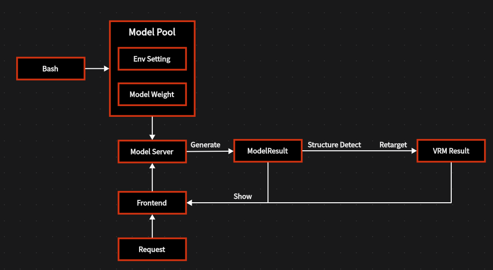
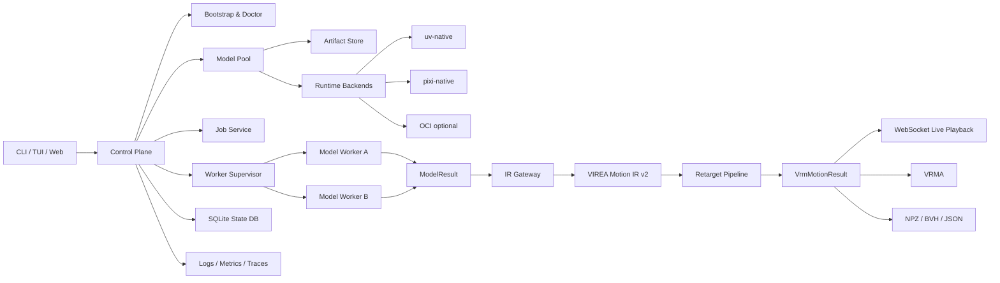
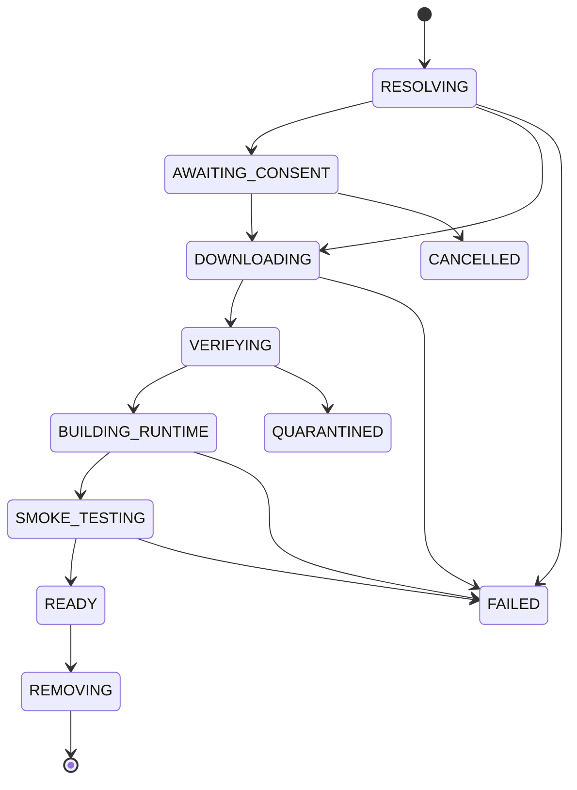

# VIREA 0.3 重构蓝图

> **多模型运动生成、规范化中间态、VRM 重定向与本地一键运行平台**
> 文档状态：Proposed
> 基线仓库：`Moonweave-AI/virea`
> 基线分支与提交：`main@bba6c414dd99ec632046825f43ea11e711b56afe`
> 研究与设计快照日期：2026-08-20
> 目标读者：维护者、架构评审者、代码智能体、模型适配智能体、测试智能体
> 规范性词语：本文中的“必须”“不得”“应”“可以”分别对应 MUST、MUST NOT、SHOULD、MAY。



---

## 0. 执行摘要

VIREA 不应被重写成“在一个巨大 Python 环境中安装全部模型，并由单个 FastAPI 进程直接导入所有依赖”的应用。该结构会把模型之间的 Python、PyTorch、CUDA、Transformers、NumPy 与原生编译依赖冲突传递给整个系统，难以在多平台和多模型条件下稳定维护。

本次重构采用以下七项不可逆的核心决策：

1. **单仓库、多包、模型运行时隔离。**
   控制面、运动中间态、重定向器、VRM 查看器共用一个 monorepo；每个模型插件拥有独立、不可变、内容寻址的运行环境。任何模型不得把自己的 PyTorch、CUDA、Transformers、NumPy 或编译依赖安装进 VIREA 核心环境。

2. **三层数据路径保持清晰，但补齐控制面。**
   业务主链仍然是“模型层 → 中间结果层 → VRM 结果层”；环境检测、模型池、运行时、任务调度、许可与观测属于控制面，不应伪装成第四种动作表示。

3. **受管理模型不得依赖启发式结构猜测。**
   模型插件必须声明准确输出格式、骨架、坐标系、单位、帧率和根运动语义。`Structure Detect` 只作为外部文件导入和遗留数据迁移的后备路径，候选不唯一时必须拒绝继续处理。

4. **现有 `T × 211` canonical v3 保留为兼容配置，而不是永久宇宙真理。**
   当前 211 维布局等价于 `3` 维根位移加 `52 × 4` 个四元数，覆盖 hips、21 个核心骨骼和 30 个手指骨骼。它应被正式命名为 `virea.canonical211.v3`，继续读写和回放；新的 `Motion IR v2` 使用显式命名骨骼与可扩展轨道，承载身体、手、面部、视线、接触、物体和多角色信息。

5. **模型池区分“模型定义、模型权重、运行时、安装实例和别名”。**
   权重与运行时均采用完整 SHA-256 标识；人类可读名称只是别名。环境目录使用完整摘要，创建过程原子化并核对 manifest，因此不会因名字重叠而被误认。

6. **一键配置不等于静默修改操作系统。**
   VIREA 自动完成用户态工具、Python、依赖、权重、缓存、运行时和服务配置；不会静默安装显卡驱动、接受第三方许可证、获取受限数据集或保存明文令牌。需要权限、身份认证或许可同意时，向用户集中展示一次明确计划。

7. **首个工程闭环与首个产品闭环分开。**
   - 工程闭环：`MoMask → HumanML3D-263 → Motion IR → 现有重定向器 → VRM`，用于尽快证明模型池、运行时、契约和 UI 的完整链路。
   - 产品优先闭环：`SentiAvatar → SuSu 63-joint 6D + ARKit 51 → Motion IR → VRM body/hands/expressions`，用于实现语音、文本动作标签、流式数字人动作与表情。

最终用户体验应为：

```text
安装 VIREA
   ↓
运行 virea
   ↓
自动检测系统与硬件
   ↓
集中完成 HF 登录、许可证确认和模型多选
   ↓
自动下载、构建、验证
   ↓
自动打开本地交互页面
   ↓
输入文本 / 音频 / 控制条件
   ↓
模型生成中间结果
   ↓
VIREA 规范化、重定向、质检
   ↓
VRM 实时播放，并可导出 VRMA / NPZ / BVH
```

---

## 1. 当前仓库评估

### 1.1 必须保留的既有资产

当前仓库已经不是空壳。重构必须把以下能力视为已投入资产，而不是重做清单：

| 现有资产 | 当前价值 | 重构处理 |
|---|---|---|
| `src/virea/data/adapters/` | 已覆盖 AMASS、BABEL、BEAT、GRAB、HumanML3D、Motion-X、SuSuInterActs | 保留数学与字段解释，迁入版本化 adapter 插件；增加契约测试 |
| `src/virea/motion/codecs.py` | 已包含 axis-angle、SMPL-H、SMPL-X、HumanML3D、SuSu 等解码逻辑 | 拆分为原生格式 codec 与 Motion IR bridge，不得盲写替代 |
| `src/virea/motion/canonical.py` | 定义 canonical v3 的 `T × 211` 序列和 21+30 骨骼顺序 | 冻结为兼容规范，建立 v3 ↔ Motion IR v2 双向桥 |
| `src/virea/motion/retarget.py`、手部 solver 与数学文档 | 已形成 basis、rest correction、body/hand 重定向及审计思路 | 提取为独立 `virea-retarget` 包，保持 fail-closed 原则 |
| `schemas/` | 已有 motion sample、artifact、quality、channel 等 JSON Schema | 迁入统一 contracts 包并保留旧 schema URI |
| `registries/` | 已有 dataset 与 skeleton 注册信息 | 升级为模型、数据集、骨架、许可、运行时、bundle 六类注册表 |
| `src/virea/server/` | 已有 FastAPI、二进制传输与 preview reader | 演化为控制面 API；旧 preview 路由暂时兼容 |
| `apps/viewer-web/` 与 `@pixiv/three-vrm` | 已能展示 VRM 与处理结果 | 迁入 TypeScript 前端，保留 normalized humanoid 播放逻辑 |
| 质量报告、artifact replay、hash 校验思路 | 已具备强审计意识 | 扩展至模型权重、运行时、任务、Motion IR 与最终 VRM 结果 |
| CLI 与 demo 数据流程 | 已有批处理和服务入口 | 保留旧命令，新增统一 `virea` 向导和 model/runtime 命令族 |

### 1.2 当前架构与目标架构之间的缺口

1. **缺少生成模型控制面。**
   现有仓库主要处理数据集和重定向，并没有正式的模型定义、权重管理、运行时隔离、进程监督、资源调度和安装事务。

2. **当前核心依赖环境无法承载异构模型。**
   不同动作模型常固定不同 Python、PyTorch、CUDA、Transformers、Lightning、NumPy 和编译工具版本。把它们合并到根 `pyproject.toml` 会使 VIREA 的核心可用性受最脆弱上游项目支配。

3. **`T × 211` 不能表达完整产品数据。**
   该布局适合 VRM 52 骨骼身体与手指，但没有原生面部参数、VRM expressions、视线、音频对齐、物体轨迹、接触、多角色和不确定性轨道。

4. **骨架命名存在潜在歧义。**
   例如 `smplx_fullpose55` 不能仅靠“55”表达到底是 54 个 SMPL-X 关节、55 个 pose block、是否含全局根、是否含 jaw/eyes。所有骨架 profile 必须声明精确数组切片与语义。

5. **数据集 profile 与模型输出 profile 尚未统一。**
   数据集 adapter 知道原始文件，模型插件知道生成张量，但两者应通过同一 `SkeletonProfile`、`RepresentationProfile` 和 `Motion IR` 契约汇合。

6. **当前 CLI、server、viewer 和处理流程尚未形成单一生命周期。**
   用户需要一个能检测、安装、验证、启动、生成、查看和诊断的统一入口，而不是先读若干 README 再手动拼接命令。

### 1.3 重构类型

本项目必须采用 **brownfield migration**：

- 先加契约、兼容层和 characterization tests；
- 再把现有实现包裹进新边界；
- 每个阶段保持旧 artifact 可读、旧 viewer 可用、旧 CLI 有明确退役期；
- 不得在一个 PR 中删除旧实现并同时引入未经回归的新实现。

---

## 2. 范围、非目标与成功定义

### 2.1 本次范围

- 本地优先的一键安装、首次运行向导和环境诊断；
- Ubuntu、Arch Linux、macOS、Windows、WSL2 的能力检测；
- NVIDIA CUDA、AMD ROCm、Apple MPS、CPU 的能力建模与模型变体选择；
- Hugging Face、GitHub Release、HTTPS、本地目录的模型 artifact 获取；
- 多模型选择、下载、独立运行时构建、校验、加载、卸载和垃圾回收；
- 文本、音频、动作控制、编辑等任务请求；
- 模型原生结果到 Motion IR 的确定性适配；
- 单角色身体、手、面部、视线、接触和物体轨道；
- VRM 1.0 avatar 检查、重定向、质检、实时播放；
- VRMA、NPZ、BVH、JSON 等结果导出；
- 完整 provenance、许可证、日志、质量和复现实验信息。

### 2.2 第一阶段明确非目标

- 自动训练或微调所有模型；
- 静默安装或升级 NVIDIA/AMD/Apple 系统驱动；
- 替用户接受 SMPL、AMASS、GRAB、受限 Hugging Face 模型等许可；
- 第一版即提供公网多租户推理平台；
- 在核心进程中执行任意远程社区插件；
- 为所有上游论文承诺跨平台支持；
- 让启发式 shape 猜测成为正常模型路径；
- 把 VRM spring bone 动力学烘焙进模型输出；
- 第一版支持任意多角色与复杂场景物理，相关字段先在 IR 中预留。

### 2.3 总体验收场景

在一台从未安装 VIREA 的受支持机器上：

1. 用户通过平台安装脚本或发行包安装；
2. 运行 `virea`；
3. 系统自动识别 OS、WSL、架构、内存、磁盘、GPU、驱动和可用后端；
4. 用户只处理必要的 HF 登录、许可同意和模型多选，不选择 CUDA 小版本；
5. VIREA 输出安装计划并一次执行；
6. 所有模型环境名称不冲突，失败安装不会留下 `READY` 假状态；
7. Web 页面自动打开；
8. 用户输入一句文本或上传音频；
9. 模型 worker 独立运行并返回 `ModelResult`；
10. VIREA 产生 `Motion IR`、重定向到导入的 VRM；
11. 页面播放动作，显示模型、骨架、质量和警告；
12. 用户可导出 VRMA 或内部 artifact；
13. 重启电脑并离线再次运行时，已安装模型仍可用；
14. 任一模型崩溃不导致控制面和其他模型崩溃；
15. 旧 `T × 211` canonical v3 artifact 仍能读取和播放。

---

## 3. 总体系统架构

### 3.1 逻辑分层



### 3.2 三条业务数据流

#### A. 生成数据流

```text
Request
  → selected model plugin
  → isolated worker
  → ModelResult
  → native decoder
  → Motion IR
  → retarget
  → VrmMotionResult
  → live viewer / export
```

#### B. 安装数据流

```text
MachineReport
  → capability resolver
  → model variant plan
  → consent/auth
  → artifact download
  → hash verification
  → runtime build
  → Worker production acceptance
  → READY
```

#### C. 审计数据流

```text
model revision + weight hash + runtime hash + request hash
  → Motion IR provenance
  → retarget policy + avatar hash
  → quality report
  → final result manifest
```

三条流共享 job ID、事件总线和日志上下文，但不能互相替代。安装成功不能证明模型输出正确，模型输出有效也不能证明重定向质量合格。

### 3.3 进程边界

| 进程 | 职责 | 信任级别 |
|---|---|---|
| `virea` CLI/TUI | 首次向导、命令分发、打开浏览器 | 高 |
| `virea-api` | 本地控制面、任务、注册表、结果与事件 | 高 |
| `virea-worker-*` | 单个模型或紧耦合模型组推理 | 中/低，按插件来源 |
| Web 静态应用 | UI、查看器、用户输入 | 受本地 API token 约束 |
| 可选 OCI 容器 | 高风险或 Linux 专用模型 | 最低，隔离执行 |

**模型代码永远不在 API 控制面进程内 import。**

---

## 4. 目标仓库结构

```text
virea/
├── README.md
├── CHANGELOG.md
├── LICENSE
├── SECURITY.md
├── THIRD_PARTY_NOTICES.md
├── AGENTS.md
├── pyproject.toml
├── uv.lock
├── .python-version
├── package.json
├── pnpm-workspace.yaml
├── pnpm-lock.yaml
├── .node-version
│
├── apps/
│   ├── cli/
│   │   ├── pyproject.toml
│   │   └── src/virea_cli/
│   │       ├── __init__.py
│   │       ├── main.py
│   │       ├── commands/
│   │       │   ├── setup.py
│   │       │   ├── doctor.py
│   │       │   ├── web.py
│   │       │   ├── serve.py
│   │       │   ├── model.py
│   │       │   ├── runtime.py
│   │       │   ├── avatar.py
│   │       │   ├── generate.py
│   │       │   └── support.py
│   │       └── tui/
│   │           ├── app.py
│   │           ├── screens/
│   │           └── widgets/
│   │
│   ├── api/
│   │   ├── pyproject.toml
│   │   └── src/virea_api/
│   │       ├── app.py
│   │       ├── lifespan.py
│   │       ├── dependencies.py
│   │       ├── auth.py
│   │       ├── routes/
│   │       │   ├── system.py
│   │       │   ├── models.py
│   │       │   ├── runtimes.py
│   │       │   ├── jobs.py
│   │       │   ├── avatars.py
│   │       │   ├── results.py
│   │       │   ├── licenses.py
│   │       │   └── events.py
│   │       └── static/
│   │
│   └── web/
│       ├── package.json
│       ├── vite.config.ts
│       ├── playwright.config.ts
│       ├── src/
│       │   ├── app/
│       │   ├── api/
│       │   ├── features/
│       │   │   ├── setup/
│       │   │   ├── machine/
│       │   │   ├── catalog/
│       │   │   ├── install-queue/
│       │   │   ├── playground/
│       │   │   ├── viewer/
│       │   │   ├── timeline/
│       │   │   ├── jobs/
│       │   │   ├── diagnostics/
│       │   │   └── settings/
│       │   ├── vrm/
│       │   ├── motion/
│       │   └── workers/
│       └── public/
│
├── packages/
│   ├── contracts/
│   │   ├── pyproject.toml
│   │   ├── src/virea_contracts/
│   │   │   ├── model.py
│   │   │   ├── motion_ir.py
│   │   │   ├── skeleton.py
│   │   │   ├── representation.py
│   │   │   ├── runtime.py
│   │   │   ├── job.py
│   │   │   ├── result.py
│   │   │   ├── quality.py
│   │   │   └── provenance.py
│   │   └── schemas/
│   │       ├── v1/
│   │       └── v2/
│   │
│   ├── core/
│   │   ├── pyproject.toml
│   │   └── src/virea_core/
│   │       ├── config/
│   │       ├── paths/
│   │       ├── db/
│   │       ├── events/
│   │       ├── jobs/
│   │       ├── locks/
│   │       ├── lifecycle/
│   │       └── errors/
│   │
│   ├── bootstrap/
│   │   ├── pyproject.toml
│   │   └── src/virea_bootstrap/
│   │       ├── detector/
│   │       │   ├── os.py
│   │       │   ├── cpu.py
│   │       │   ├── memory.py
│   │       │   ├── storage.py
│   │       │   ├── nvidia.py
│   │       │   ├── rocm.py
│   │       │   ├── mps.py
│   │       │   ├── windows.py
│   │       │   └── wsl.py
│   │       ├── resolver/
│   │       ├── installers/
│   │       ├── auth/
│   │       └── doctor/
│   │
│   ├── model-pool/
│   │   ├── pyproject.toml
│   │   └── src/virea_model_pool/
│   │       ├── registry/
│   │       ├── catalog/
│   │       ├── artifacts/
│   │       ├── sources/
│   │       │   ├── huggingface.py
│   │       │   ├── github_release.py
│   │       │   ├── https.py
│   │       │   └── local.py
│   │       ├── transactions/
│   │       ├── licenses/
│   │       ├── verification/
│   │       └── gc/
│   │
│   ├── runtime/
│   │   ├── pyproject.toml
│   │   └── src/virea_runtime/
│   │       ├── identity.py
│   │       ├── backends/
│   │       │   ├── base.py
│   │       │   ├── uv_native.py
│   │       │   ├── pixi_native.py
│   │       │   └── oci.py
│   │       ├── supervisor/
│   │       ├── scheduler/
│   │       ├── protocol/
│   │       ├── resources/
│   │       └── sandbox/
│   │
│   ├── model-sdk/
│   │   ├── pyproject.toml
│   │   └── src/virea_model_sdk/
│   │       ├── plugin.py
│   │       ├── worker.py
│   │       ├── requests.py
│   │       ├── responses.py
│   │       ├── artifacts.py
│   │       ├── streaming.py
│   │       └── testing.py
│   │
│   ├── motion-ir/
│   │   ├── pyproject.toml
│   │   └── src/virea_motion_ir/
│   │       ├── model.py
│   │       ├── validation/
│   │       ├── storage/
│   │       ├── streaming/
│   │       ├── transforms/
│   │       ├── detection/
│   │       └── compatibility/
│   │           └── canonical211_v3.py
│   │
│   ├── retarget/
│   │   ├── pyproject.toml
│   │   └── src/virea_retarget/
│   │       ├── pipeline.py
│   │       ├── basis/
│   │       ├── skeleton/
│   │       ├── rest_pose/
│   │       ├── mapping/
│   │       ├── body/
│   │       ├── hands/
│   │       ├── face/
│   │       ├── gaze/
│   │       ├── ik/
│   │       ├── contacts/
│   │       ├── constraints/
│   │       ├── filters/
│   │       ├── quality/
│   │       └── policies/
│   │
│   ├── vrm/
│   │   ├── pyproject.toml
│   │   └── src/virea_vrm/
│   │       ├── inspect/
│   │       ├── avatar/
│   │       ├── profiles/
│   │       ├── calibration/
│   │       ├── expressions/
│   │       ├── vrma/
│   │       └── exporters/
│   │
│   ├── observability/
│   │   ├── pyproject.toml
│   │   └── src/virea_observability/
│   │       ├── logging.py
│   │       ├── metrics.py
│   │       ├── tracing.py
│   │       ├── redaction.py
│   │       └── support_bundle.py
│   │
│   └── compatibility/
│       ├── pyproject.toml
│       └── src/virea_compat/
│           ├── legacy_cli.py
│           ├── legacy_artifact.py
│           ├── legacy_preview.py
│           └── deprecations.py
│
├── plugins/
│   ├── models/
│   │   ├── momask/
│   │   ├── mdm/
│   │   ├── sentiavatar/
│   │   ├── emage/
│   │   ├── motionlcm/
│   │   ├── motiongpt/
│   │   ├── t2m_gpt/
│   │   ├── edge/
│   │   ├── lodge/
│   │   └── intergen/
│   │
│   ├── adapters/
│   │   ├── humanml3d_263d/
│   │   ├── kitml_251d/
│   │   ├── smpl/
│   │   ├── smplh/
│   │   ├── smplx/
│   │   ├── beat_bvh/
│   │   ├── beat2_smplx_flame/
│   │   ├── susu_63j_6d/
│   │   ├── aistpp_smpl24/
│   │   ├── finedance/
│   │   ├── interhuman/
│   │   └── bvh_named/
│   │
│   └── exporters/
│       ├── vrma/
│       ├── gltf_animation/
│       ├── bvh/
│       ├── npz/
│       └── json/
│
├── registries/
│   ├── models/
│   ├── datasets/
│   ├── skeletons/
│   ├── representations/
│   ├── runtimes/
│   ├── licenses/
│   ├── bundles/
│   └── index.yaml
│
├── schemas/
│   ├── v1/
│   ├── v2/
│   └── README.md
│
├── configs/
│   ├── defaults.toml
│   ├── logging.toml
│   ├── security.toml
│   └── policies/
│
├── docs/
│   ├── architecture/
│   ├── adr/
│   ├── contracts/
│   ├── models/
│   ├── datasets/
│   ├── skeletons/
│   ├── retarget/
│   ├── operations/
│   ├── security/
│   ├── migration/
│   └── agent/
│
├── scripts/
│   ├── install.sh
│   ├── install.ps1
│   ├── bootstrap/
│   ├── release/
│   ├── registry/
│   └── migration/
│
├── tests/
│   ├── unit/
│   ├── contract/
│   ├── integration/
│   ├── e2e/
│   ├── platform/
│   ├── golden/
│   ├── security/
│   └── fixtures/
│
└── tools/
    ├── registry-lint/
    ├── schema-codegen/
    ├── model-acceptance/
    ├── artifact-inspect/
    └── motion-compare/
```

### 4.1 Workspace 规则

- 根 `uv.lock` 只锁定 VIREA 核心 workspace 包。
- `plugins/models/*/runtime/` 不得成为根 uv workspace 成员。
- 每个模型插件包含自己的 runtime manifest、lock 和上游 revision。
- Web 开发使用 pnpm workspace；生产 wheel/发行包内嵌已构建静态资源，终端用户不需要安装 Node.js。
- Python 分发包使用独立导入名，例如 `virea_core`、`virea_motion_ir`，避免多个 wheel 对同一非 namespace 顶层包互相覆盖。
- `virea` 命令由 `apps/cli` 发行包提供。

---

## 5. 本地数据目录与状态

使用 `platformdirs` 选择默认目录，并允许 `VIREA_HOME` 覆盖：

| 平台 | 默认根目录示例 |
|---|---|
| Linux / WSL | `$XDG_DATA_HOME/virea`，否则 `~/.local/share/virea` |
| macOS | `~/Library/Application Support/VIREA` |
| Windows | `%LOCALAPPDATA%\VIREA` |

```text
VIREA_HOME/
├── config/
│   ├── config.toml
│   ├── mirrors.toml
│   └── policies.toml
├── state/
│   ├── virea.db
│   └── migrations/
├── machine/
│   ├── latest.json
│   └── history/
├── registries/
│   ├── builtin/
│   ├── remote/
│   └── local/
├── model-store/
│   ├── blobs/sha256/
│   ├── manifests/
│   ├── snapshots/
│   ├── refs/
│   └── quarantine/
├── runtimes/
│   └── sha256/<full-runtime-digest>/
├── plugins/
│   ├── builtin/
│   └── local/
├── avatars/
│   ├── blobs/
│   ├── descriptors/
│   └── calibrations/
├── jobs/
│   └── <uuidv7>/
│       ├── request.json
│       ├── staging/
│       ├── events.jsonl
│       └── logs/
├── results/
│   └── <uuidv7>/
├── cache/
│   ├── huggingface/
│   ├── downloads/
│   ├── compilation/
│   └── previews/
├── logs/
├── locks/
├── tmp/
└── support-bundles/
```

### 5.1 不变量

- 用户 prompt、模型名称和文件名不得直接拼接为目录名。
- job ID 使用 UUIDv7 或 ULID。
- 所有写入先进入同文件系统 staging，再以原子 rename 发布。
- SQLite 开启 WAL，所有安装事务和状态迁移由数据库记录。
- token 不写入 TOML、SQLite、manifest、日志或 support bundle。
- `READY` 资源必须存在完整 manifest、固定 revision 验证和 production acceptance 记录。
- GC 仅删除引用计数为零且不在运行或事务中的 blob/runtime。

---

## 6. 首次运行与自动环境配置

### 6.1 统一入口

```bash
virea
```

行为：

- 首次运行：进入 TUI setup wizard；
- 已完成设置：显示 dashboard，允许启动 Web、生成动作、管理模型或运行 doctor；
- `--no-tui`：输出可脚本化的纯文本；
- `--json`：机器可读输出；
- 无显示环境时：自动进入 headless 模式。

完整命令族：

```text
virea
virea setup
virea setup --plan
virea doctor
virea doctor --json
virea web
virea serve --headless
virea model search [query]
virea model add <model-id> [<model-id> ...]
virea model add --bundle starter-text
virea model list
virea model info <model-id>
virea model verify <model-id>
virea model remove <model-id>
virea model load <model-id>
virea model unload <model-id>
virea runtime list
virea runtime inspect <runtime-id>
virea runtime gc
virea avatar add <file.vrm>
virea avatar inspect <avatar-id>
virea generate --model <id> --text "..."
virea generate --model <id> --audio speech.wav
virea result inspect <job-id>
virea support bundle
```

### 6.2 检测内容

`MachineReport` 至少包含：

```json
{
  "schema_version": "virea.machine_report.v1.0.0",
  "machine_id": "sha256:...",
  "captured_at": "2026-08-20T00:00:00Z",
  "os": {
    "family": "linux",
    "distribution": "ubuntu",
    "version": "24.04",
    "kernel": "...",
    "wsl": false,
    "container": false
  },
  "architecture": "x86_64",
  "cpu": {
    "logical_cores": 16,
    "physical_cores": 8,
    "features": ["avx2"]
  },
  "memory": {
    "ram_bytes": 34359738368,
    "swap_bytes": 8589934592
  },
  "storage": {
    "virea_home_free_bytes": 500000000000
  },
  "accelerators": [
    {
      "kind": "nvidia",
      "name": "...",
      "vram_bytes": 12884901888,
      "driver_version": "...",
      "compute_capability": "8.6",
      "runtime_compatibility": ["cuda12"]
    }
  ],
  "probes": {
    "python_cpu": "pass",
    "torch_cuda": "not_installed",
    "mps": "not_applicable"
  }
}
```

检测策略：

- Linux：`/etc/os-release`、kernel、glibc/musl、WSL 标记；
- Windows：版本、架构、PowerShell、长路径能力、WSL 可用性；
- macOS：版本、Apple Silicon/Intel、Metal/MPS；
- NVIDIA：优先 NVML，回退 `nvidia-smi`，记录驱动、VRAM、compute capability；
- AMD：`rocminfo`/ROCm runtime probe；
- Apple：`system_profiler` 加实际 PyTorch MPS runtime probe；
- CPU：核心数、RAM、指令集；
- 磁盘：VIREA_HOME 所在卷的可用空间；
- 网络：只做可选的 endpoint reachability，不把断网误判为机器不支持。

### 6.3 能力解析

模型 runtime variant 示例：

```text
linux-x86_64-cuda12
linux-x86_64-rocm6
macos-arm64-mps
windows-x86_64-cuda12
linux-x86_64-cpu
windows-x86_64-cpu
```

默认优先级不是简单写死为 GPU 型号排序，而是：

1. 过滤 manifest 明确不支持的 OS/arch/backend；
2. 过滤 RAM、VRAM、磁盘和驱动 ABI 不满足的 variant；
3. 运行插件声明的轻量 probe；
4. 按插件给出的 preference 和估计性能排序；
5. 自动选择最优 variant；
6. 若无 variant 可用，输出具体缺口，不进入半安装状态。

### 6.4 核心与模型运行时

#### 核心环境

使用 `uv`：

- 安装并管理 VIREA CLI/core Python；
- 使用统一 lockfile；
- 使用全局 cache 减少重复 wheel；
- 可通过 `uv tool install` 提供隔离命令；
- 支持 Linux、macOS、Windows。

#### 模型环境

运行时 backend 抽象：

| backend | 用途 | 典型模型 |
|---|---|---|
| `uv-native` | 纯 wheel、现代 Python、无复杂 Conda/CUDA 包 | 简单适配器、CPU 模型、工具型 worker |
| `pixi-native` | 旧版 PyTorch、Conda 系统库、CUDA virtual package、跨平台 lock | MDM、T2M-GPT、MotionGPT、EDGE、Lodge 等 |
| `oci` | Linux 专用、高风险、复杂系统依赖、远端部署 | 后续可选，不作为 MVP 前置条件 |

不得把 “uv 或 pixi” 暴露为普通用户需要理解的选项。用户只看模型、磁盘和许可证计划。

### 6.5 运行时唯一标识

运行时规范经过 canonical JSON 序列化：

```json
{
  "plugin_id": "sentiavatar",
  "plugin_version": "0.1.0",
  "plugin_revision": "<full-git-sha>",
  "backend": "pixi-native",
  "backend_version": "<pinned>",
  "platform": "linux-x86_64",
  "python_abi": "cp310",
  "accelerator_abi": "cuda12",
  "lock_digest": "sha256:...",
  "patchset_digest": "sha256:...",
  "build_flags": {}
}
```

```text
runtime_id = "sha256:" + sha256(canonical_json(runtime_spec))
runtime_path = VIREA_HOME/runtimes/sha256/<完整 64 位摘要>/
```

人类可读别名：

```text
sentiavatar-0.1.0-py310-cuda12-a1b2c3d4e5f6
```

保证不重叠的机制：

- 真实身份始终使用完整摘要；
- 目录创建使用 `O_EXCL`/原子锁；
- 已存在目录必须逐字节核对 manifest；
- 别名表有唯一约束；
- 12 位短摘要仅显示，不用于资源定位；
- 同一 digest 的并发安装合并为一个事务；
- 不同 digest 即使别名相似也不会共用环境。

### 6.6 系统修改策略

自动完成：

- 下载固定版本 `uv`/`pixi` 到 VIREA 私有工具目录；
- 安装用户态 Python；
- 安装 wheel/Conda/native runtime 依赖；
- 下载模型权重和辅助资源；
- 配置 VIREA 私有缓存与环境变量；
- 构建静态 Web；
- 创建本地 DB 和服务配置。

不得静默完成：

- 修改 GPU 驱动；
- 修改系统 Python；
- 向全局 site-packages 安装模型依赖；
- 修改 shell rc，除非用户明确确认；
- 运行未审计的上游 `curl | sh`；
- 接受第三方许可证；
- 使用 root/Administrator 权限执行未展示命令。

确有系统包缺失时，向用户展示平台相关的最小修复计划；默认优先在 pixi 环境内提供 ffmpeg、编译器和运行库，减少 `apt`、`pacman`、Homebrew、winget 的必要性。

### 6.7 Hugging Face 登录与下载

- 设置 `HF_HOME=$VIREA_HOME/cache/huggingface`；
- 使用 `hf auth login` 或 OS keyring 中的 token；
- token 只通过环境或 keyring 注入 worker；
- 使用 `snapshot_download(revision=<完整 commit>)`；
- 使用 `allow_patterns`/`ignore_patterns` 限制文件；
- 保存 resolved commit、文件列表、ETag/LFS metadata 与 SHA-256；
- gated repo 在安装事务进入 `AWAITING_CONSENT`；
- 离线模式使用 `local_files_only=True`，缺文件时给出明确清单；
- 镜像和代理配置单独保存，不把 token 嵌入 URL。

---

## 7. 模型池设计

### 7.1 领域对象

| 对象 | 含义 |
|---|---|
| `ModelDefinition` | VIREA 支持的逻辑模型与任务能力 |
| `ModelVersion` | 插件版本、上游 revision、输出契约 |
| `RuntimeSpec` | Python、依赖、平台、加速器和锁 |
| `ArtifactManifest` | 权重、配置、词表、音频 encoder 等内容 |
| `ModelInstallation` | 某 ModelVersion + Runtime + Artifact 在本机的已验证安装 |
| `ModelAlias` | `stable`、`candidate`、`local` 等可变引用 |
| `ModelBundle` | 一组可批量安装的模型 |
| `WorkerInstance` | 已加载的运行进程 |
| `LicenseRecord` | 代码、权重、数据、body model 的许可事实和用户接受记录 |

这些对象不得混成一个“model folder”。

### 7.2 安装状态机



规则：

- 所有状态变更写入 DB 和事件流；
- 下载可恢复；
- hash 错误进入 quarantine；
- runtime build 失败保留诊断但不标 READY；
- production acceptance 必须真实启动 Worker、加载声明权重路径并运行 manifest 固定请求；
- rollback 只删除本事务新建且无其他引用的对象；
- 多模型安装建立 DAG，共享 blob 只下载一次；
- 下载可并发，环境前缀的变更必须按 runtime ID 串行。

### 7.3 模型插件 manifest 示例

```yaml
schema_version: virea.model_plugin.v1.0.0

model:
  id: sentiavatar-susu
  display_name: SentiAvatar
  plugin_version: 0.1.0
  upstream:
    repository: https://github.com/SentiAvatar/SentiAvatar
    revision: "<full-git-commit>"
  tasks:
    - speech_to_motion
    - dialogue_to_motion
    - speech_to_face
  trust: builtin-reviewed

inputs:
  - schema: virea.request.speech_motion.v1
    fields:
      audio:
        sample_rate_hz: 16000
        channels: 1
      text:
        required: false
      action_tags:
        required: false

outputs:
  envelope: virea.model_result.v1
  native:
    representation_id: susu.motion63_6d_root_delta.v1
    skeleton_id: susu.body25_hands40.v1
    fps: 20
    coordinate_system: susu_native
    units: meters
    face_tracks:
      - arkit51.v1

runtime_variants:
  - id: linux-x86_64-cuda12
    backend: pixi-native
    platforms: [linux-64]
    python: "3.10.*"
    accelerator:
      kind: nvidia
      abi: cuda12
      min_vram_gib: 12
    lockfile: runtime/linux-cuda12/pixi.lock
    entrypoint:
      argv: ["python", "-m", "virea_sentiavatar_worker"]
  - id: linux-x86_64-cpu
    backend: pixi-native
    platforms: [linux-64]
    python: "3.10.*"
    accelerator:
      kind: cpu
    availability: unsupported_for_release

artifacts:
  - id: motion-rvqvae
    source:
      kind: huggingface
      repo_id: "<resolved-repo-id>"
      revision: "<full-commit>"
      allow_patterns: ["*.safetensors", "*.json"]
    files:
      - path: model.safetensors
        sha256: "<required>"
        size: 0
  - id: planner
    source:
      kind: huggingface
      repo_id: "<resolved-repo-id>"
      revision: "<full-commit>"

resources:
  estimated_download_gib: 8
  estimated_runtime_gib: 12
  recommended_ram_gib: 32
  recommended_vram_gib: 16
  warmup_seconds: 90
  supports_streaming: true

licenses:
  code: SentiPulse-NonCommercial-1.0
  weights: SentiPulse-NonCommercial-1.0
  dataset_lineage:
    - SuSuInterActs
    - BEATv2
  commercial_allowed: false
  redistribution_allowed: false
  requires_acceptance: true

production_acceptance:
  request_fixture: tests/fixtures/production-acceptance-request.json
  expected:
    result_schema: virea.model_result.v1
    representation_id: susu.motion63_6d_root_delta.v1
    min_frames: 4
    finite: true
```

### 7.4 Manifest 安全约束

- 远程 registry manifest 不得携带任意 shell 字符串；
- `entrypoint.argv` 必须是数组并引用已审计插件包；
- 上游 source 固定完整 Git SHA；
- 权重固定 revision 和 SHA-256；
- patch 必须在 VIREA 仓库内版本化并有摘要；
- 本地自定义插件默认 `untrusted-local`；
- 未签名远程 registry 默认不可自动启用；
- manifest schema、许可、hash、路径、资源范围均由 registry linter 检查。

### 7.5 预置 bundle

```yaml
starter-text:
  models:
    - momask-humanml3d
    - mdm-humanml3d

avatar-speech:
  models:
    - sentiavatar-susu
    - emage-beat2

control-research:
  models:
    - motionlcm-humanml3d
    - motiongpt-humanml3d

dance:
  models:
    - edge-aistpp
    - lodge-finedance

all-license-compatible:
  policy:
    exclude_noncommercial: false
    require_separate_consent: true
```

`all-supported` 不得绕过 non-commercial、gated 或 body-model 许可。

---

## 8. 模型支持规划

### 8.1 支持等级

- **P0 Vertical Slice**：用于验证端到端架构，必须最先稳定。
- **P1 Official**：进入主 UI、持续集成 production acceptance、发布文档和兼容承诺。
- **P2 Candidate**：有官方代码/权重，但仍需运行时、许可或输出契约校准。
- **P3 Experimental**：扩展 IR 后支持，不进入默认安装。
- **Watchlist**：论文或代码值得跟踪，但不承诺集成。

### 8.2 推荐矩阵

| 插件 ID | 等级 | 任务 | 主要训练/评测数据 | 原生输出与骨架 | VIREA adapter | 许可与部署备注 |
|---|---:|---|---|---|---|---|
| `momask-humanml3d` | P0 | 文本到动作、时域补全 | HumanML3D、KIT-ML | HumanML3D-263 / KIT-ML-251；恢复为 22/21 关节 | `humanml3d_263d`、`kitml_251d` | 官方代码 MIT；SMPL、数据集权利另计；可提供 CPU variant |
| `sentiavatar-susu` | P0/P1 | 语音+文本/动作标签到身体、手、面部，流式 | SuSuInterActs，BEATv2 评测 | body `(T,153)`、双手各 `(T,120)`，63 关节 6D + root delta；ARKit 51；20 FPS | `susu_63j_6d` + `arkit51` | 非商业许可；需单独确认；插件可能管理 planner 与 infill 多子进程 |
| `mdm-humanml3d` | P1 | 文本到动作、动作类别、编辑 | HumanML3D、KIT-ML、HumanAct12、UESTC | HumanML3D/KIT 表示或关节序列 | `humanml3d_263d` / `kitml_251d` | 官方代码 MIT；旧依赖隔离；body model 与数据集许可另计 |
| `emage-beat2` | P1 | 音频到全身、手和面部 | BEAT2/BEATX | SMPL-X 身体/手 + FLAME 面部参数 | `beat2_smplx_flame` | 需核验每组权重当前可用性和许可；不得假设所有 checkpoint 同版本 |
| `motionlcm-humanml3d` | P1/P2 | 实时文本动作、重建、时空控制 | HumanML3D | HumanML3D-263 latent decode | `humanml3d_263d` | 官方自定义非商业许可 |
| `motiongpt-humanml3d` | P2 | 文本到动作、动作描述、预测、补间 | HumanML3D，KIT-ML 评测 | 官方 demo 输出 `(T,22,3)`；内部 motion tokens | `humanml3d_positions22` | 官方依赖较重；固定 MotionGPT 版本，不把 MotionGPT3 混入同一 ID |
| `t2m-gpt` | P2 | 文本到动作 | HumanML3D、KIT-ML | HumanML3D-263 / KIT-ML-251 | 对应 adapter | 官方代码 Apache-2.0；Python/PyTorch 较旧，必须独立 pixi runtime |
| `edge-aistpp` | P2 | 音乐到舞蹈、补间、关节约束 | AIST++ | SMPL body 24 体系，无手指/面部 | `aistpp_smpl24` | Jukebox 条件提取较重；先支持 Linux/NVIDIA |
| `lodge-finedance` | P2 | 长时音乐到舞蹈 | FineDance | 原数据 52 关节；Lodge 官方训练只使用 22 body joints | `finedance_body22` | 官方环境基于 CUDA 11/A100；checkpoint 完整性需在引入时审计 |
| `intergen-interhuman` | P3 | 文本到双人交互 | InterHuman | 两个同步 actor；SMPL 22 joints，位置与 6D rotation | `interhuman_two_actor22` | 数据集 BY-NC-SA，禁止再分发；要求 Motion IR multi-actor |
| `grab-hoi` | P3 | 人体-物体交互、抓取与接触 | GRAB | SMPL-X/MANO、物体刚体 pose、接触 map | `smplx_object_contact` | 数据集受限、研究用途；先扩展 object/contact，再选具体生成模型 |

### 8.3 Watchlist

以下模型只进入研究追踪，不应仅因“较新”就塞入首版默认安装：

- MotionGPT3：统一 motion-language 新架构，需独立插件 ID 和输出契约；
- MotionLab：统一动作生成与编辑，适合作为 HumanML3D 新一代候选；
- Text2Interact：2026 双人交互模型，依赖 multi-actor IR 和许可审计；
- 其他 2025–2026 模型：只有同时满足官方代码、可获取权重、稳定许可、可复现最小推理和可声明输出格式后，才能进入 P2。

### 8.4 模型进入 P1 的硬门槛

1. 官方或作者认可的源码；
2. 固定完整 revision；
3. 可合法获取且固定 hash 的权重；
4. 明确 code/weights/dataset/body model 许可；
5. 至少一个受支持平台的独立 runtime lock；
6. `ModelResult` contract test；
7. 原生输出与骨架 profile；
8. 确定性 adapter；
9. 最小真实 runtime acceptance；
10. 一条真实 prompt/audio 的 golden result；
11. worker 崩溃、取消、超时和 OOM 行为测试；
12. 文档中注明资源和功能限制。

---

## 9. 数据集、表示与骨架体系

### 9.1 数据集注册表

| 数据集 | 主要模态 | 典型原生表示 | 骨架/参数体系 | VIREA 用途 |
|---|---|---|---|---|
| AMASS | 全身 MoCap | SMPL-H axis-angle、translation | body 22 + hands 30 | SMPL-H codec、动作先验与回归 |
| BABEL | AMASS + 文本动作标签 | AMASS carrier + 时段标签 | SMPL-H | 文本/动作标注与时间语义 |
| HumanML3D | 文本 + 动作 | 263D，20 FPS | 22-joint SMPL-style | 文本动作模型主表示 |
| KIT-ML | 文本 + 动作 | 251D | 21-joint KIT | 文本动作模型补充表示 |
| BEAT | 音频、文本、情绪、BVH/ARKit | BVH + ARKit | 数据版本相关 | 遗留 co-speech 数据路径 |
| BEAT2/BEATX | 音频 + 全身 + 面部 | SMPL-X + FLAME | body/hands/face | EMAGE |
| Motion-X | 文本、情绪、全身、手、面部 | SMPL-X 参数块 | SMPL-X | 全身 motion-language 与 adapter 回归 |
| GRAB | 全身、手、面部、物体、接触 | SMPL-X/MANO + rigid object | 多轨道 | HOI 与 contact extension |
| SuSuInterActs | 语音、文本、动作标签、身体、手、面部 | 63-joint 6D + root delta；ARKit 51 | 25+20+20 | SentiAvatar |
| AIST++ | 音乐、舞蹈 | SMPL body | 24 body | EDGE |
| FineDance | 长音乐、舞蹈 | 52 joints 原始 | 22 body + 30 hands | Lodge 与后续全手舞蹈 |
| InterHuman | 文本、双人交互 | 两人 SMPL 22 | multi-actor | InterGen |

### 9.2 HumanML3D-263 精确定义

对 22 关节版本，每帧：

```text
1   root yaw angular velocity
2   root XZ linear velocity
1   root height
63  21 × 3 root-invariant local joint positions
126 21 × 6 continuous local rotations
66  22 × 3 local joint velocities
4   foot contacts
---
263
```

KIT-ML 21 关节版本按同一公式得到 251 维。注册表不得把二者都写成模糊的 `t2m_vector`。

### 9.3 SuSuInterActs 精确定义

```text
body  : (T, 153) = root_offset(3) + body_6d(25 × 6)
left  : (T, 120) = left_hand_6d(20 × 6)
right : (T, 120) = right_hand_6d(20 × 6)
face  : (T, 51)  = ARKit blendshape coefficients
fps   : 20
```

VIREA adapter 必须记录 63 个 source joints 的准确名称、父关系、6D 行/列约定、root delta 的积分方式、坐标系和 rest frame。不得仅用数组维数推断。

### 9.4 SkeletonProfile 必需字段

```yaml
schema_version: virea.skeleton_profile.v1.0.0
id: humanml3d.body22.v1
version: 1.0.0
joint_order:
  - name: pelvis
    parent: null
    semantic: hips
    required: true
  - name: left_hip
    parent: pelvis
    semantic: leftUpperLeg
    required: true
coordinate_system:
  handedness: right
  up: y
  forward: z
units: meters
rest_pose:
  source: embedded
rotation:
  representation: cont6d
  layout: rows
  space: parent_local
root_motion:
  translation: velocity_xz_plus_height
  rotation: yaw_velocity
aliases: []
references: []
```

必须声明：

- 精确 joint order；
- parent graph；
- 语义映射；
- required/optional；
- 源坐标系、handedness、up、forward；
- 单位；
- rest pose；
- rotation encoding、layout、space；
- root translation/rotation 语义；
- FPS 或时间基；
- 源出处与验证状态。

### 9.5 建议注册的 source profile

```text
humanml3d.body22.positions.v1
humanml3d.vector263.v1
kitml.body21.positions.v1
kitml.vector251.v1
smpl.body24.axis_angle.v1
smplh.body22_hands30.axis_angle.v1
smplx.official54.axis_angle.v1
beat.bvh.named.v1
beat2.smplx_flame.v1
susu.body25_hands40.cont6d_root_delta.v1
susu.arkit51.v1
aistpp.smpl24.v1
finedance.body22_hands30.v1
interhuman.two_actor_smpl22.v1
bvh.named.v1
```

SMPL-X 官方实现使用 54 joints；若某数据集保存 55 个 rotation block，必须另建精确 profile，注明第 55 块是什么，不得复用 `official54`。

---

## 10. VIREA 支持的 VRM 骨架

VRM 1.0 humanoid 定义 55 个命名骨骼：

- torso：5；
- head/eyes/jaw：4；
- legs：8；
- arms：8；
- fingers：30；
- 总计：55。

其中 required subset 为 15 个：

```text
hips, spine, head,
leftUpperLeg, leftLowerLeg, leftFoot,
rightUpperLeg, rightLowerLeg, rightFoot,
leftUpperArm, leftLowerArm, leftHand,
rightUpperArm, rightLowerArm, rightHand
```

### 10.1 VIREA target profiles

| Profile | 骨骼数 | 内容 | 用途 |
|---|---:|---|---|
| `vrm1.required15.v1` | 15 | VRM 必需骨骼 | 最低兼容、降级播放 |
| `vrm1.body22.v1` | 22 | hips + 当前 21 core，含 chest、upperChest、neck、shoulders、toes | 常规身体动作 |
| `vrm1.humanoid52.v1` | 52 | body22 + 30 fingers | 当前 canonical211 的骨骼覆盖 |
| `vrm1.full55.v1` | 55 | humanoid52 + leftEye + rightEye + jaw | 完整 humanoid bone profile |

### 10.2 当前 211 维的正式定位

```text
root translation: 3
VRM humanoid52 local/world-defined quaternions: 52 × 4
total: 211
```

命名：

```text
virea.canonical211.v3
```

新系统必须：

- 保持当前顺序和四元数 `xyzw`；
- 保持读取、校验、viewer replay；
- 提供到 Motion IR v2 的无损身体/手转换；
- 对面部、视线、物体等新增轨道明确标记“旧格式不可表示”；
- 不修改旧 artifact 的含义；
- 不把可选的 `3 + 55 × 4 = 223` packed view 设为唯一 IR。

---

## 11. ModelResult 契约

模型 worker 输出统一 envelope，原生数组可通过 artifact 引用传输：

```json
{
  "schema_version": "virea.model_result.v1.0.0",
  "job_id": "0198...",
  "model": {
    "id": "momask-humanml3d",
    "plugin_version": "0.1.0",
    "upstream_revision": "<full-sha>",
    "runtime_id": "sha256:...",
    "artifact_manifest_id": "sha256:..."
  },
  "task": "text_to_motion",
  "request_digest": "sha256:...",
  "native": {
    "representation_id": "humanml3d.vector263.v1",
    "skeleton_id": "humanml3d.body22.v1",
    "fps": 20,
    "frame_count": 120,
    "coordinate_system": "humanml3d_normalized",
    "units": "meters",
    "artifacts": [
      {
        "name": "motion",
        "media_type": "application/vnd.safetensors",
        "uri": "virea-job://0198.../native/motion.safetensors",
        "sha256": "..."
      }
    ]
  },
  "segments": [
    {"start_frame": 0, "end_frame": 120, "valid": true}
  ],
  "warnings": [],
  "provenance": {
    "seed": 42,
    "precision": "fp16",
    "device": "cuda:0",
    "generation_parameters": {}
  }
}
```

约束：

- 大数组不得 base64 塞入主 JSON；
- worker 只能写 job staging 的授权目录；
- `representation_id` 与 `skeleton_id` 必须存在于 registry；
- FPS、单位、basis、root semantics 不得省略；
- worker 负责 native 事实，不能冒充已经完成 VRM 重定向；
- `warnings` 不得替代 schema validation error。

---

## 12. Motion IR v2

### 12.1 设计目标

Motion IR 是模型层和重定向层之间的稳定边界：

- 显式命名，不靠隐含 joint index；
- 支持单人和未来多角色；
- 支持 body、hands、face、gaze、contact、object；
- 支持等间隔 FPS 和显式 timestamps；
- 支持流式 chunk；
- 支持 provenance、置信度和 discontinuity；
- 可映射旧 canonical211；
- 数值数据与元数据分离；
- 可被 Python、TypeScript 和未来其他语言读取。

### 12.2 逻辑模型

```json
{
  "schema_version": "virea.motion_ir.v2.0.0",
  "motion_id": "sha256:...",
  "time": {
    "timebase": {"num": 1, "den": 20},
    "frame_count": 120,
    "timestamps_artifact": null
  },
  "actors": [
    {
      "actor_id": "actor-0",
      "skeleton": {
        "profile_id": "humanml3d.body22.v1",
        "joint_names": ["pelvis", "..."],
        "parent_indices": [-1, 0]
      },
      "root_translation": {
        "artifact": "motion.safetensors#actor0.root_translation",
        "space": "world",
        "units": "meters"
      },
      "root_rotation": {
        "artifact": "motion.safetensors#actor0.root_rotation",
        "representation": "quaternion_xyzw",
        "space": "local_to_world"
      },
      "local_rotations": {
        "artifact": "motion.safetensors#actor0.local_rotations",
        "representation": "quaternion_xyzw",
        "joint_order": "skeleton.joint_names"
      },
      "global_positions": {
        "artifact": "motion.safetensors#actor0.global_positions",
        "derived": true
      },
      "confidence": null
    }
  ],
  "face_tracks": [],
  "gaze_tracks": [],
  "contact_tracks": [],
  "object_tracks": [],
  "audio_alignment": null,
  "annotations": [],
  "segments": [],
  "provenance": {},
  "quality": {}
}
```

### 12.3 数值存储

推荐：

- immutable tensor：Safetensors；
- 小型 descriptor/provenance/events：canonical JSON；
- 表格型大标注：Arrow/Parquet，可沿用当前 PyArrow 能力；
- 实时传输：WebSocket binary frame + MessagePack header，或 Arrow IPC；
- 不使用 pickle 作为 Motion IR 正式存储。

### 12.4 面部轨道

Motion IR 保留 source-native 与 normalized 两层：

```text
face_tracks:
  - representation_id: arkit51.v1
    values: ...
    source_native: true
  - representation_id: vrm_expression_weights.v1
    values: ...
    derived_from: arkit51.v1
    calibration_id: sha256:...
```

原则：

- ARKit 51 到 VRM expressions 是有损、avatar-specific 映射；
- FLAME 到 VRM 不是简单同名复制；
- 原始 ARKit/FLAME 轨道应保留；
- 若 avatar 没有对应 expression，结果报告应注明 dropped/unmapped；
- jaw/eye 骨骼与 expression/lookAt 分开建模。

### 12.5 物体与接触

```text
object_tracks:
  - object_id
  - mesh_reference
  - translation
  - rotation
  - scale
  - coordinate_system

contact_tracks:
  - actor_id
  - object_id or ground
  - body_part / joint / vertex semantic
  - active interval or per-frame probability
  - source_native / inferred
```

### 12.6 canonical211 bridge

- `canonical211_to_motion_ir()`：无损恢复 VRM humanoid52 的 root + local rotations；
- `motion_ir_to_canonical211()`：仅当单 actor、可映射 humanoid52、无关键不可表示信息时成功；
- 对 face/object/multi-actor 只允许显式降级并生成 loss report；
- 旧 `canonical_artifact.v3` 读取器继续执行当前 hash、solver replay 和 quality 验证。

---

## 13. Structure Detect 的正确定位

### 13.1 受管理模型路径

正常路径：

```text
plugin manifest
  → exact representation_id
  → exact skeleton_id
  → exact decoder
```

不得做：

```text
看到 tensor.shape == (..., 263)
  → 猜是 HumanML3D
```

因为同维度、不同 layout、不同归一化和不同 root semantics 完全可能存在。

### 13.2 外部导入后备检测

只用于 `virea import`、遗留 artifact、用户手工文件：

1. 检查 file magic、容器格式和显式 metadata；
2. 枚举 registry candidate；
3. 比较 shape、dtype、FPS、字段、joint names；
4. 尝试安全 decode；
5. 验证 parent graph、有限值、rotation 合法性、bone length、FK 连续性；
6. 计算候选分数和证据；
7. 只有唯一候选超过阈值才接受；
8. 多候选或低置信度时要求用户选择 profile；
9. 写出 `StructureDetectionReport`；
10. 检测结果进入 provenance，不覆盖原始文件。

### 13.3 报告示例

```json
{
  "schema_version": "virea.structure_detection.v1",
  "selected": null,
  "candidates": [
    {
      "representation_id": "humanml3d.vector263.v1",
      "score": 0.91,
      "evidence": ["shape=263", "fps=20", "normalization metadata matched"],
      "conflicts": []
    },
    {
      "representation_id": "custom.vector263.v1",
      "score": 0.88,
      "evidence": ["shape=263"],
      "conflicts": ["missing joint order"]
    }
  ],
  "decision": "ambiguous",
  "requires_user_hint": true
}
```

---

## 14. 重定向流水线

### 14.1 阶段

```mermaid
flowchart LR
    A["Validate ModelResult"] --> B["Decode Native"]
    B --> C["Resolve Skeleton"]
    C --> D["Normalize Time / Units / Basis"]
    D --> E["Build Source Rest + FK"]
    E --> F["Semantic Bone Mapping"]
    F --> G["Root Scale / Translation"]
    G --> H["Rest-frame Rotation Retarget"]
    H --> I["Missing Bone Policy"]
    I --> J["Hand Solver"]
    J --> K["Contact-aware IK"]
    K --> L["Joint Limits / Quaternion Cleanup"]
    L --> M["Temporal Filter / Resample"]
    M --> N["Avatar-specific Mapping"]
    N --> O["Quality Gate"]
    O --> P["VrmMotionResult"]
```



### 14.2 不变量

- world basis 变换与 local joint rotation 的语义必须区分；
- determinant 为 `-1` 的 basis 不是 quaternion，必须在 matrix space 和经过验证的 handedness decode 中处理；
- source rest、target rest、bone mapping 和 policy 均版本化并进入结果 hash；
- 目标 avatar 的实际 rest rotation 不得假设 identity；
- optional bone 缺失策略显式记录；
- 四元数单位化、符号连续和最短弧插值；
- root translation 的单位统一为米；
- 时间区间统一左闭右开 `[start, end)`。

### 14.3 缺失骨骼策略

每个 target bone 只能采用一种声明策略：

- `preserve_source`：存在直接对应；
- `derive_chain`：从父子方向推导；
- `distribute_rotation`：在可选链间分配；
- `identity_neutral`：保持 neutral；
- `avatar_procedural`：交给 lookAt/expression/spring bone；
- `drop_with_report`：不可映射。

例如 HumanML3D 22 body 没有 fingers，不能凭空生成真实指法；默认 fingers 为 neutral，并在 fidelity 报告中标为 unavailable。

### 14.4 手部

保留当前 VIREA 的核心原则：

- source evidence 与 final constrained pose 分开；
- parent-local rotations、joint positions、identity neutral 三种证据模式显式选择；
- 同一 solver policy 处理左右手；
- 不按 dataset 名写 viewer 特例；
- solver certificate 可重放；
- 不可观测 DOF 不冒充恢复值；
- hand constraint gate 与 source fidelity 分开报告。

### 14.5 足部与接触

- 使用 native foot contact 时保留原轨道；
- 无 contact 时可以推断，但标记 `inferred`；
- IK 只在 contact 段约束 foot lock；
- 记录 foot slide、penetration、floating；
- 对舞蹈中的有意滑步不能用零滑移规则粗暴抹除；
- root correction 必须保持原始轨迹的可审计差异。

### 14.6 面部与视线

处理顺序应与 VRM runtime 语义相容：

1. humanoid body；
2. gaze/lookAt；
3. expressions/lip-sync/blink；
4. node constraints；
5. spring bone。

VIREA 负责生成 body、gaze 和 expression controls；spring bone 由 avatar runtime 根据 VRM 参数执行，不由动作模型直接生成。

### 14.7 avatar 校准

导入 `.vrm` 时：

- 计算 avatar bytes SHA-256；
- 检查 `VRMC_vrm.humanoid`；
- 记录 55 bone availability；
- 读取 raw 与 normalized rest transforms；
- 建立 `AvatarDescriptor`；
- 对 expression 名、preset/custom、lookAt type 建立映射；
- calibration 缓存 key：
  `avatar_hash + skeleton_profile + retarget_policy_version`；
- avatar 文件变化后旧 calibration 自动失效。

---

## 15. 最终结果与导出

### 15.1 VrmMotionResult

```json
{
  "schema_version": "virea.vrm_motion_result.v1.0.0",
  "job_id": "0198...",
  "source_motion_ir": "sha256:...",
  "avatar": {
    "avatar_id": "sha256:...",
    "profile": "vrm1.humanoid52.v1"
  },
  "retarget": {
    "policy_id": "virea.retarget.v1",
    "mapping_digest": "sha256:...",
    "calibration_id": "sha256:...",
    "quality_report": "result://quality.json"
  },
  "tracks": {
    "humanoid": "result://motion.safetensors",
    "expressions": "result://expressions.safetensors",
    "gaze": null
  },
  "exports": [
    {"format": "vrma", "uri": "result://motion.vrma"}
  ]
}
```

### 15.2 导出优先级

1. **VRMA**：首选可移植 VRM humanoid animation；
2. **VIREA result artifact**：最完整、可审计、可重放；
3. **NPZ/Safetensors**：科研与程序消费；
4. **BVH**：兼容 DCC/传统动画流程，但需要明确 skeleton；
5. **glTF animation**：通用资产链；
6. **JSON**：仅用于小型 metadata，不承载大型浮点序列。

VRMA 中的 pose 兼容仍受 target/source rest rotation 和 optional bone 影响，不能简单复制 quaternion。导出前必须使用 normalized pose 或规范要求的转换。

---

## 16. Worker 协议与服务端

### 16.1 Worker 基础协议

借鉴 KServe V2 的 health、metadata、infer 概念，但保留 VIREA 扩展：

```text
GET  /health/live
GET  /health/ready
GET  /metadata
POST /infer
POST /cancel/{job_id}
WS   /stream/{job_id}
```

每个 worker：

- 绑定 `127.0.0.1` 随机端口；
- 使用每次启动生成的 bearer token；
- 只接受 supervisor 请求；
- metadata 返回任务、输入 schema、输出 profile、资源占用、版本；
- 输出大型 artifact path/hash，不返回巨型 JSON；
- 日志走 stdout/stderr 结构化收集；
- 超时、取消、OOM、非法请求使用稳定错误码。

### 16.2 Control Plane API

```text
GET    /api/v1/system
POST   /api/v1/setup/plan
POST   /api/v1/setup/apply

GET    /api/v1/models
GET    /api/v1/models/{id}
POST   /api/v1/models/install
DELETE /api/v1/models/{id}
POST   /api/v1/models/{id}/load
POST   /api/v1/models/{id}/unload

GET    /api/v1/runtimes
GET    /api/v1/runtimes/{id}
POST   /api/v1/runtimes/gc

POST   /api/v1/jobs
GET    /api/v1/jobs/{id}
DELETE /api/v1/jobs/{id}
GET    /api/v1/jobs/{id}/result

POST   /api/v1/avatars
GET    /api/v1/avatars
GET    /api/v1/avatars/{id}

GET    /api/v1/results/{id}
GET    /api/v1/results/{id}/artifacts/{name}

GET    /api/v1/licenses
POST   /api/v1/licenses/{id}/accept

WS     /api/v1/events
WS     /api/v1/jobs/{id}/motion
```

### 16.3 Job 状态

```text
QUEUED
ADMITTED
STARTING_WORKER
LOADING_MODEL
RUNNING
DECODING
NORMALIZING
RETARGETING
VALIDATING
EXPORTING
SUCCEEDED

CANCELLING
CANCELLED
FAILED
TIMED_OUT
REJECTED
```

- 状态单调；
- 每个请求支持 idempotency key；
- 取消贯穿 worker、decoder、retarget 和 export；
- 任务失败保留阶段、稳定错误码、可清理的 staging；
- 成功结果 immutable。

### 16.4 资源调度

MVP 使用本地进程调度，不引入 Kafka、Celery、Ray：

- 每 GPU 默认一个重模型 worker；
- 保留 VRAM safety margin；
- manifest 声明可否共存；
- LRU 卸载；
- warm worker 可配置；
- MPS/CPU 单独队列；
- OOM 后 worker quarantine，降低并发或建议低精度 variant；
- SentiAvatar 这类含 planner 服务的插件可由一个 worker group 管理多个子进程，外部仍呈现一个模型。

### 16.5 流式 MotionChunk

```json
{
  "schema_version": "virea.motion_chunk.v1",
  "job_id": "0198...",
  "sequence_id": "actor-0",
  "chunk_index": 4,
  "start_frame": 48,
  "frame_count": 16,
  "fps": 20,
  "overlap_frames": 4,
  "final": false,
  "skeleton_profile": "vrm1.humanoid52.v1",
  "binary_layout": "virea.motion_chunk.binary.v1"
}
```

合并要求：

- root translation 线性或速度一致插值；
- quaternion 使用最短弧 SLERP；
- overlap 使用确定性窗函数；
- contact/IK 维护跨 chunk 状态；
- 支持 backpressure；
- client 断开不一定取消 job，策略显式；
- chunk 可先播放，最终 artifact 仍需完整验证。

---

## 17. CLI、TUI 与 Web 交互

### 17.1 首次向导页面

1. 欢迎与项目数据目录；
2. 机器检测进度；
3. 机器能力摘要；
4. 访问 Hugging Face / 其他源的登录；
5. 模型目录与 bundle 多选；
6. 许可证分组确认；
7. 下载空间、运行时空间、预计耗时与风险计划；
8. 安装进度和每个模型状态；
9. production acceptance；
10. 添加或选择 VRM；
11. 启动 Web；
12. 第一条示例请求。

用户不选择：

- Python 版本；
- CUDA minor；
- torch wheel URL；
- conda channel；
- 环境名；
- 端口。

### 17.2 Web 页面

| 页面 | 主要功能 |
|---|---|
| Setup | 首次配置和恢复失败事务 |
| Machine | OS/GPU/RAM/磁盘/后端与 doctor |
| Model Catalog | 能力、任务、许可、资源、平台过滤 |
| Install Queue | 多模型计划、下载、运行时构建、日志 |
| Playground | 文本/音频/控制条件、模型选择、参数 |
| Viewer | VRM 3D 播放、source/IR/target 切换 |
| Timeline | body、hands、face、contacts、segments |
| Jobs | 队列、状态、取消、重试、结果 |
| Models & Runtimes | load/unload、health、VRAM、GC |
| Diagnostics | 日志、质量、support bundle |
| Settings | 路径、镜像、缓存、隐私、许可 |

### 17.3 Viewer 原则

- 使用 `@pixiv/three-vrm` normalized humanoid；
- Viewer 不修正业务数据；
- source、Motion IR、VRM target 可并排或切换；
- 显示 dropped/synthesized/unobservable bones；
- 显示 face mapping 覆盖率；
- SpringBone 作为显示 runtime；
- 失败时明确展示模块加载、avatar mapping、payload validation 等具体原因；
- 生产前端固定 Three.js 和 three-vrm 兼容版本，不追随 `latest`。

---

## 18. SQLite 状态模型

建议表：

```text
schema_migrations
machine_reports
registry_sources
model_definitions
model_versions
model_aliases
artifact_manifests
artifact_blobs
artifact_refs
runtime_specs
runtime_installations
model_installations
license_facts
license_acceptances
worker_instances
avatars
avatar_calibrations
jobs
job_events
results
result_artifacts
transactions
locks
```

关键约束：

- `runtime_specs.digest UNIQUE`；
- `artifact_blobs.sha256 UNIQUE`；
- `model_installations(model_version_id, runtime_id, artifact_manifest_id) UNIQUE`；
- license acceptance 关联具体 license digest，不只关联名字；
- job event append-only；
- result immutable；
- token 不入库；
- 路径均以 VIREA_HOME 相对 locator 或安全 URI 保存；
- DB migration 由 Alembic 或等价严格迁移工具管理。

---

## 19. 安全、许可与供应链

### 19.1 权重与序列化

- 优先 Safetensors；
- `.pt/.pth/.pkl` 视为不可信；
- 必须使用 hash 固定；
- 能用 `torch.load(weights_only=True)` 时强制使用；
- 无法安全加载的遗留 checkpoint 只在隔离 worker 内运行；
- 控制面不得 unpickle 模型或数据；
- 正式 Motion IR 不使用 pickle；
- archive 解压校验路径、文件数、总展开大小和压缩比；
- 禁止符号链接逃逸和路径穿越；
- hash 失败进入 quarantine。

### 19.2 插件信任级别

```text
builtin-reviewed
signed-third-party
local-trusted
local-untrusted
remote-untrusted
```

默认：

- 只有 `builtin-reviewed` 可无额外警告启用；
- signed third-party 需要 registry policy；
- local plugin 明确提示可执行代码风险；
- remote-untrusted 不自动执行；
- 插件进程不继承全部环境变量；
- worker 只获得需要的 token、job 目录和设备权限。

### 19.3 许可证模型

每个模型记录：

```yaml
code_license:
weights_license:
dataset_lineage:
body_model_license:
commercial_allowed:
redistribution_allowed:
gated:
requires_registration:
requires_acceptance:
attribution:
source_urls:
license_digest:
```

必须区分：

- 代码许可证；
- 权重许可证；
- 数据集许可证；
- SMPL/SMPL-X/MANO/FLAME 等 body model 许可；
- avatar 自身 VRM meta 权限；
- 商用、再分发、衍生、托管服务权利。

SentiAvatar、MotionLCM、InterHuman 等非商业限制不得被“项目代码是 MIT”掩盖。用户接受记录只证明其确认，不代表 VIREA 替其取得权利。

### 19.4 本地服务

- 默认只绑定 `127.0.0.1`；
- 首次启动生成随机 session token；
- 浏览器使用 same-origin 或显式 CSRF 防护；
- artifact 路径经过授权解析；
- 禁止任意文件读取；
- remote mode 单独配置 TLS、认证、CORS 和配额；
- 日志默认脱敏 prompt、路径、token 和用户名。

### 19.5 发行供应链

- release 二进制、wheel、容器和 SBOM 使用 Sigstore/cosign 或等价签名；
- registry index 签名；
- 依赖使用 lock；
- GitHub Actions 最小权限；
- 生成 SBOM；
- Dependabot/Renovate、OSV、pip-audit、npm audit 等按策略运行；
- 模型权重 hash 与 source revision 进入结果 provenance。

---

## 20. 质量、测试和可观测性

### 20.1 运动质量指标

- schema validity；
- NaN/Inf；
- quaternion norm 与符号连续；
- bone length preservation；
- source FK 与 decoded positions 一致性；
- root drift；
- foot sliding；
- ground penetration/floating；
- contact residual；
- joint limit violation；
- velocity、acceleration、jerk outlier；
- left/right symmetry 仅作描述，不作为普遍正确性；
- hand coverage、可观测 DOF、solver certificate；
- face coefficient range、mapping coverage；
- source-to-target direction/position error；
- dropped/synthesized channel 数；
- retarget confidence。

### 20.2 测试层次

| 层次 | 内容 |
|---|---|
| Unit | hash ID、路径、basis、rotation、schema、状态机 |
| Contract | 每个模型插件输入/输出、每个 adapter、每个 exporter |
| Platform fixture | Ubuntu、Arch、macOS、Windows、WSL、CUDA、ROCm、MPS、CPU 的合成 probe |
| Integration | model install transaction、runtime build、worker lifecycle |
| Golden | 固定 source motion、avatar、policy 的 Motion IR 与 VRM 结果 |
| E2E | prompt/audio → worker → Motion IR → retarget → viewer/export |
| Viewer | Playwright 加固定 VRM、timeline、错误态 |
| Security | archive traversal、pickle、token redaction、unauthorized path |
| Migration | legacy canonical v3、旧 processed artifact 和旧 API |

### 20.3 CI 策略

PR CI：

- lint、typecheck、unit、schema、registry；
- 小型 fake worker；
- 不下载大型权重；
- Web build 与 Playwright fixture；
- legacy compatibility；
- Linux/Windows/macOS 核心 matrix。

Nightly/manual：

- 真实模型 production acceptance；
- GPU matrix；
- 下载链接和 hash 可用性；
- VRM golden；
- 性能与 VRAM；
- registry license/source link 检查；
- 多模型并装与 GC。

### 20.4 可观测性

结构化日志字段：

```text
timestamp
level
component
job_id
transaction_id
model_id
runtime_id
worker_id
stage
event
duration_ms
error_code
```

trace spans：

```text
resolve
consent
download
verify
runtime.build
worker.start
model.load
infer
decode
motion_ir.validate
retarget
quality
export
stream
```

`virea support bundle` 默认包含：

- 脱敏 machine report；
- VIREA 版本；
- registry 和 manifest 摘要；
- 事务/任务事件；
- 脱敏日志；
- 不包含 token、权重、原始音频、prompt 全文和私有绝对路径，除非用户明确勾选。

---

## 21. 迁移路线

### Phase 0：冻结与基线

- 记录当前 commit；
- 运行现有测试；
- 为 canonical v3、主要 adapter、retarget、viewer 建 characterization tests；
- 列出所有 schema URI、CLI 命令、artifact 目录；
- 修复或登记明显依赖元数据异常；
- 禁止同时进行无关重排。

**出口：** 新分支上的测试能够证明“旧行为是什么”。

### Phase 1：契约和兼容层

- 创建 `contracts`、`motion-ir` 包；
- 定义 ModelResult、Motion IR、SkeletonProfile、RuntimeSpec；
- 实现 canonical211 v3 bridge；
- 把现有 schema 复制为不可变 v1/v3 兼容资源；
- 新旧 reader 交叉测试。

**出口：** 当前 artifact 可转换为 Motion IR 并回转，无身体/手信息损失。

### Phase 2：VIREA_HOME、DB 与 machine doctor

- platformdirs；
- SQLite migration；
- machine detector；
- `virea doctor --json`；
- capability fixture；
- 日志脱敏。

**出口：** 五类 OS 场景可稳定输出规范 report。

### Phase 3：运行时与模型池

- uv/pixi backend；
- runtime ID；
- artifact CAS/HF integration；
- install transaction；
- license gate；
- fake model plugin；
- worker supervisor。

**出口：** 两个互相冲突的 fake PyTorch 环境可并存，名称和依赖不串扰。

### Phase 4：MoMask 工程闭环

- 固定官方 source/weight；
- HumanML3D adapter；
- worker；
- ModelResult；
- Motion IR；
- 现有 retarget；
- API；
- viewer；
- golden E2E。

**出口：** 新机器从模型安装到 VRM 播放全自动完成。

### Phase 5：SentiAvatar 产品闭环

- SuSu 63-joint profile 校准；
- root delta、6D layout、rest frame 回归；
- ARKit 51 track；
- planner/infill worker group；
- 流式 chunk；
- VRM expression calibration；
- non-commercial gate。

**出口：** 音频+动作/文本条件生成身体、手和面部，并流式播放。

### Phase 6：EMAGE、MDM、MotionLCM

- 完成 co-speech 对照模型；
- 完成 text baseline；
- 完成控制型模型；
- 加强模型目录和多模型安装。

### Phase 7：VRMA、发布与硬化

- VRMA exporter；
- signed release；
- SBOM；
- install scripts；
- offline test；
- remote mode 文档；
- deprecation plan。

### Phase 8：多角色、舞蹈、HOI

- InterGen；
- EDGE/Lodge；
- object/contact；
- 复杂场景和多 avatar。

---

## 22. 当前代码到目标代码的映射

| 当前路径 | 目标路径 | 处理 |
|---|---|---|
| `src/virea/motion/canonical.py` | `packages/motion-ir/.../compatibility/canonical211_v3.py` | 冻结格式与测试 |
| `src/virea/motion/codecs.py` | `plugins/adapters/*` + `packages/motion-ir/transforms` | 按 source profile 拆分 |
| `src/virea/motion/skeleton.py` | `registries/skeletons/` + `packages/contracts/skeleton.py` | 数据化 parent/order/rest |
| `src/virea/motion/retarget.py` | `packages/retarget/` | 保持数学，拆阶段 |
| 手部 solver | `packages/retarget/hands/` | 保留证据、policy、certificate |
| `src/virea/data/adapters/*` | `plugins/adapters/*` 或 legacy data plugins | 复用，不重写字段事实 |
| `src/virea/server/*` | `apps/api/` + compatibility route | 新任务 API 与旧 preview 并行 |
| `apps/viewer-web/` | `apps/web/` | TypeScript 化并保留 VRM normalized API |
| `registries/datasets.yaml` | `registries/datasets/*.yaml` | 一数据集一文件、schema lint |
| `registries/skeletons.yaml` | `registries/skeletons/*.yaml` | 精确版本与命名 |
| `schemas/*` | `packages/contracts/schemas/v1`、`schemas/v2` | 旧 URI 不变 |
| `configs/project.yaml` | `configs/defaults.toml` + migration reader | 用户数据迁移 |
| `src/virea/cli.py` | `apps/cli/commands/` | 保留旧命令 shim |

---

## 23. Agent 执行协议

### 23.1 每个工作包的固定流程

1. 阅读相关 ADR、现有代码和 characterization tests；
2. 输出变更计划和影响范围；
3. 修改 schema/registry 时先改契约和样例；
4. 实现最小纵向能力；
5. 添加 unit、contract、integration；
6. 运行指定测试；
7. 生成迁移说明和证据；
8. 一个 PR 只解决一个明确工作包或其小切片；
9. 未通过门禁不得宣称完成；
10. 不因“代码更整洁”顺手删除兼容路径。

### 23.2 Agent 禁止事项

- 不得删除 current canonical v3 reader；
- 不得把所有模型依赖写入根 `pyproject.toml`；
- 不得使用 `main`、`latest`、短 Git SHA 作为发布 artifact 身份；
- 不得在代码中存 HF token；
- 不得在控制面 `torch.load` 不可信 pickle；
- 不得让远程 manifest 执行任意 shell；
- 不得把 source tensor shape 当作唯一结构证据；
- 不得在 viewer 中补数学修正；
- 不得静默接受许可证；
- 不得在测试中伪造“真实模型通过”；
- 不得把非商业模型归入默认商业 bundle；
- 不得在没有 profile 验证时宣称骨架支持；
- 不得以一次截图代替 golden 数值回归。

### 23.3 PR 必需证据

- 变更的 ADR/issue/work package ID；
- schema diff；
- registry diff；
- 测试命令与结果；
- 兼容性说明；
- 新增下载源和许可来源；
- 若涉及模型，给出 source revision、weight hash、runtime lock；
- 若涉及重定向，给出 source/target skeleton 和质量报告；
- 若涉及 UI，给出 Playwright 或可重现录屏步骤；
- 若涉及迁移，给出 rollback 方法。

---

## 24. 工作包与定义完成

详细机器可读计划见同目录的 `VIREA_AGENT_EXECUTION_PLAN.yaml`。高层依赖如下：

```text
WP00 Baseline
  → WP01 ADR & Contracts
  → WP02 State & Paths
  → WP03 Machine Detection
  → WP04 Runtime Backends
  → WP05 Model Pool
  → WP06 Worker SDK/Supervisor
  → WP07 Motion IR & Legacy Bridge
  → WP08 Retarget Extraction
  → WP09 MoMask Vertical Slice
  → WP10 API/Jobs/Events
  → WP11 TUI/Web
  → WP12 SentiAvatar Vertical Slice
  → WP13 VRMA/Export
  → WP14 Security/License/Supply Chain
  → WP15 CI/Release/Docs
```

可并行关系：

- WP03 可与 WP07 并行；
- WP04、WP05 在 WP02 后可部分并行；
- WP08 在 WP01/WP07 后可与 WP04/WP05 并行；
- WP11 可在 fake worker API 稳定后提前；
- WP14 是贯穿项，但在 release 前必须独立总验收。

---

## 25. 版本和兼容策略

- VIREA 应用采用 SemVer；
- schema 使用独立完整版本；
- registry 条目也有版本；
- model plugin 版本与上游模型版本分开；
- runtime ID 内容寻址，不人为复用；
- artifact manifest immutable；
- alias 可变；
- 每个 major schema 至少提供一个迁移器；
- 旧 canonical v3 在 0.x 重构周期内必须持续读取；
- 删除兼容代码需先发布 deprecation、统计使用和迁移工具。

建议版本：

```text
VIREA 0.3.x  新架构并行、旧路径兼容
VIREA 0.4.x  新模型池与 Motion IR 默认
VIREA 0.5.x  SentiAvatar/EMAGE/VRMA 稳定
VIREA 1.0    API、schema、plugin SDK 稳定承诺
```

---

## 26. 工程量与推进顺序

单名熟悉 Python/TypeScript/动作数学的工程师，完成可发布的 P0/P1 基础闭环，保守估计为 **10–16 工程周**；两到三人可并行缩短日历时间，但模型校准、上游权重和跨平台 GPU 验证仍是关键路径。

建议优先级：

1. characterization 和 contracts；
2. runtime isolation；
3. fake worker；
4. MoMask vertical slice；
5. UI first-run；
6. SentiAvatar；
7. EMAGE/MDM/MotionLCM；
8. VRMA、发布、安全硬化；
9. 舞蹈、多角色、HOI。

不应优先重写首页。应先稳定 ModelResult、Motion IR、runtime identity 和模型进程边界，再推进完整前端改造。

---

## 27. 最终验收清单

### 安装与平台

- [ ] Ubuntu LTS + NVIDIA 完整闭环；
- [ ] Arch Linux 核心、CPU/NVIDIA 可用，不依赖静默 pacman 修改；
- [ ] WSL2 + NVIDIA 识别准确；
- [ ] macOS Apple Silicon MPS/CPU 按 manifest 降级；
- [ ] Windows native 核心和至少一个受支持模型；
- [ ] 无 GPU 时给出可用 CPU 模型而非失败堆栈；
- [ ] 多模型一次安装；
- [ ] 相同 runtime 去重，不同 runtime 不重叠；
- [ ] 中断恢复和 rollback；
- [ ] 离线二次启动。

### 模型与契约

- [ ] 每个 P1 模型固定 source、weight、license；
- [ ] worker 独立进程；
- [ ] ModelResult schema；
- [ ] 原生 skeleton/representation；
- [ ] production acceptance 和 golden；
- [ ] OOM/timeout/cancel；
- [ ] 模型崩溃不影响控制面。

### Motion IR 与重定向

- [ ] canonical211 v3 无损 bridge；
- [ ] body22/humanoid52/full55 profiles；
- [ ] source basis、unit、root semantics；
- [ ] avatar rest rotation；
- [ ] hand certificate；
- [ ] foot/contact quality；
- [ ] face native + VRM mapped track；
- [ ] dropped/synthesized report；
- [ ] VRMA 导出。

### UI 与运维

- [ ] `virea` 首次向导；
- [ ] model catalog 和 install queue；
- [ ] playground；
- [ ] VRM viewer/timeline；
- [ ] job history；
- [ ] diagnostics；
- [ ] support bundle；
- [ ] 日志脱敏；
- [ ] signed release 和 SBOM。

---

## 28. 关键 ADR 清单

```text
ADR-0001 Brownfield migration, no destructive rewrite
ADR-0002 Core environment and model runtime isolation
ADR-0003 Content-addressed runtime and artifact identities
ADR-0004 Explicit output schema over heuristic structure detection
ADR-0005 Motion IR v2 and canonical211 compatibility profile
ADR-0006 Local-first control plane and process-per-model workers
ADR-0007 uv core plus pixi model runtime strategy
ADR-0008 VRM target profiles and avatar-specific calibration
ADR-0009 VRMA as primary portable animation export
ADR-0010 License facts and user consent are separate from installation
ADR-0011 Untrusted weights and plugin execution boundary
ADR-0012 Streaming chunk semantics and overlap merge
ADR-0013 Registry signing, source pinning and release provenance
```

每项 ADR 应包含 Context、Decision、Alternatives、Consequences、Migration、Verification。

---

## 29. 参考资料

以下优先使用官方文档、官方源码仓库和论文页面。版本与许可在具体插件落地时仍须重新固定。

### VIREA 现有实现

- [Moonweave-AI/virea](https://github.com/Moonweave-AI/virea)
- [VIREA 当前工程设计](https://github.com/Moonweave-AI/virea/blob/main/doc/engineering-design.zh-CN.md)
- [VIREA canonical](https://github.com/Moonweave-AI/virea/blob/main/src/virea/motion/canonical.py)
- [VIREA codecs](https://github.com/Moonweave-AI/virea/blob/main/src/virea/motion/codecs.py)
- [VIREA skeleton](https://github.com/Moonweave-AI/virea/blob/main/src/virea/motion/skeleton.py)

### 环境、模型获取与服务协议

- [uv 官方文档](https://docs.astral.sh/uv/)
- [uv tools](https://docs.astral.sh/uv/concepts/tools/)
- [Pixi 官方文档](https://pixi.sh/)
- [Pixi system requirements](https://pixi.sh/latest/workspace/system_requirements/)
- [Hugging Face Hub downloads](https://huggingface.co/docs/huggingface_hub/en/guides/download)
- [Hugging Face CLI](https://huggingface.co/docs/huggingface_hub/en/guides/cli)
- [Hugging Face cache](https://huggingface.co/docs/huggingface_hub/package_reference/file_download)
- [KServe V2 inference protocol](https://kserve.github.io/website/docs/concepts/architecture/data-plane/v2-protocol)
- [Triton model repository](https://docs.nvidia.com/deeplearning/triton-inference-server/user-guide/docs/user_guide/model_repository.html)
- [MLflow Model Registry](https://mlflow.org/docs/latest/ml/model-registry/)

### VRM、glTF 与查看器

- [VRM 1.0 humanoid](https://github.com/vrm-c/vrm-specification/blob/master/specification/VRMC_vrm-1.0/humanoid.md)
- [VRM 1.0 overview](https://github.com/vrm-c/vrm-specification/blob/master/specification/VRMC_vrm-1.0/README.md)
- [VRM animation pose conversion](https://github.com/vrm-c/vrm-specification/blob/master/specification/VRMC_vrm_animation-1.0/how_to_transform_human_pose.md)
- [VRM expressions](https://github.com/vrm-c/vrm-specification/blob/master/specification/VRMC_vrm-1.0/expressions.md)
- [VRM lookAt](https://github.com/vrm-c/vrm-specification/blob/master/specification/VRMC_vrm-1.0/lookAt.md)
- [VRM spring bone](https://github.com/vrm-c/vrm-specification/blob/master/specification/VRMC_springBone-1.0/README.md)
- [three-vrm](https://github.com/pixiv/three-vrm)
- [three-vrm 1.0 migration and normalized bones](https://pixiv.github.io/three-vrm/docs/documents/migration-guide-1.0.html)
- [glTF 2.0 specification](https://registry.khronos.org/glTF/specs/2.0/glTF-2.0.html)

### 表示、数据集和 body model

- [HumanML3D](https://github.com/EricGuo5513/HumanML3D)
- [HumanML3D motion representation notebook](https://github.com/EricGuo5513/HumanML3D/blob/main/motion_representation.ipynb)
- [SMPL-X official implementation](https://github.com/vchoutas/smplx)
- [BEAT](https://github.com/PantoMatrix/BEAT)
- [GRAB](https://github.com/otaheri/GRAB)
- [InterGen / InterHuman](https://github.com/tr3e/InterGen)

### 模型

- [MoMask](https://github.com/EricGuo5513/momask-codes)
- [MDM](https://github.com/GuyTevet/motion-diffusion-model)
- [SentiAvatar](https://github.com/SentiAvatar/SentiAvatar)
- [SentiAvatar paper](https://arxiv.org/abs/2604.02908)
- [PantoMatrix / EMAGE](https://github.com/PantoMatrix/PantoMatrix)
- [EMAGE project](https://pantomatrix.github.io/EMAGE/)
- [MotionLCM](https://github.com/Dai-Wenxun/MotionLCM)
- [MotionGPT](https://github.com/OpenMotionLab/MotionGPT)
- [MotionGPT3](https://github.com/OpenMotionLab/MotionGPT3)
- [T2M-GPT](https://github.com/Mael-zys/T2M-GPT)
- [EDGE](https://github.com/Stanford-TML/EDGE)
- [Lodge](https://github.com/li-ronghui/LODGE)
- [InterGen](https://github.com/tr3e/InterGen)

### 安全与供应链

- [Safetensors](https://huggingface.co/docs/safetensors/)
- [Hugging Face pickle security](https://huggingface.co/docs/hub/security-pickle)
- [PyTorch serialization semantics](https://docs.pytorch.org/docs/stable/notes/serialization.html)
- [Sigstore](https://docs.sigstore.dev/)

---

## 30. 最终架构判定

VIREA 的合理定位不是“某个动作模型的 WebUI”，而是：

> **一个本地优先、模型可插拔、运行时隔离、表示可审计、面向 VRM 的动作生成与重定向基础设施。**

模型会更新，论文会过时，下载链接会失效，依赖会争吵。稳定的价值应沉淀在：

- 可重复构建的模型运行时；
- 明确的 ModelResult；
- 可扩展的 Motion IR；
- 严格的骨架与表示 registry；
- 经验证的重定向数学；
- avatar-specific calibration；
- 完整的质量和 provenance；
- 对用户真正可用的一键入口。

这也是本次重构必须保护的长期边界。
